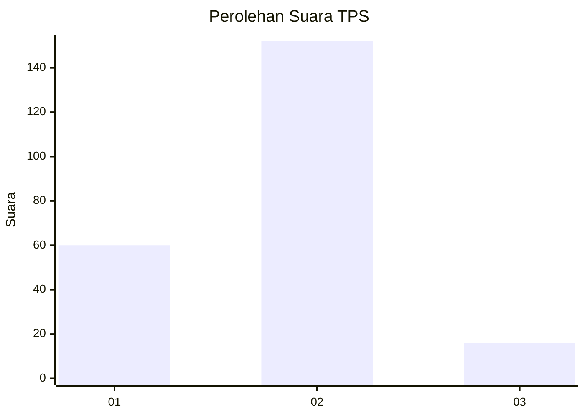
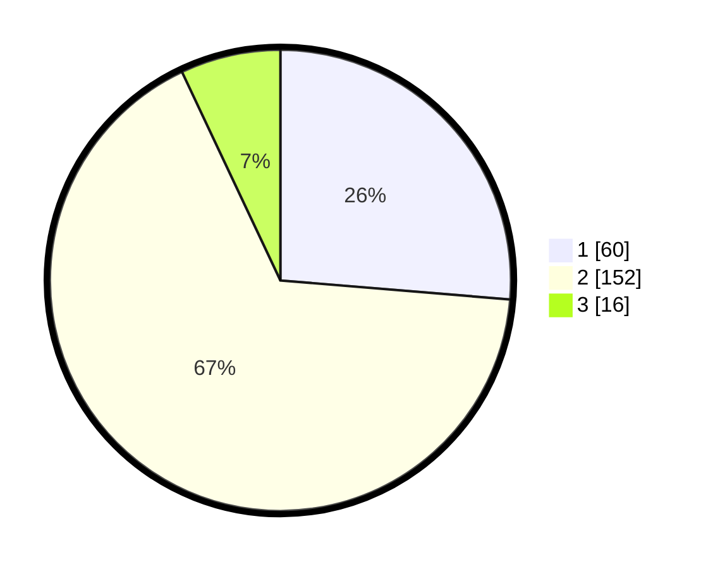

# Hasil

## Grafik

## Tabel

| No. | Nama Paslon    | Suara | Suara (raw) | Persentase |
|:--- |:-------------- | -----:| -----------:| ----------:|
| 1   | ANIES MUHAIMIN | 60    | [60][p-1]   | 26,32      |
| 2   | PRABOWO GIBRAN | 152   | [152][p-2]  | 66,67      |
| 3   | GANJAR MAHFUD  | 16    | [16][p-3]   | 7,02       |

[p-1]: https://github.com/gigit-pemilu/pemilu-2024-32-jawa-barat/blob/main/pilpres/hitung-suara/sub/32-jawa-barat/sub/10-majalengka/sub/16-ligung/sub/2001-cibogor/sub/008-tps/sub/paslon-1.txt
[p-2]: https://github.com/gigit-pemilu/pemilu-2024-32-jawa-barat/blob/main/pilpres/hitung-suara/sub/32-jawa-barat/sub/10-majalengka/sub/16-ligung/sub/2001-cibogor/sub/008-tps/sub/paslon-2.txt
[p-3]: https://github.com/gigit-pemilu/pemilu-2024-32-jawa-barat/blob/main/pilpres/hitung-suara/sub/32-jawa-barat/sub/10-majalengka/sub/16-ligung/sub/2001-cibogor/sub/008-tps/sub/paslon-3.txt

## Foto C Plano

https://sirekap-obj-formc.kpu.go.id/e298/pemilu/ppwp/32/10/16/20/01/3210162001008-20240215-031159--d7ea7b43-01ef-44c7-9a82-509ea08d708b.jpg

https://sirekap-obj-formc.kpu.go.id/e298/pemilu/ppwp/32/10/16/20/01/3210162001008-20240215-031003--4822523a-7831-4c05-bde5-6a3c4c52691f.jpg

https://sirekap-obj-formc.kpu.go.id/e298/pemilu/ppwp/32/10/16/20/01/3210162001008-20240215-031058--06ff0d30-af3b-424e-ace8-8864a2ed40b7.jpg

## Metadata

| Key        | Value               |
| ---------- | ------------------- |
| Time Stamp | 2024-02-24 23:00:00 |

