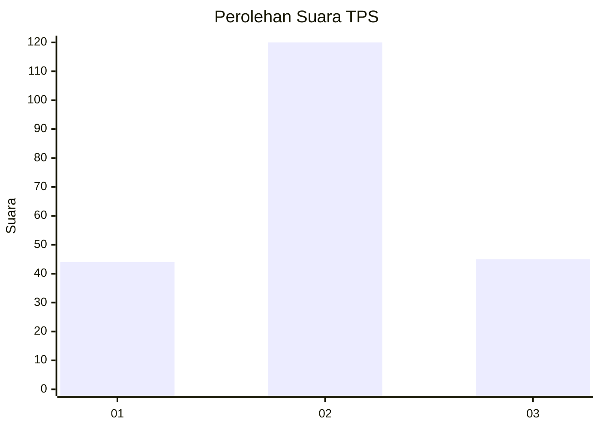
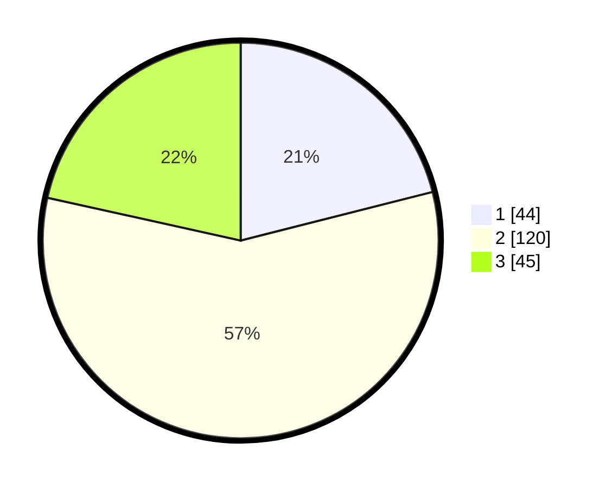

# Hasil

## Grafik

## Tabel

| No. | Nama Paslon    | Suara | Suara (raw) | Persentase |
|:--- |:-------------- | -----:| -----------:| ----------:|
| 1   | ANIES MUHAIMIN | 44    | [44][p-1]   | 21,05      |
| 2   | PRABOWO GIBRAN | 120   | [120][p-2]  | 57,42      |
| 3   | GANJAR MAHFUD  | 45    | [45][p-3]   | 21,53      |

[p-1]: https://github.com/gigit-pemilu/pemilu-2024-32-jawa-barat/blob/main/pilpres/hitung-suara/sub/32-jawa-barat/sub/10-majalengka/sub/18-panyingkiran/sub/2002-pasirmuncang/sub/001-tps/sub/paslon-1.txt
[p-2]: https://github.com/gigit-pemilu/pemilu-2024-32-jawa-barat/blob/main/pilpres/hitung-suara/sub/32-jawa-barat/sub/10-majalengka/sub/18-panyingkiran/sub/2002-pasirmuncang/sub/001-tps/sub/paslon-2.txt
[p-3]: https://github.com/gigit-pemilu/pemilu-2024-32-jawa-barat/blob/main/pilpres/hitung-suara/sub/32-jawa-barat/sub/10-majalengka/sub/18-panyingkiran/sub/2002-pasirmuncang/sub/001-tps/sub/paslon-3.txt

## Foto C Plano

https://sirekap-obj-formc.kpu.go.id/b08a/pemilu/ppwp/32/10/18/20/02/3210182002001-20240215-012935--aa2da08a-2013-4530-980e-ec4997a07764.jpg

https://sirekap-obj-formc.kpu.go.id/b08a/pemilu/ppwp/32/10/18/20/02/3210182002001-20240215-013119--6bb43d7a-a137-44a4-bed4-7c781554ea64.jpg

https://sirekap-obj-formc.kpu.go.id/b08a/pemilu/ppwp/32/10/18/20/02/3210182002001-20240215-013233--b940da5b-b660-43c5-b691-f440e8b1eec5.jpg

## Metadata

| Key        | Value               |
| ---------- | ------------------- |
| Time Stamp | 2024-02-24 22:31:28 |

