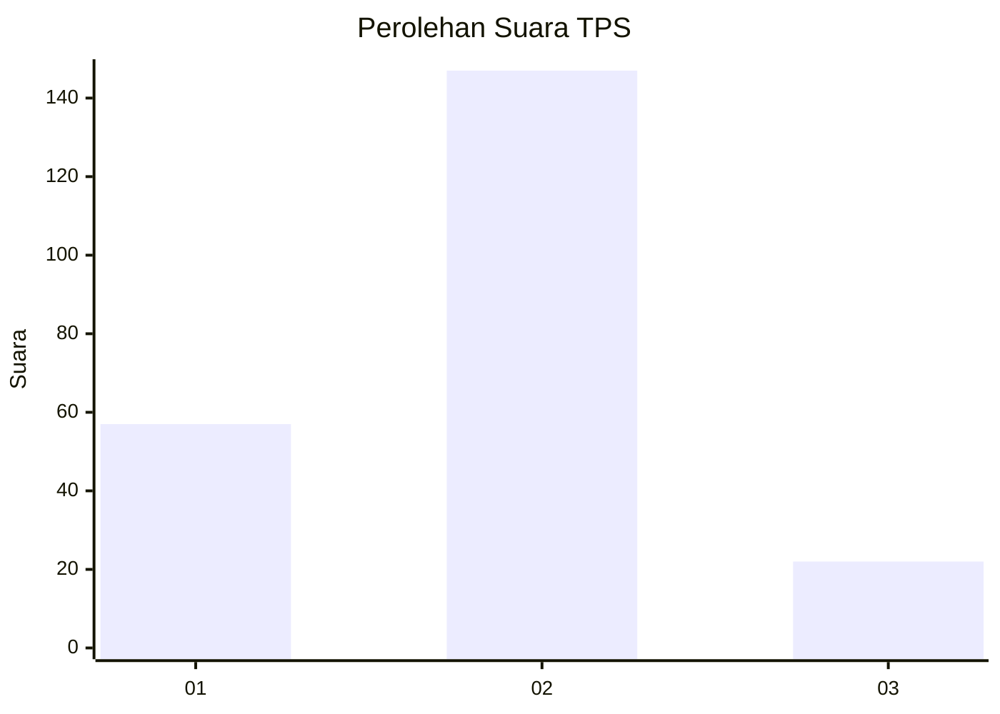
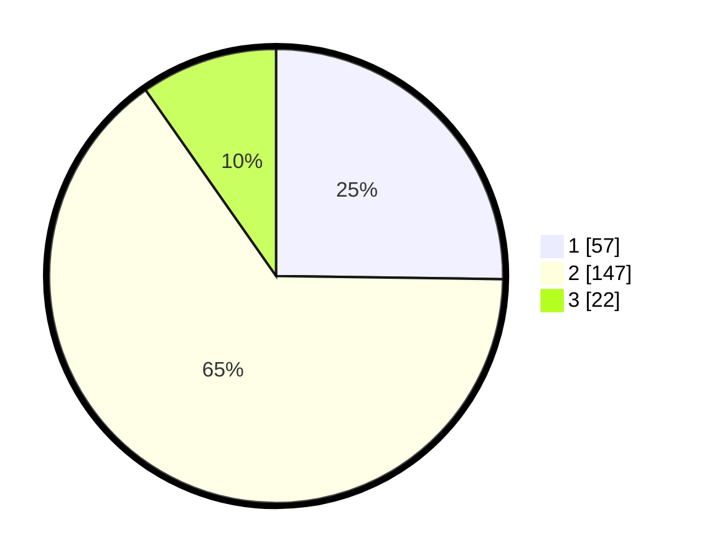

# Hasil

## Grafik

## Tabel

| No. | Nama Paslon    | Suara | Suara (raw) | Persentase |
|:--- |:-------------- | -----:| -----------:| ----------:|
| 1   | ANIES MUHAIMIN | 57    | [57][p-1]   | 25,22      |
| 2   | PRABOWO GIBRAN | 147   | [147][p-2]  | 65,04      |
| 3   | GANJAR MAHFUD  | 22    | [22][p-3]   | 9,73       |

[p-1]: https://github.com/gigit-pemilu/pemilu-2024-32-jawa-barat/blob/main/pilpres/hitung-suara/sub/32-jawa-barat/sub/10-majalengka/sub/20-cigasong/sub/1004-cigasong/sub/003-tps/sub/paslon-1.txt
[p-2]: https://github.com/gigit-pemilu/pemilu-2024-32-jawa-barat/blob/main/pilpres/hitung-suara/sub/32-jawa-barat/sub/10-majalengka/sub/20-cigasong/sub/1004-cigasong/sub/003-tps/sub/paslon-2.txt
[p-3]: https://github.com/gigit-pemilu/pemilu-2024-32-jawa-barat/blob/main/pilpres/hitung-suara/sub/32-jawa-barat/sub/10-majalengka/sub/20-cigasong/sub/1004-cigasong/sub/003-tps/sub/paslon-3.txt

## Foto C Plano

https://sirekap-obj-formc.kpu.go.id/93ac/pemilu/ppwp/32/10/20/10/04/3210201004003-20240218-141150--acb64ffb-7aa3-45ea-aa72-6e3435a86c9d.jpg

https://sirekap-obj-formc.kpu.go.id/93ac/pemilu/ppwp/32/10/20/10/04/3210201004003-20240218-141227--fd156a61-4dda-4465-a588-bd2c0b02d046.jpg

https://sirekap-obj-formc.kpu.go.id/93ac/pemilu/ppwp/32/10/20/10/04/3210201004003-20240218-141258--7993bd0e-786e-47bf-8f72-aa2de9f2d7d8.jpg

## Metadata

| Key        | Value               |
| ---------- | ------------------- |
| Time Stamp | 2024-02-25 15:00:00 |

