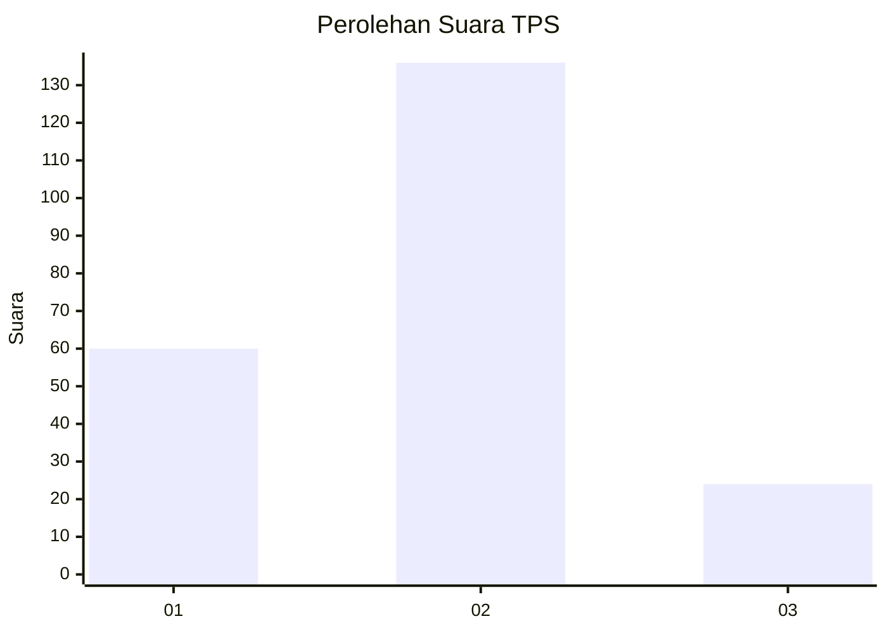
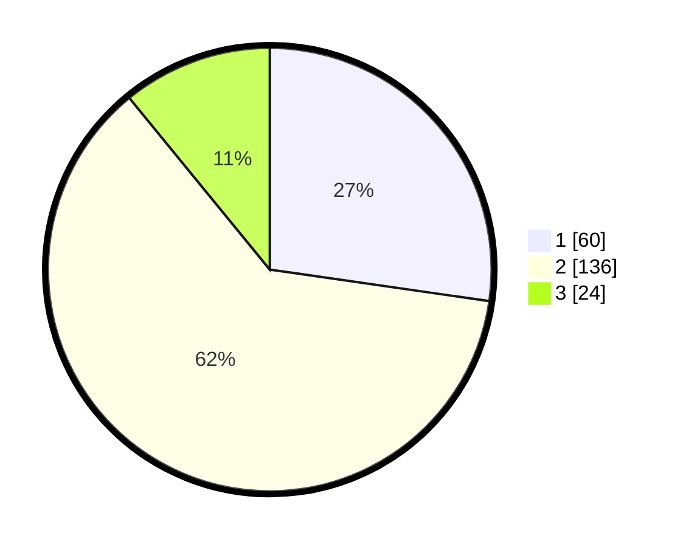

# Hasil

## Grafik

## Tabel

| No. | Nama Paslon    | Suara | Suara (raw) | Persentase |
|:--- |:-------------- | -----:| -----------:| ----------:|
| 1   | ANIES MUHAIMIN | 60    | [60][p-1]   | 27,27      |
| 2   | PRABOWO GIBRAN | 136   | [136][p-2]  | 61,82      |
| 3   | GANJAR MAHFUD  | 24    | [24][p-3]   | 10,91      |

[p-1]: https://github.com/gigit-pemilu/pemilu-2024/blob/main/pilpres/hitung-suara/sub/32-jawa-barat/sub/10-majalengka/sub/20-cigasong/sub/2003-tenjolayar/sub/001-tps/sub/paslon-1.txt
[p-2]: https://github.com/gigit-pemilu/pemilu-2024/blob/main/pilpres/hitung-suara/sub/32-jawa-barat/sub/10-majalengka/sub/20-cigasong/sub/2003-tenjolayar/sub/001-tps/sub/paslon-2.txt
[p-3]: https://github.com/gigit-pemilu/pemilu-2024/blob/main/pilpres/hitung-suara/sub/32-jawa-barat/sub/10-majalengka/sub/20-cigasong/sub/2003-tenjolayar/sub/001-tps/sub/paslon-3.txt

## Foto C Plano

https://sirekap-obj-formc.kpu.go.id/8c03/pemilu/ppwp/32/10/20/20/03/3210202003001-20240219-093839--2f9f1ae1-5814-4873-90c4-34128be1bb4c.jpg

https://sirekap-obj-formc.kpu.go.id/8c03/pemilu/ppwp/32/10/20/20/03/3210202003001-20240219-093912--b59aae1e-b2f2-43f9-9aa1-5f7d228a62a2.jpg

https://sirekap-obj-formc.kpu.go.id/8c03/pemilu/ppwp/32/10/20/20/03/3210202003001-20240219-094027--22187ef4-7536-41e6-beea-701f148ead1d.jpg

## Metadata

| Key        | Value               |
| ---------- | ------------------- |
| Time Stamp | 2024-02-24 22:31:28 |

