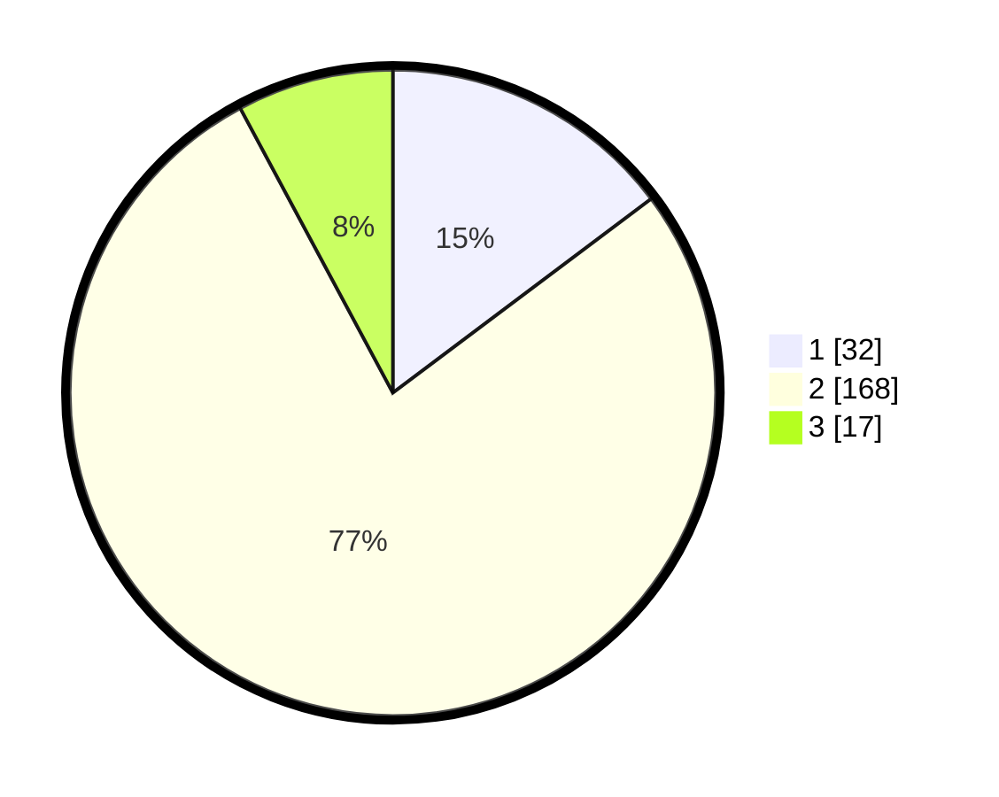

# Hasil

## Grafik

## Tabel

| No. | Nama Paslon    | Suara | Suara (raw) | Persentase |
|:--- |:-------------- | -----:| -----------:| ----------:|
| 1   | ANIES MUHAIMIN | 32    | [32][p-1]   | 14,75      |
| 2   | PRABOWO GIBRAN | 168   | [168][p-2]  | 77,42      |
| 3   | GANJAR MAHFUD  | 17    | [17][p-3]   | 7,83       |

[p-1]: https://github.com/gigit-pemilu/pemilu-2024-32-jawa-barat/blob/main/pilpres/hitung-suara/sub/32-jawa-barat/sub/10-majalengka/sub/21-sindangwangi/sub/2001-bantaragung/sub/007-tps/sub/paslon-1.txt
[p-2]: https://github.com/gigit-pemilu/pemilu-2024-32-jawa-barat/blob/main/pilpres/hitung-suara/sub/32-jawa-barat/sub/10-majalengka/sub/21-sindangwangi/sub/2001-bantaragung/sub/007-tps/sub/paslon-2.txt
[p-3]: https://github.com/gigit-pemilu/pemilu-2024-32-jawa-barat/blob/main/pilpres/hitung-suara/sub/32-jawa-barat/sub/10-majalengka/sub/21-sindangwangi/sub/2001-bantaragung/sub/007-tps/sub/paslon-3.txt

## Foto C Plano

https://sirekap-obj-formc.kpu.go.id/2ba2/pemilu/ppwp/32/10/21/20/01/3210212001007-20240214-190557--364b0096-0fca-4d7e-8173-bc0cf0b0ea9e.jpg

https://sirekap-obj-formc.kpu.go.id/2ba2/pemilu/ppwp/32/10/21/20/01/3210212001007-20240214-191152--95cbb8dd-c39e-42b5-863c-019d3d4980a5.jpg

https://sirekap-obj-formc.kpu.go.id/2ba2/pemilu/ppwp/32/10/21/20/01/3210212001007-20240214-191551--a8318435-644c-415f-a61a-03cc39d47d93.jpg

## Metadata

| Key        | Value               |
| ---------- | ------------------- |
| Time Stamp | 2024-02-24 22:31:28 |

