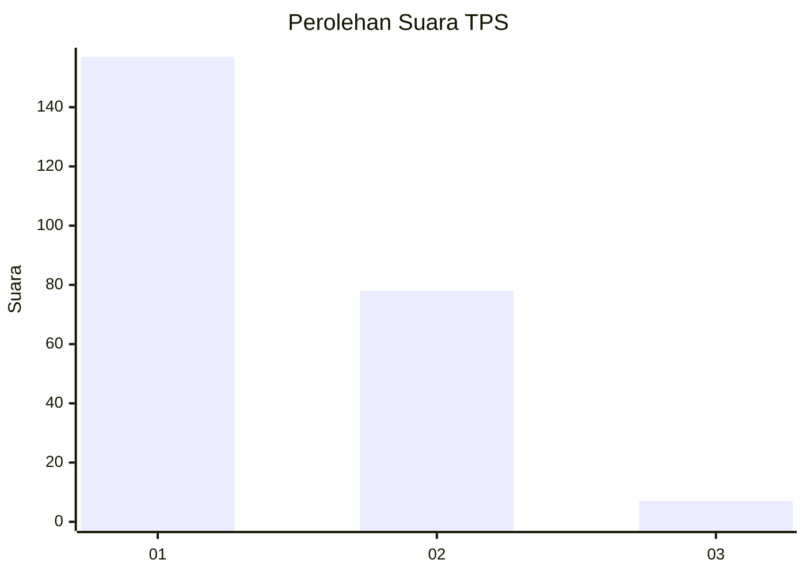
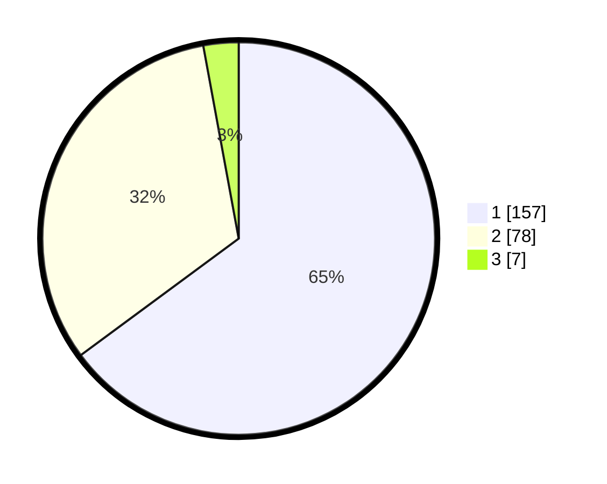

# Hasil

## Grafik

## Tabel

| No. | Nama Paslon    | Suara | Suara (raw) | Persentase |
|:--- |:-------------- | -----:| -----------:| ----------:|
| 1   | ANIES MUHAIMIN | 157   | [157][p-1]  | 64,88      |
| 2   | PRABOWO GIBRAN | 78    | [78][p-2]   | 32,23      |
| 3   | GANJAR MAHFUD  | 7     | [7][p-3]    | 2,89       |

[p-1]: https://github.com/gigit-pemilu/pemilu-2024-32-jawa-barat/blob/main/pilpres/hitung-suara/sub/32-jawa-barat/sub/10-majalengka/sub/22-banjaran/sub/2005-banjaran/sub/007-tps/sub/paslon-1.txt
[p-2]: https://github.com/gigit-pemilu/pemilu-2024-32-jawa-barat/blob/main/pilpres/hitung-suara/sub/32-jawa-barat/sub/10-majalengka/sub/22-banjaran/sub/2005-banjaran/sub/007-tps/sub/paslon-2.txt
[p-3]: https://github.com/gigit-pemilu/pemilu-2024-32-jawa-barat/blob/main/pilpres/hitung-suara/sub/32-jawa-barat/sub/10-majalengka/sub/22-banjaran/sub/2005-banjaran/sub/007-tps/sub/paslon-3.txt

## Foto C Plano

https://sirekap-obj-formc.kpu.go.id/6a1d/pemilu/ppwp/32/10/22/20/05/3210222005007-20240215-021404--1bd59b88-6fd2-48f5-986c-cdb19c495961.jpg

https://sirekap-obj-formc.kpu.go.id/6a1d/pemilu/ppwp/32/10/22/20/05/3210222005007-20240215-021522--cc984447-36ff-4ae4-b86a-7204499923c7.jpg

https://sirekap-obj-formc.kpu.go.id/6a1d/pemilu/ppwp/32/10/22/20/05/3210222005007-20240215-021614--5a86556d-8507-4ff3-ae3a-2bedfcb2593a.jpg

## Metadata

| Key        | Value               |
| ---------- | ------------------- |
| Time Stamp | 2024-02-24 22:31:28 |

