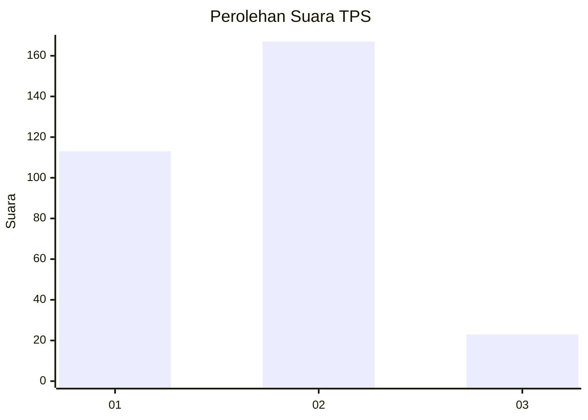

# Hasil

## Grafik

## Tabel

| No. | Nama Paslon    | Suara | Suara (raw) | Persentase |
|:--- |:-------------- | -----:| -----------:| ----------:|
| 1   | ANIES MUHAIMIN | 113   | [113][p-1]  | 37,29      |
| 2   | PRABOWO GIBRAN | 167   | [167][p-2]  | 55,12      |
| 3   | GANJAR MAHFUD  | 23    | [23][p-3]   | 7,59       |

[p-1]: https://github.com/gigit-pemilu/pemilu-2024-32-jawa-barat/blob/main/pilpres/hitung-suara/sub/32-jawa-barat/sub/10-majalengka/sub/22-banjaran/sub/2006-kagok/sub/001-tps/sub/paslon-1.txt
[p-2]: https://github.com/gigit-pemilu/pemilu-2024-32-jawa-barat/blob/main/pilpres/hitung-suara/sub/32-jawa-barat/sub/10-majalengka/sub/22-banjaran/sub/2006-kagok/sub/001-tps/sub/paslon-2.txt
[p-3]: https://github.com/gigit-pemilu/pemilu-2024-32-jawa-barat/blob/main/pilpres/hitung-suara/sub/32-jawa-barat/sub/10-majalengka/sub/22-banjaran/sub/2006-kagok/sub/001-tps/sub/paslon-3.txt

## Foto C Plano

https://sirekap-obj-formc.kpu.go.id/20c5/pemilu/ppwp/32/10/22/20/06/3210222006001-20240214-213830--b1a106a7-443c-4b84-bb87-942241e3d8d0.jpg

https://sirekap-obj-formc.kpu.go.id/20c5/pemilu/ppwp/32/10/22/20/06/3210222006001-20240214-214017--94955e65-97bf-45ad-a578-690bf2f9c611.jpg

https://sirekap-obj-formc.kpu.go.id/20c5/pemilu/ppwp/32/10/22/20/06/3210222006001-20240214-214129--c741fed2-9a13-409d-8b14-5536af671cbb.jpg

## Metadata

| Key        | Value               |
| ---------- | ------------------- |
| Time Stamp | 2024-02-19 06:16:00 |

