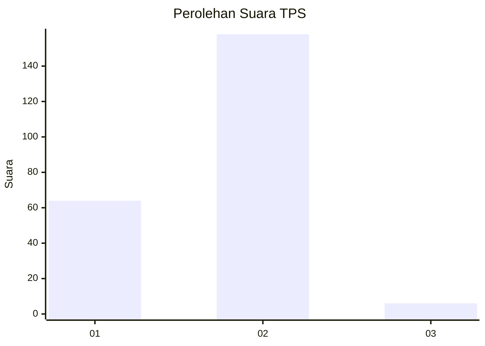
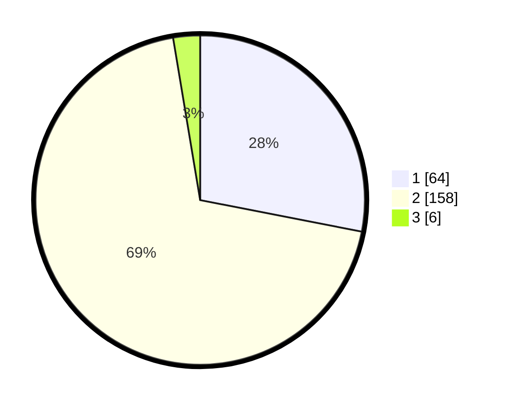

# Hasil

## Grafik

## Tabel

| No. | Nama Paslon    | Suara | Suara (raw) | Persentase |
|:--- |:-------------- | -----:| -----------:| ----------:|
| 1   | ANIES MUHAIMIN | 64    | [64][p-1]   | 28,07      |
| 2   | PRABOWO GIBRAN | 158   | [158][p-2]  | 69,30      |
| 3   | GANJAR MAHFUD  | 6     | [6][p-3]    | 2,63       |

[p-1]: https://github.com/gigit-pemilu/pemilu-2024-32-jawa-barat/blob/main/pilpres/hitung-suara/sub/32-jawa-barat/sub/10-majalengka/sub/24-kasokandel/sub/2001-jatisawit/sub/002-tps/sub/paslon-1.txt
[p-2]: https://github.com/gigit-pemilu/pemilu-2024-32-jawa-barat/blob/main/pilpres/hitung-suara/sub/32-jawa-barat/sub/10-majalengka/sub/24-kasokandel/sub/2001-jatisawit/sub/002-tps/sub/paslon-2.txt
[p-3]: https://github.com/gigit-pemilu/pemilu-2024-32-jawa-barat/blob/main/pilpres/hitung-suara/sub/32-jawa-barat/sub/10-majalengka/sub/24-kasokandel/sub/2001-jatisawit/sub/002-tps/sub/paslon-3.txt

## Foto C Plano

https://sirekap-obj-formc.kpu.go.id/f7d3/pemilu/ppwp/32/10/24/20/01/3210242001002-20240215-023030--404eed63-2c9d-48c1-bed7-8a624d1ecd0f.jpg

https://sirekap-obj-formc.kpu.go.id/f7d3/pemilu/ppwp/32/10/24/20/01/3210242001002-20240215-023600--a55cc779-ce57-4627-908f-5d9b317a0020.jpg

https://sirekap-obj-formc.kpu.go.id/f7d3/pemilu/ppwp/32/10/24/20/01/3210242001002-20240215-023758--ef76f5d9-2b88-48cd-9bd1-8e6e9eec8036.jpg

## Metadata

| Key        | Value               |
| ---------- | ------------------- |
| Time Stamp | 2024-02-26 21:00:00 |

