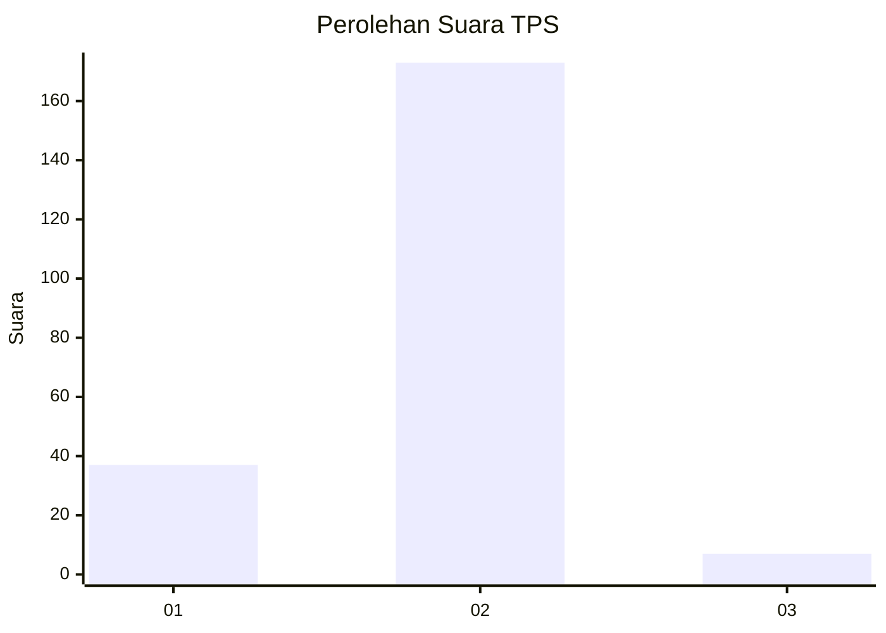
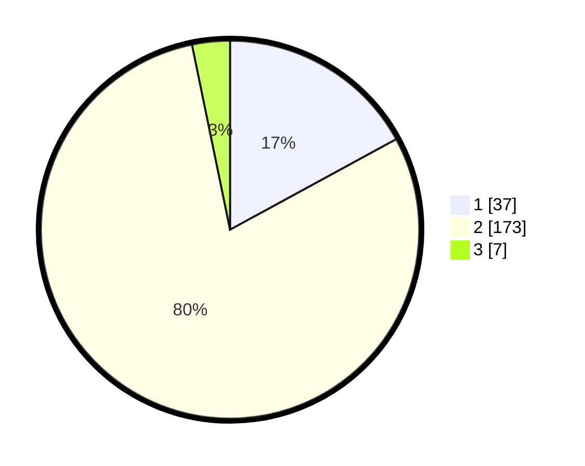

# Hasil

## Grafik

## Tabel

| No. | Nama Paslon    | Suara | Suara (raw) | Persentase |
|:--- |:-------------- | -----:| -----------:| ----------:|
| 1   | ANIES MUHAIMIN | 37    | [37][p-1]   | 17,05      |
| 2   | PRABOWO GIBRAN | 173   | [173][p-2]  | 79,72      |
| 3   | GANJAR MAHFUD  | 7     | [7][p-3]    | 3,23       |

[p-1]: https://github.com/gigit-pemilu/pemilu-2024/blob/main/pilpres/hitung-suara/sub/32-jawa-barat/sub/10-majalengka/sub/24-kasokandel/sub/2001-jatisawit/sub/003-tps/sub/paslon-1.txt
[p-2]: https://github.com/gigit-pemilu/pemilu-2024/blob/main/pilpres/hitung-suara/sub/32-jawa-barat/sub/10-majalengka/sub/24-kasokandel/sub/2001-jatisawit/sub/003-tps/sub/paslon-2.txt
[p-3]: https://github.com/gigit-pemilu/pemilu-2024/blob/main/pilpres/hitung-suara/sub/32-jawa-barat/sub/10-majalengka/sub/24-kasokandel/sub/2001-jatisawit/sub/003-tps/sub/paslon-3.txt

## Foto C Plano

https://sirekap-obj-formc.kpu.go.id/484e/pemilu/ppwp/32/10/24/20/01/3210242001003-20240215-020304--bb0971c2-8563-41c9-bdc3-aac6c7c6f5e1.jpg

https://sirekap-obj-formc.kpu.go.id/484e/pemilu/ppwp/32/10/24/20/01/3210242001003-20240215-020500--c25b2ba5-cdbf-4a07-a5a3-31de083ec967.jpg

https://sirekap-obj-formc.kpu.go.id/484e/pemilu/ppwp/32/10/24/20/01/3210242001003-20240215-020619--6877efea-5d31-4740-b40e-fb8d8f5caa0a.jpg

## Metadata

| Key        | Value               |
| ---------- | ------------------- |
| Time Stamp | 2024-02-17 13:37:34 |

