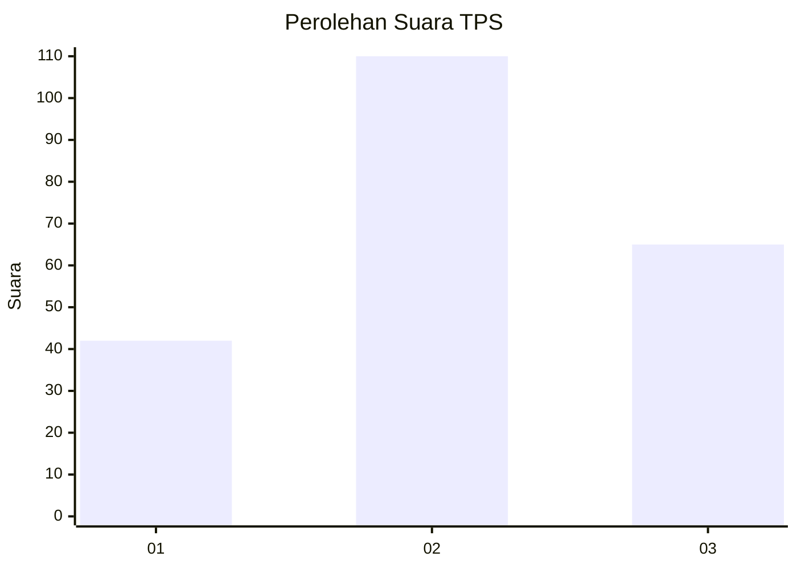
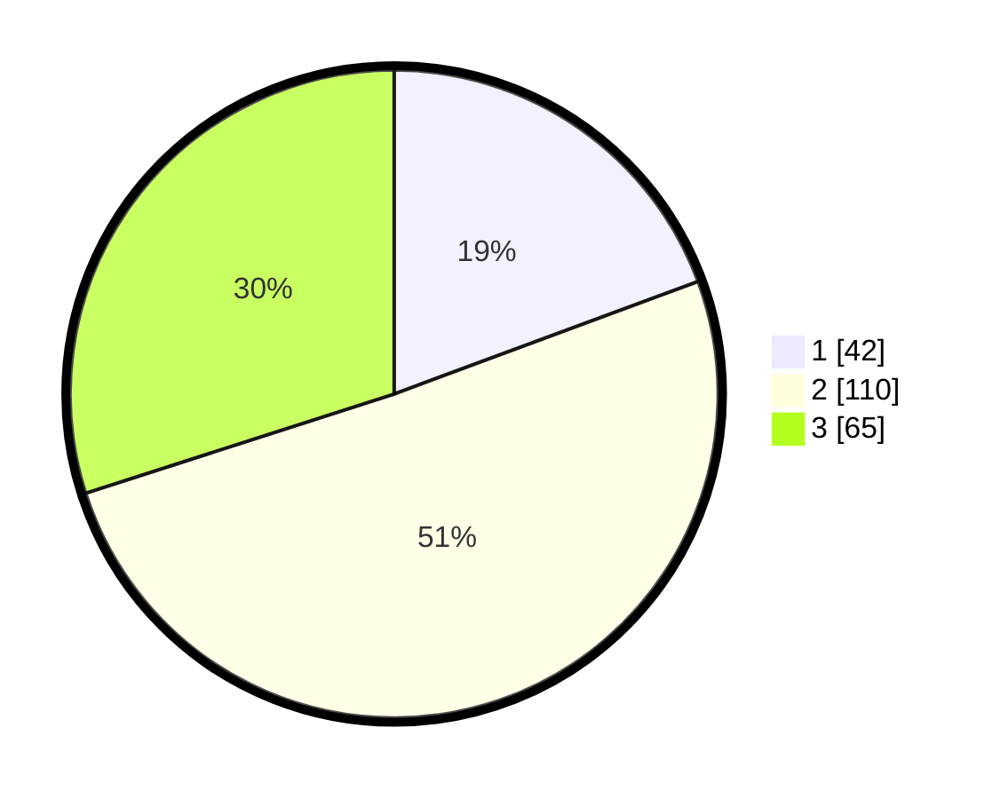

# Hasil

## Grafik

## Tabel

| No. | Nama Paslon    | Suara | Suara (raw) | Persentase |
|:--- |:-------------- | -----:| -----------:| ----------:|
| 1   | ANIES MUHAIMIN | 42    | [42][p-1]   | 19,35      |
| 2   | PRABOWO GIBRAN | 110   | [110][p-2]  | 50,69      |
| 3   | GANJAR MAHFUD  | 65    | [65][p-3]   | 29,95      |

[p-1]: https://github.com/gigit-pemilu/pemilu-2024/blob/main/pilpres/hitung-suara/sub/32-jawa-barat/sub/10-majalengka/sub/24-kasokandel/sub/2001-jatisawit/sub/005-tps/sub/paslon-1.txt
[p-2]: https://github.com/gigit-pemilu/pemilu-2024/blob/main/pilpres/hitung-suara/sub/32-jawa-barat/sub/10-majalengka/sub/24-kasokandel/sub/2001-jatisawit/sub/005-tps/sub/paslon-2.txt
[p-3]: https://github.com/gigit-pemilu/pemilu-2024/blob/main/pilpres/hitung-suara/sub/32-jawa-barat/sub/10-majalengka/sub/24-kasokandel/sub/2001-jatisawit/sub/005-tps/sub/paslon-3.txt

## Foto C Plano

https://sirekap-obj-formc.kpu.go.id/fa49/pemilu/ppwp/32/10/24/20/01/3210242001005-20240215-020909--a2c5411f-8259-44b2-be38-f4b0d95a4bcc.jpg

https://sirekap-obj-formc.kpu.go.id/fa49/pemilu/ppwp/32/10/24/20/01/3210242001005-20240215-014619--769d3230-b38a-461d-9b09-bac1bd96dc69.jpg

https://sirekap-obj-formc.kpu.go.id/fa49/pemilu/ppwp/32/10/24/20/01/3210242001005-20240215-014707--eca9fa53-75de-45ec-80d0-ab0a8572844c.jpg

## Metadata

| Key        | Value               |
| ---------- | ------------------- |
| Time Stamp | 2024-02-25 16:00:00 |

