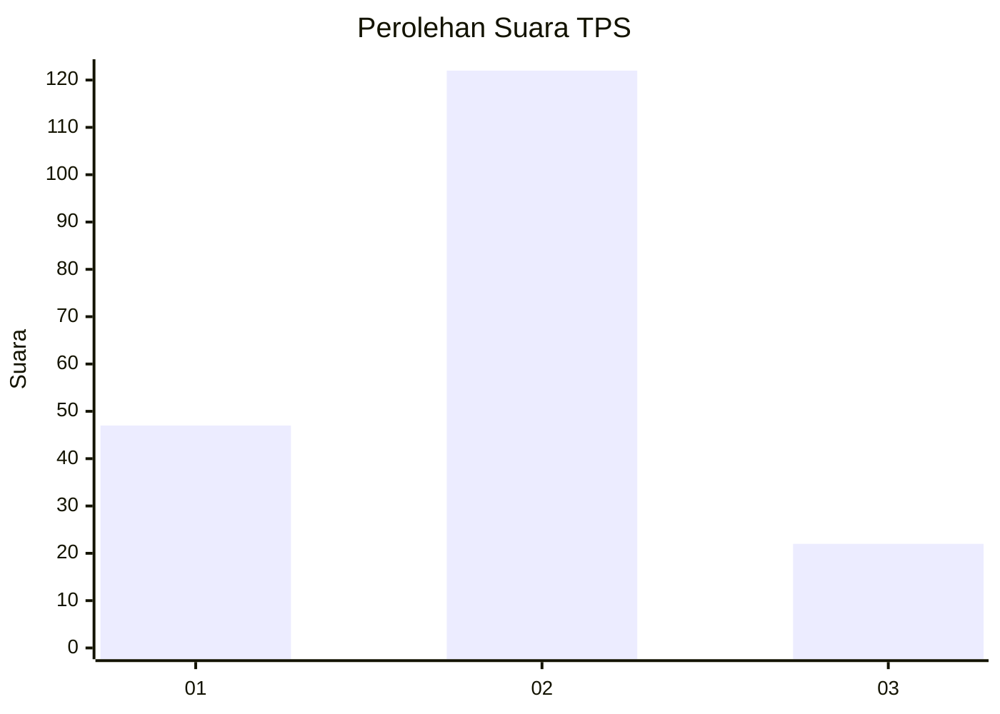
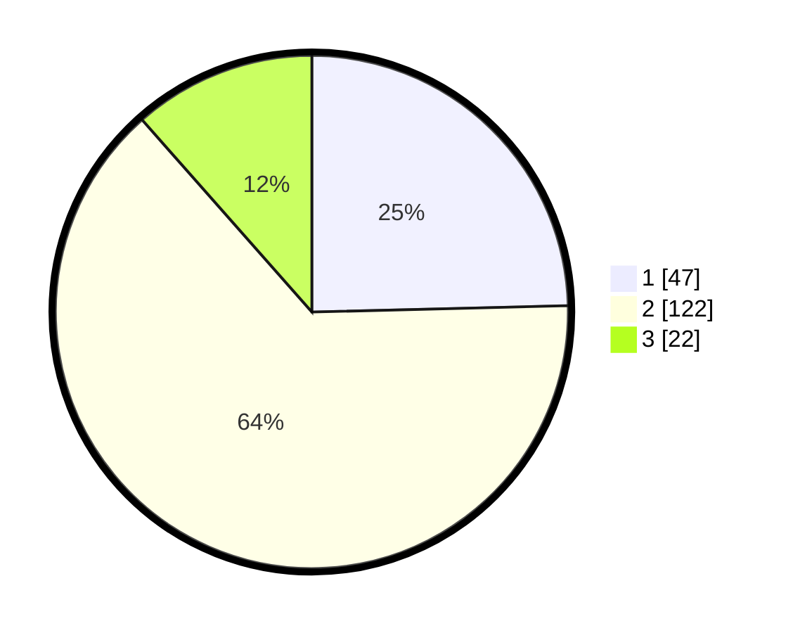

# Hasil

## Grafik

## Tabel

| No. | Nama Paslon    | Suara | Suara (raw) | Persentase |
|:--- |:-------------- | -----:| -----------:| ----------:|
| 1   | ANIES MUHAIMIN | 47    | [47][p-1]   | 24,61      |
| 2   | PRABOWO GIBRAN | 122   | [122][p-2]  | 63,87      |
| 3   | GANJAR MAHFUD  | 22    | [22][p-3]   | 11,52      |

[p-1]: https://github.com/gigit-pemilu/pemilu-2024-32-jawa-barat/blob/main/pilpres/hitung-suara/sub/32-jawa-barat/sub/10-majalengka/sub/25-sindang/sub/2001-pasirayu/sub/001-tps/sub/paslon-1.txt
[p-2]: https://github.com/gigit-pemilu/pemilu-2024-32-jawa-barat/blob/main/pilpres/hitung-suara/sub/32-jawa-barat/sub/10-majalengka/sub/25-sindang/sub/2001-pasirayu/sub/001-tps/sub/paslon-2.txt
[p-3]: https://github.com/gigit-pemilu/pemilu-2024-32-jawa-barat/blob/main/pilpres/hitung-suara/sub/32-jawa-barat/sub/10-majalengka/sub/25-sindang/sub/2001-pasirayu/sub/001-tps/sub/paslon-3.txt

## Foto C Plano

https://sirekap-obj-formc.kpu.go.id/38bd/pemilu/ppwp/32/10/25/20/01/3210252001001-20240215-015120--59d98575-fe40-4000-acc4-cb5d20905b35.jpg

https://sirekap-obj-formc.kpu.go.id/38bd/pemilu/ppwp/32/10/25/20/01/3210252001001-20240215-015331--ddc39f0c-e599-4c5c-955f-e64fb5886f59.jpg

https://sirekap-obj-formc.kpu.go.id/38bd/pemilu/ppwp/32/10/25/20/01/3210252001001-20240215-023031--4a254636-dd47-47e4-8f63-726d74f27a1c.jpg

## Metadata

| Key        | Value               |
| ---------- | ------------------- |
| Time Stamp | 2024-02-15 09:00:24 |

