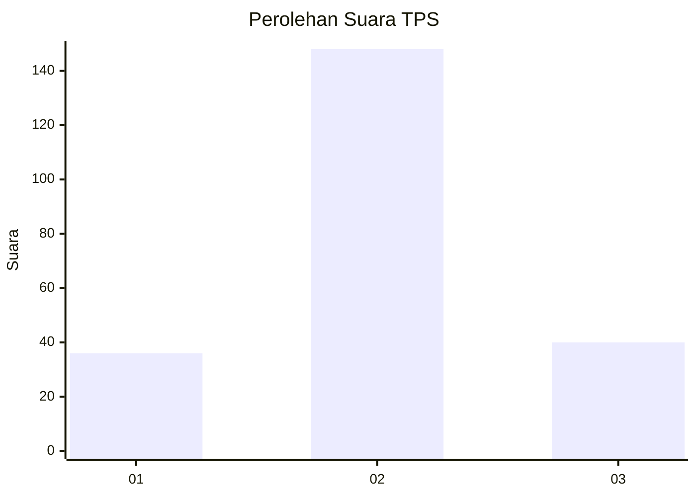
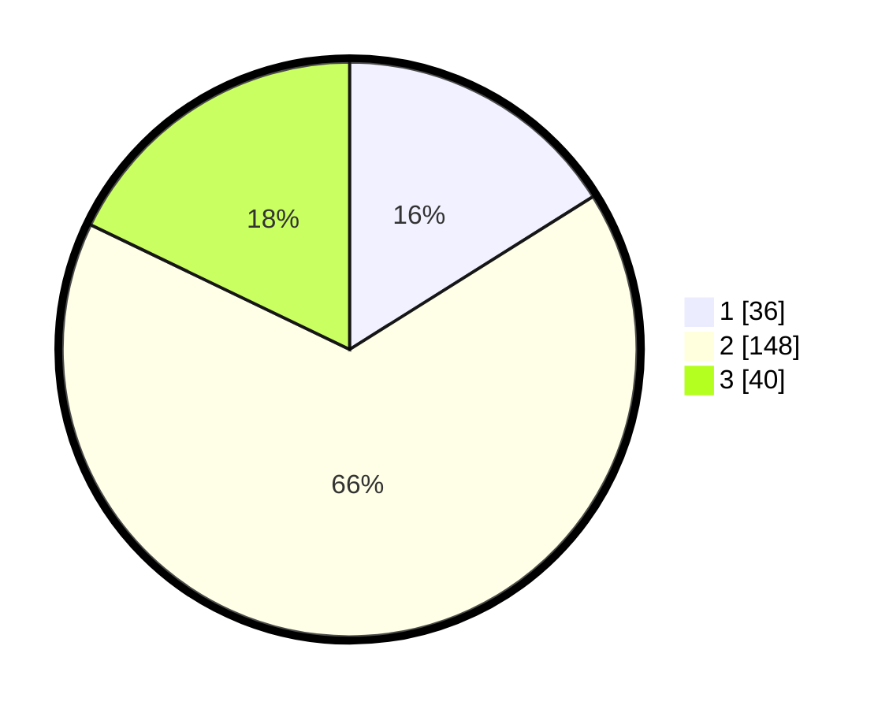

# Hasil

## Grafik

## Tabel

| No. | Nama Paslon    | Suara | Suara (raw) | Persentase |
|:--- |:-------------- | -----:| -----------:| ----------:|
| 1   | ANIES MUHAIMIN | 36    | [36][p-1]   | 16,07      |
| 2   | PRABOWO GIBRAN | 148   | [148][p-2]  | 66,07      |
| 3   | GANJAR MAHFUD  | 40    | [40][p-3]   | 17,86      |

[p-1]: https://github.com/gigit-pemilu/pemilu-2024/blob/main/pilpres/hitung-suara/sub/32-jawa-barat/sub/10-majalengka/sub/25-sindang/sub/2004-indrakila/sub/003-tps/sub/paslon-1.txt
[p-2]: https://github.com/gigit-pemilu/pemilu-2024/blob/main/pilpres/hitung-suara/sub/32-jawa-barat/sub/10-majalengka/sub/25-sindang/sub/2004-indrakila/sub/003-tps/sub/paslon-2.txt
[p-3]: https://github.com/gigit-pemilu/pemilu-2024/blob/main/pilpres/hitung-suara/sub/32-jawa-barat/sub/10-majalengka/sub/25-sindang/sub/2004-indrakila/sub/003-tps/sub/paslon-3.txt

## Foto C Plano

https://sirekap-obj-formc.kpu.go.id/ccad/pemilu/ppwp/32/10/25/20/04/3210252004003-20240215-054207--5c1d132f-07b6-4cf6-89ae-40da46ff4a28.jpg

https://sirekap-obj-formc.kpu.go.id/ccad/pemilu/ppwp/32/10/25/20/04/3210252004003-20240215-054236--5a30f4b6-e1b7-4d5e-8134-81a4cc79a490.jpg

https://sirekap-obj-formc.kpu.go.id/ccad/pemilu/ppwp/32/10/25/20/04/3210252004003-20240215-054301--3dc6c1f1-37cb-48c2-aad4-938145f6cc80.jpg

## Metadata

| Key        | Value               |
| ---------- | ------------------- |
| Time Stamp | 2024-02-15 20:00:44 |

