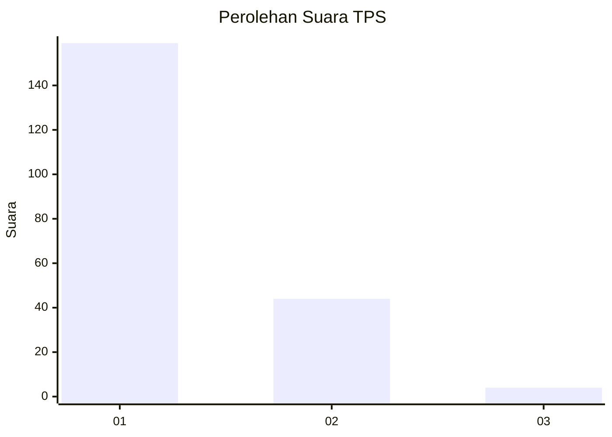
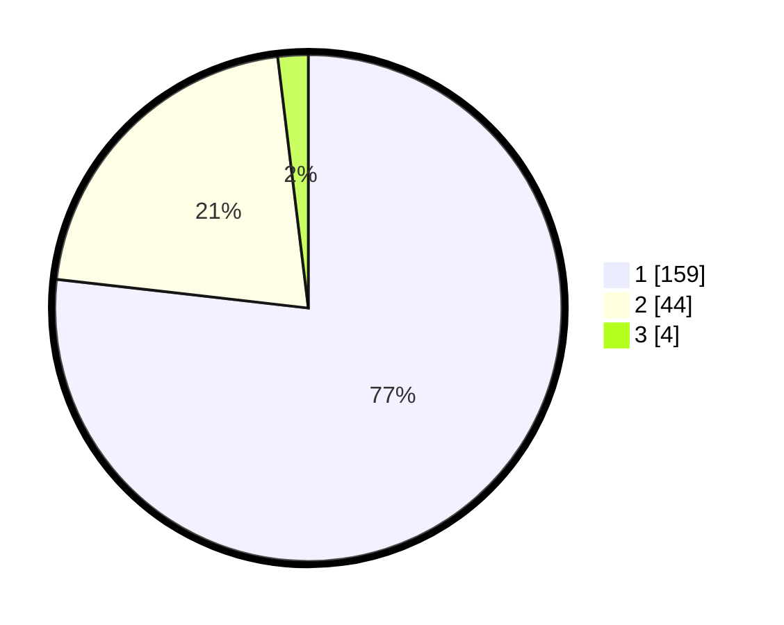

# Hasil

## Grafik

## Tabel

| No. | Nama Paslon    | Suara | Suara (raw) | Persentase |
|:--- |:-------------- | -----:| -----------:| ----------:|
| 1   | ANIES MUHAIMIN | 159   | [159][p-1]  | 76,81      |
| 2   | PRABOWO GIBRAN | 44    | [44][p-2]   | 21,26      |
| 3   | GANJAR MAHFUD  | 4     | [4][p-3]    | 1,93       |

[p-1]: https://github.com/gigit-pemilu/pemilu-2024/blob/main/pilpres/hitung-suara/sub/32-jawa-barat/sub/10-majalengka/sub/26-malausma/sub/2003-malausma/sub/017-tps/sub/paslon-1.txt
[p-2]: https://github.com/gigit-pemilu/pemilu-2024/blob/main/pilpres/hitung-suara/sub/32-jawa-barat/sub/10-majalengka/sub/26-malausma/sub/2003-malausma/sub/017-tps/sub/paslon-2.txt
[p-3]: https://github.com/gigit-pemilu/pemilu-2024/blob/main/pilpres/hitung-suara/sub/32-jawa-barat/sub/10-majalengka/sub/26-malausma/sub/2003-malausma/sub/017-tps/sub/paslon-3.txt

## Foto C Plano

https://sirekap-obj-formc.kpu.go.id/720f/pemilu/ppwp/32/10/26/20/03/3210262003017-20240215-021343--5e834218-9399-4567-980b-650dbf04ff9d.jpg

https://sirekap-obj-formc.kpu.go.id/720f/pemilu/ppwp/32/10/26/20/03/3210262003017-20240215-021413--c8736460-5f42-4a34-8592-5efc324b45d2.jpg

https://sirekap-obj-formc.kpu.go.id/720f/pemilu/ppwp/32/10/26/20/03/3210262003017-20240215-012314--89ff5bfe-f9e3-4fb2-a7f9-7fa340e51995.jpg

## Metadata

| Key        | Value               |
| ---------- | ------------------- |
| Time Stamp | 2024-02-16 12:51:22 |

