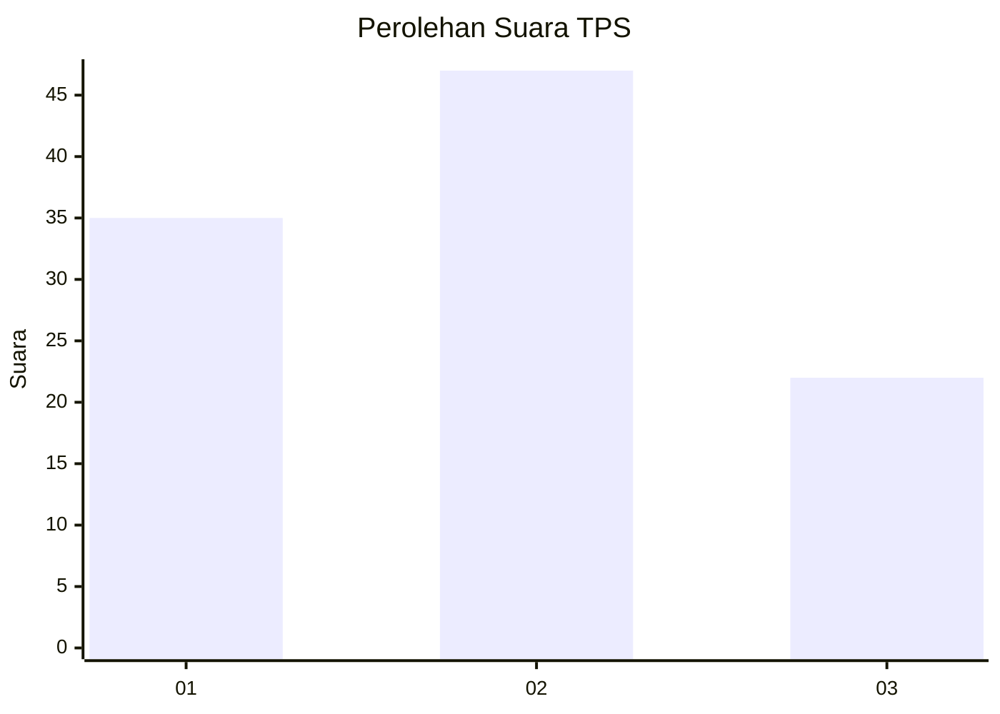
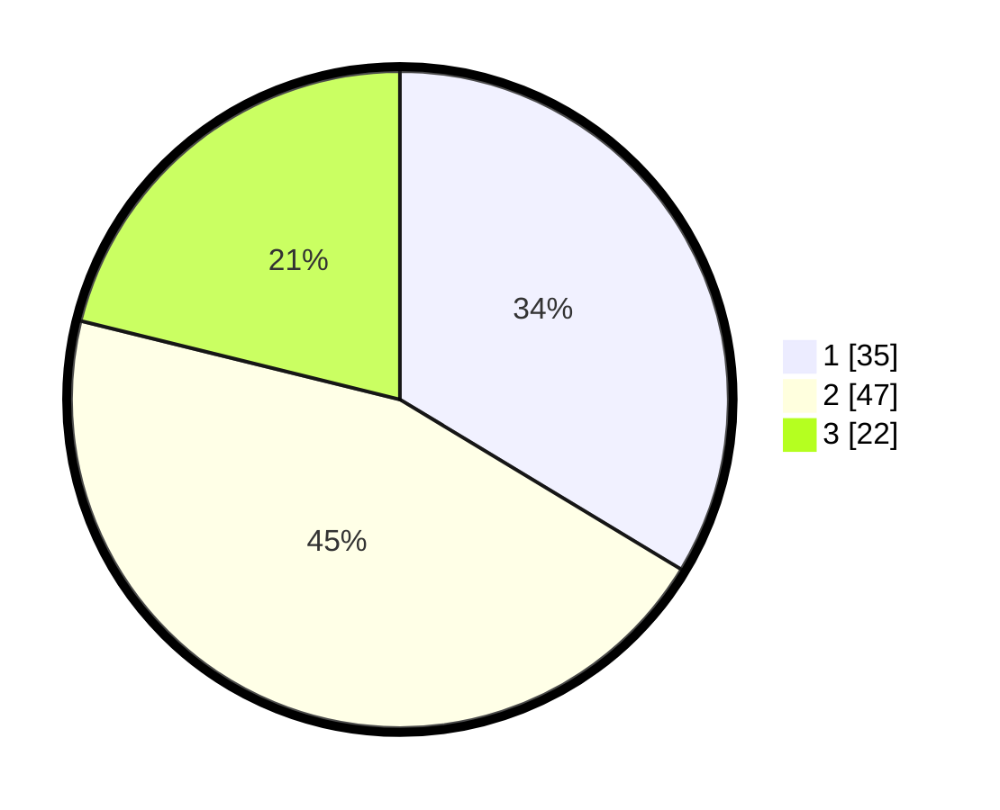

# Hasil

## Grafik

## Tabel

| No. | Nama Paslon    | Suara | Suara (raw) | Persentase |
|:--- |:-------------- | -----:| -----------:| ----------:|
| 1   | ANIES MUHAIMIN | 35    | [35][p-1]   | 33,65      |
| 2   | PRABOWO GIBRAN | 47    | [47][p-2]   | 45,19      |
| 3   | GANJAR MAHFUD  | 22    | [22][p-3]   | 21,15      |

[p-1]: https://github.com/gigit-pemilu/pemilu-2024/blob/main/pilpres/hitung-suara/sub/32-jawa-barat/sub/10-majalengka/sub/26-malausma/sub/2010-girimukti/sub/009-tps/sub/paslon-1.txt
[p-2]: https://github.com/gigit-pemilu/pemilu-2024/blob/main/pilpres/hitung-suara/sub/32-jawa-barat/sub/10-majalengka/sub/26-malausma/sub/2010-girimukti/sub/009-tps/sub/paslon-2.txt
[p-3]: https://github.com/gigit-pemilu/pemilu-2024/blob/main/pilpres/hitung-suara/sub/32-jawa-barat/sub/10-majalengka/sub/26-malausma/sub/2010-girimukti/sub/009-tps/sub/paslon-3.txt

## Foto C Plano

https://sirekap-obj-formc.kpu.go.id/f65c/pemilu/ppwp/32/10/26/20/10/3210262010009-20240214-225948--5a0e1059-f4a3-4c98-a44e-70bea64b5429.jpg

https://sirekap-obj-formc.kpu.go.id/f65c/pemilu/ppwp/32/10/26/20/10/3210262010009-20240214-230944--73aac1da-90bd-4ce7-ab0e-9fde1f0e16c1.jpg

https://sirekap-obj-formc.kpu.go.id/f65c/pemilu/ppwp/32/10/26/20/10/3210262010009-20240214-230138--5f069a77-a795-4fc8-9921-f92f0ac2f3cf.jpg

## Metadata

| Key        | Value               |
| ---------- | ------------------- |
| Time Stamp | 2024-02-15 12:00:28 |

