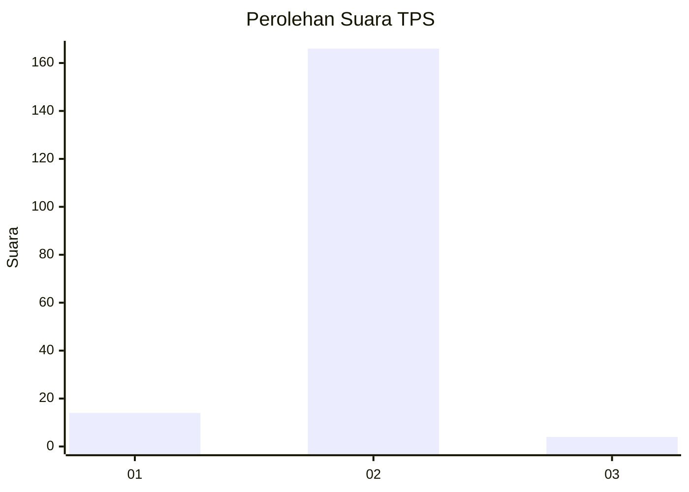
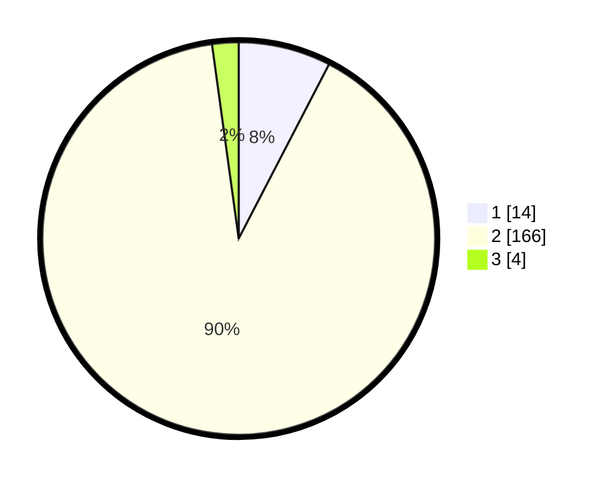

# Hasil

## Grafik

## Tabel

| No. | Nama Paslon    | Suara | Suara (raw) | Persentase |
|:--- |:-------------- | -----:| -----------:| ----------:|
| 1   | ANIES MUHAIMIN | 14    | [14][p-1]   | 7,61       |
| 2   | PRABOWO GIBRAN | 166   | [166][p-2]  | 90,22      |
| 3   | GANJAR MAHFUD  | 4     | [4][p-3]    | 2,17       |

[p-1]: https://github.com/gigit-pemilu/pemilu-2024/blob/main/pilpres/hitung-suara/sub/32-jawa-barat/sub/11-sumedang/sub/01-wado/sub/2001-cimungkal/sub/005-tps/sub/paslon-1.txt
[p-2]: https://github.com/gigit-pemilu/pemilu-2024/blob/main/pilpres/hitung-suara/sub/32-jawa-barat/sub/11-sumedang/sub/01-wado/sub/2001-cimungkal/sub/005-tps/sub/paslon-2.txt
[p-3]: https://github.com/gigit-pemilu/pemilu-2024/blob/main/pilpres/hitung-suara/sub/32-jawa-barat/sub/11-sumedang/sub/01-wado/sub/2001-cimungkal/sub/005-tps/sub/paslon-3.txt

## Foto C Plano

https://sirekap-obj-formc.kpu.go.id/c4f9/pemilu/ppwp/32/11/01/20/01/3211012001005-20240218-155134--a63ca858-a7e9-4e5b-92a7-85a78acf33b3.jpg

https://sirekap-obj-formc.kpu.go.id/c4f9/pemilu/ppwp/32/11/01/20/01/3211012001005-20240218-155224--aa03d567-88fc-4f45-89f9-31507c723275.jpg

https://sirekap-obj-formc.kpu.go.id/c4f9/pemilu/ppwp/32/11/01/20/01/3211012001005-20240218-155307--28197761-9579-48d7-9bfd-ce429db559df.jpg

## Metadata

| Key        | Value               |
| ---------- | ------------------- |
| Time Stamp | 2024-02-19 06:16:00 |

