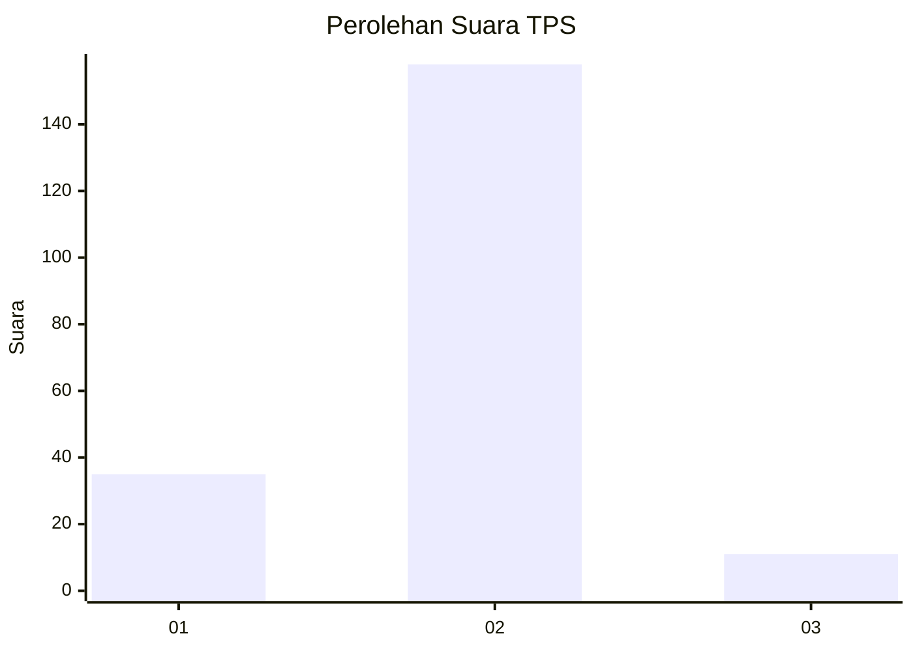
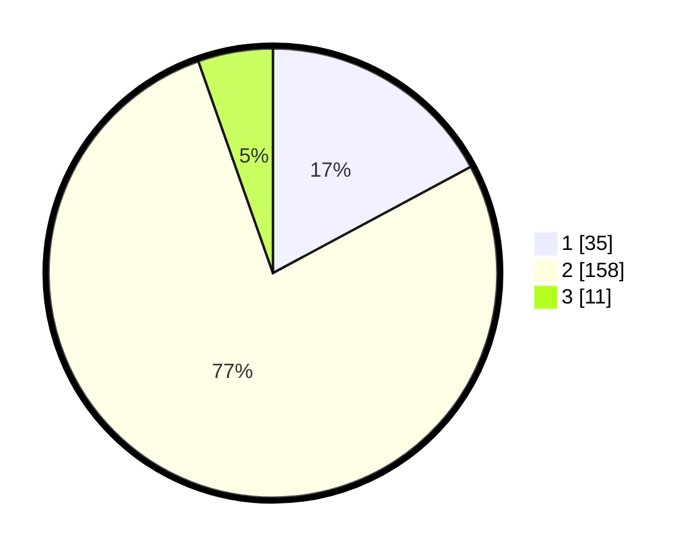

# Hasil

## Grafik

## Tabel

| No. | Nama Paslon    | Suara | Suara (raw) | Persentase |
|:--- |:-------------- | -----:| -----------:| ----------:|
| 1   | ANIES MUHAIMIN | 35    | [35][p-1]   | 17,16      |
| 2   | PRABOWO GIBRAN | 158   | [158][p-2]  | 77,45      |
| 3   | GANJAR MAHFUD  | 11    | [11][p-3]   | 5,39       |

[p-1]: https://github.com/gigit-pemilu/pemilu-2024/blob/main/pilpres/hitung-suara/sub/32-jawa-barat/sub/11-sumedang/sub/01-wado/sub/2001-cimungkal/sub/006-tps/sub/paslon-1.txt
[p-2]: https://github.com/gigit-pemilu/pemilu-2024/blob/main/pilpres/hitung-suara/sub/32-jawa-barat/sub/11-sumedang/sub/01-wado/sub/2001-cimungkal/sub/006-tps/sub/paslon-2.txt
[p-3]: https://github.com/gigit-pemilu/pemilu-2024/blob/main/pilpres/hitung-suara/sub/32-jawa-barat/sub/11-sumedang/sub/01-wado/sub/2001-cimungkal/sub/006-tps/sub/paslon-3.txt

## Foto C Plano

https://sirekap-obj-formc.kpu.go.id/d68b/pemilu/ppwp/32/11/01/20/01/3211012001006-20240218-155014--11bac2e9-605b-4e3c-a2c2-3ed311ea612d.jpg

https://sirekap-obj-formc.kpu.go.id/d68b/pemilu/ppwp/32/11/01/20/01/3211012001006-20240218-155230--fb0b25c6-8f11-44a9-8c7f-155e10eb3776.jpg

https://sirekap-obj-formc.kpu.go.id/d68b/pemilu/ppwp/32/11/01/20/01/3211012001006-20240218-155323--e43c46f6-2c60-4823-b366-0e1c64ce5eb1.jpg

## Metadata

| Key        | Value               |
| ---------- | ------------------- |
| Time Stamp | 2024-02-19 06:16:00 |

