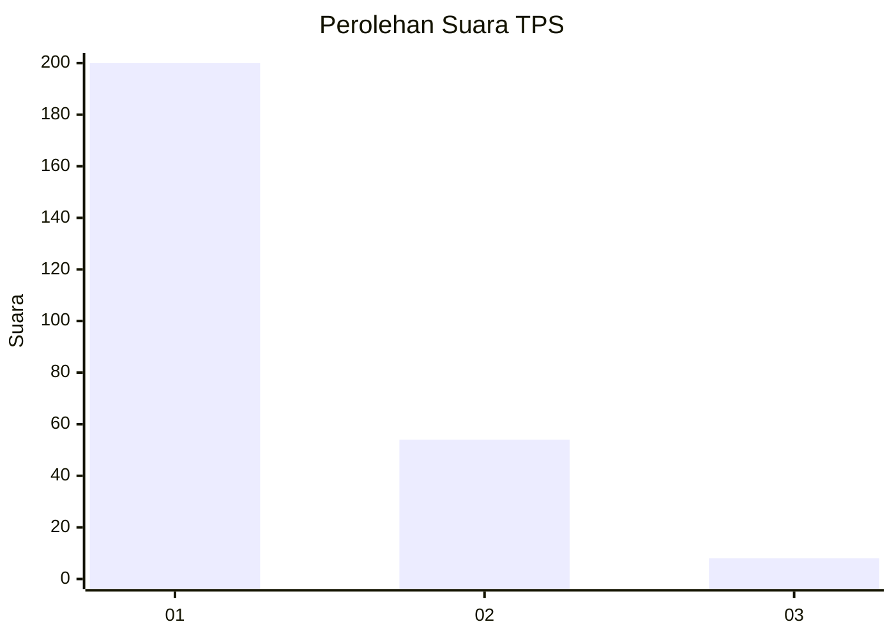
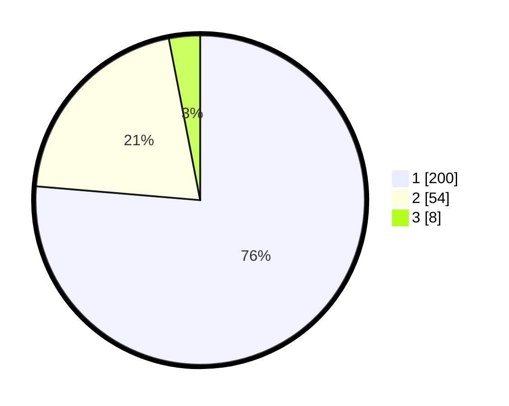

# Hasil

## Grafik

## Tabel

| No. | Nama Paslon    | Suara | Suara (raw) | Persentase |
|:--- |:-------------- | -----:| -----------:| ----------:|
| 1   | ANIES MUHAIMIN | 200   | [200][p-1]  | 76,34      |
| 2   | PRABOWO GIBRAN | 54    | [54][p-2]   | 20,61      |
| 3   | GANJAR MAHFUD  | 8     | [8][p-3]    | 3,05       |

[p-1]: https://github.com/gigit-pemilu/pemilu-2024-32-jawa-barat/blob/main/pilpres/hitung-suara/sub/32-jawa-barat/sub/11-sumedang/sub/01-wado/sub/2002-ganjaresik/sub/010-tps/sub/paslon-1.txt
[p-2]: https://github.com/gigit-pemilu/pemilu-2024-32-jawa-barat/blob/main/pilpres/hitung-suara/sub/32-jawa-barat/sub/11-sumedang/sub/01-wado/sub/2002-ganjaresik/sub/010-tps/sub/paslon-2.txt
[p-3]: https://github.com/gigit-pemilu/pemilu-2024-32-jawa-barat/blob/main/pilpres/hitung-suara/sub/32-jawa-barat/sub/11-sumedang/sub/01-wado/sub/2002-ganjaresik/sub/010-tps/sub/paslon-3.txt

## Foto C Plano

https://sirekap-obj-formc.kpu.go.id/b1a6/pemilu/ppwp/32/11/01/20/02/3211012002010-20240214-195846--cebcb4ae-0a3a-45fc-99c1-3ba1ea46fa09.jpg

https://sirekap-obj-formc.kpu.go.id/b1a6/pemilu/ppwp/32/11/01/20/02/3211012002010-20240214-200135--57c30d50-79ce-4941-b00c-89be08f576d1.jpg

https://sirekap-obj-formc.kpu.go.id/b1a6/pemilu/ppwp/32/11/01/20/02/3211012002010-20240214-200511--a4136828-bae9-4ec3-b281-dff72d3e692a.jpg

## Metadata

| Key        | Value               |
| ---------- | ------------------- |
| Time Stamp | 2024-02-19 06:16:00 |

