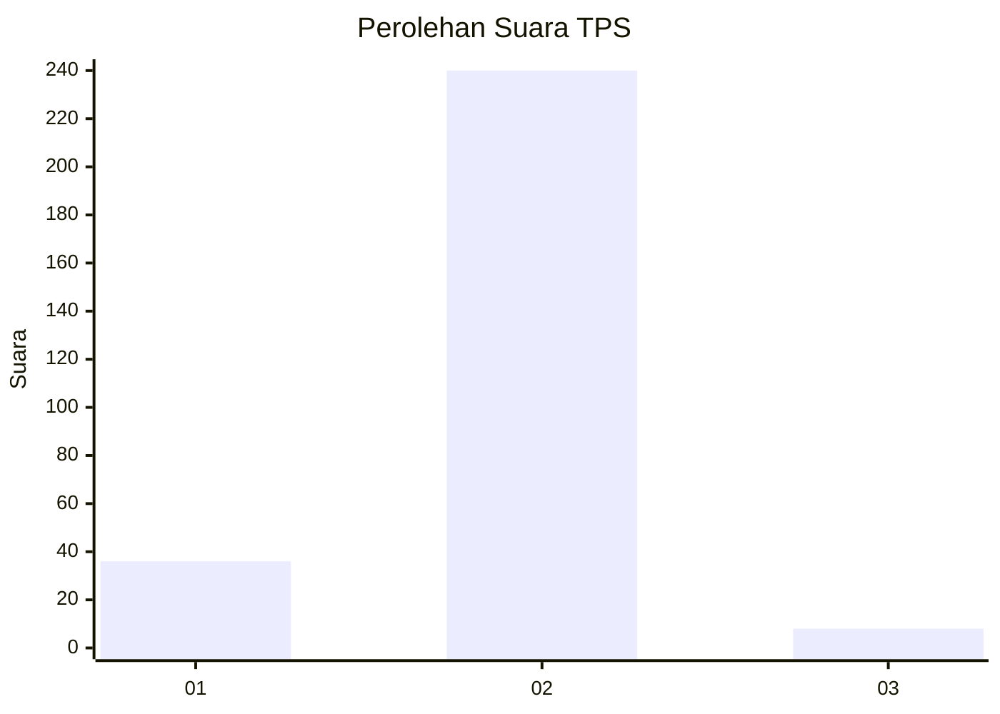
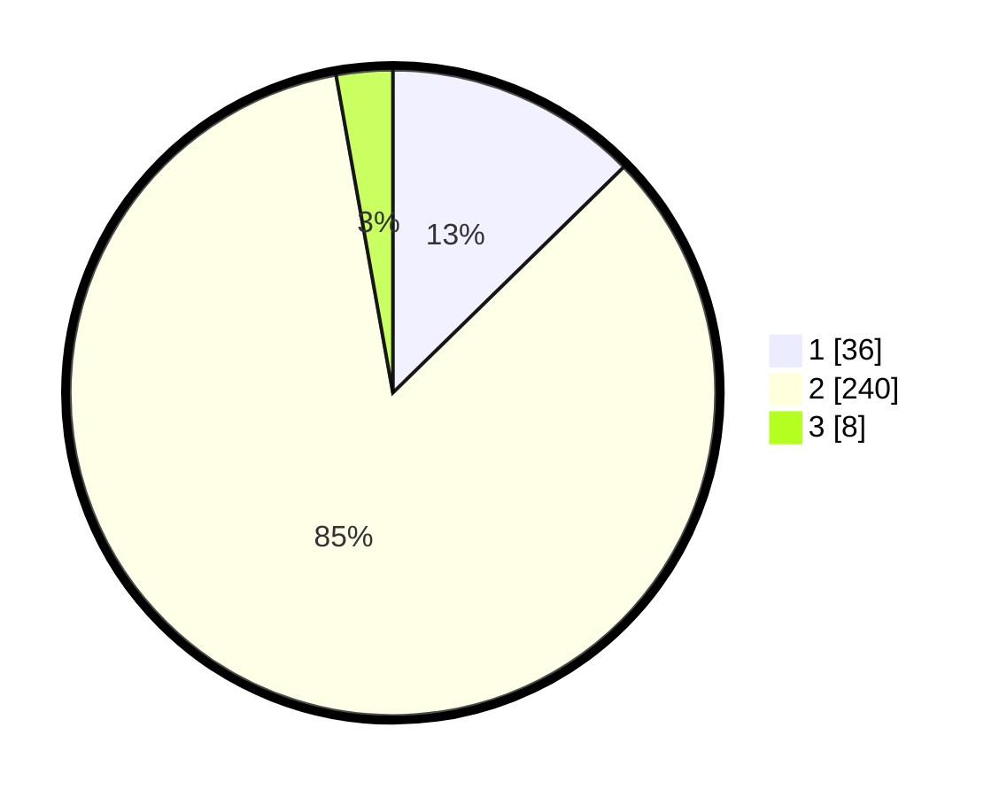

# Hasil

## Grafik

## Tabel

| No. | Nama Paslon    | Suara | Suara (raw) | Persentase |
|:--- |:-------------- | -----:| -----------:| ----------:|
| 1   | ANIES MUHAIMIN | 36    | [36][p-1]   | 12,68      |
| 2   | PRABOWO GIBRAN | 240   | [240][p-2]  | 84,51      |
| 3   | GANJAR MAHFUD  | 8     | [8][p-3]    | 2,82       |

[p-1]: https://github.com/gigit-pemilu/pemilu-2024/blob/main/pilpres/hitung-suara/sub/32-jawa-barat/sub/11-sumedang/sub/01-wado/sub/2003-cilengkrang/sub/007-tps/sub/paslon-1.txt
[p-2]: https://github.com/gigit-pemilu/pemilu-2024/blob/main/pilpres/hitung-suara/sub/32-jawa-barat/sub/11-sumedang/sub/01-wado/sub/2003-cilengkrang/sub/007-tps/sub/paslon-2.txt
[p-3]: https://github.com/gigit-pemilu/pemilu-2024/blob/main/pilpres/hitung-suara/sub/32-jawa-barat/sub/11-sumedang/sub/01-wado/sub/2003-cilengkrang/sub/007-tps/sub/paslon-3.txt

## Foto C Plano

https://sirekap-obj-formc.kpu.go.id/d84d/pemilu/ppwp/32/11/01/20/03/3211012003007-20240218-172632--44d9abe6-5b1d-4185-b2dc-7ee7f12dde78.jpg

https://sirekap-obj-formc.kpu.go.id/d84d/pemilu/ppwp/32/11/01/20/03/3211012003007-20240218-172706--2f2258df-797a-4aec-8b64-9d4812ba8d97.jpg

https://sirekap-obj-formc.kpu.go.id/d84d/pemilu/ppwp/32/11/01/20/03/3211012003007-20240218-172746--5aea7645-dfd5-42f3-b08e-7f777c6483c1.jpg

## Metadata

| Key        | Value               |
| ---------- | ------------------- |
| Time Stamp | 2024-02-19 06:16:00 |

