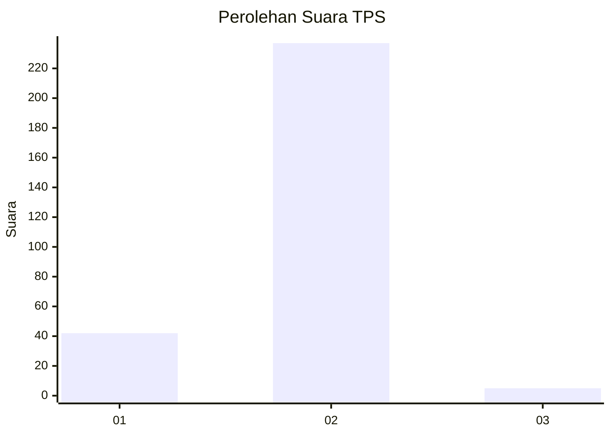
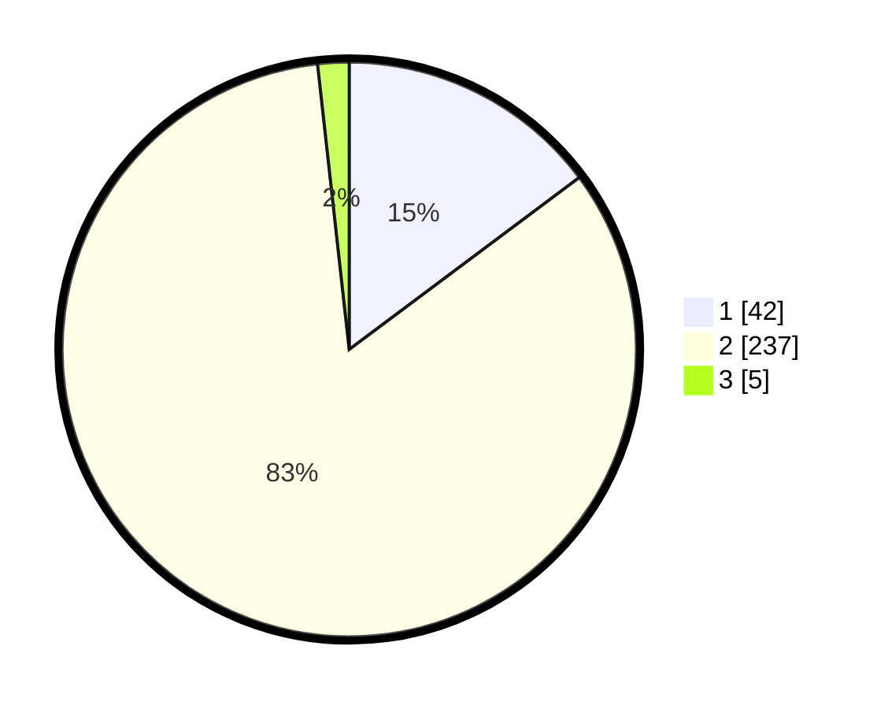

# Hasil

## Grafik

## Tabel

| No. | Nama Paslon    | Suara | Suara (raw) | Persentase |
|:--- |:-------------- | -----:| -----------:| ----------:|
| 1   | ANIES MUHAIMIN | 42    | [42][p-1]   | 14,79      |
| 2   | PRABOWO GIBRAN | 237   | [237][p-2]  | 83,45      |
| 3   | GANJAR MAHFUD  | 5     | [5][p-3]    | 1,76       |

[p-1]: https://github.com/gigit-pemilu/pemilu-2024-32-jawa-barat/blob/main/pilpres/hitung-suara/sub/32-jawa-barat/sub/11-sumedang/sub/01-wado/sub/2003-cilengkrang/sub/008-tps/sub/paslon-1.txt
[p-2]: https://github.com/gigit-pemilu/pemilu-2024-32-jawa-barat/blob/main/pilpres/hitung-suara/sub/32-jawa-barat/sub/11-sumedang/sub/01-wado/sub/2003-cilengkrang/sub/008-tps/sub/paslon-2.txt
[p-3]: https://github.com/gigit-pemilu/pemilu-2024-32-jawa-barat/blob/main/pilpres/hitung-suara/sub/32-jawa-barat/sub/11-sumedang/sub/01-wado/sub/2003-cilengkrang/sub/008-tps/sub/paslon-3.txt

## Foto C Plano

https://sirekap-obj-formc.kpu.go.id/8edc/pemilu/ppwp/32/11/01/20/03/3211012003008-20240218-173418--377faf50-c0d8-4de8-91dc-4baa70c97efa.jpg

https://sirekap-obj-formc.kpu.go.id/8edc/pemilu/ppwp/32/11/01/20/03/3211012003008-20240218-173539--c3f36696-ae9c-4305-ab00-a779f9136527.jpg

https://sirekap-obj-formc.kpu.go.id/8edc/pemilu/ppwp/32/11/01/20/03/3211012003008-20240218-173632--1f5d5609-a35d-4ea0-ae50-4229ce4f76c7.jpg

## Metadata

| Key        | Value               |
| ---------- | ------------------- |
| Time Stamp | 2024-02-19 06:16:00 |

