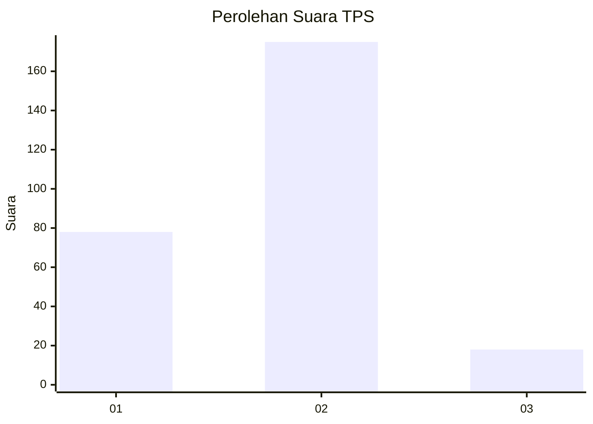
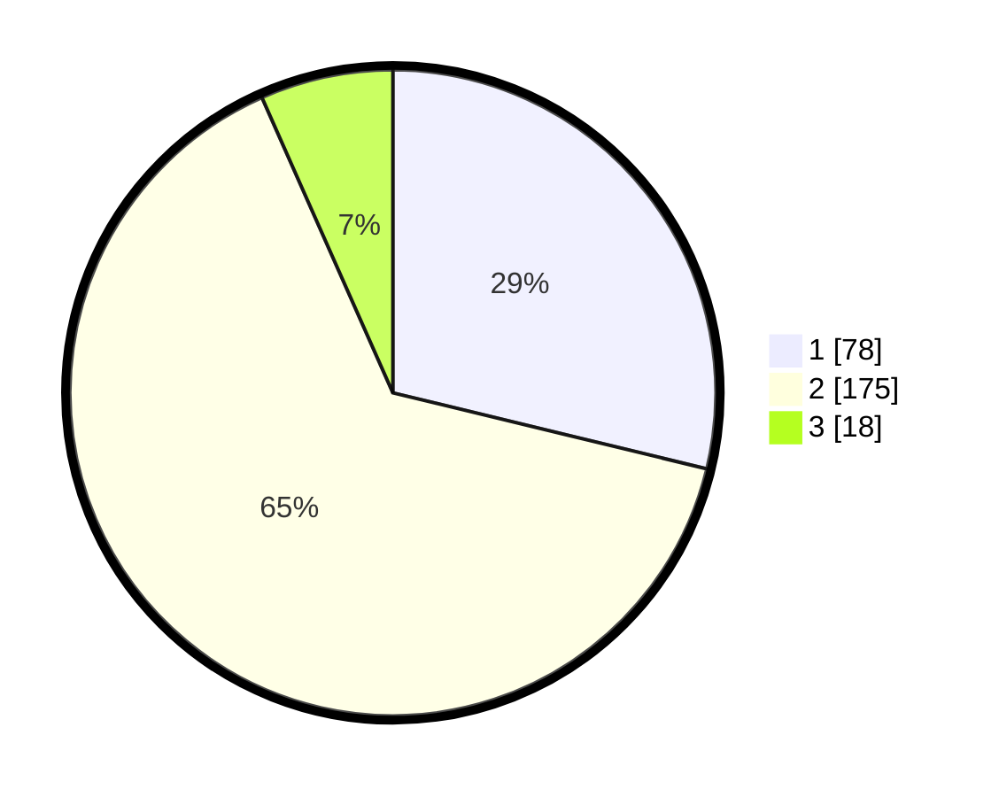

# Hasil

## Grafik

## Tabel

| No. | Nama Paslon    | Suara | Suara (raw) | Persentase |
|:--- |:-------------- | -----:| -----------:| ----------:|
| 1   | ANIES MUHAIMIN | 78    | [78][p-1]   | 28,78      |
| 2   | PRABOWO GIBRAN | 175   | [175][p-2]  | 64,58      |
| 3   | GANJAR MAHFUD  | 18    | [18][p-3]   | 6,64       |

[p-1]: https://github.com/gigit-pemilu/pemilu-2024/blob/main/pilpres/hitung-suara/sub/32-jawa-barat/sub/11-sumedang/sub/01-wado/sub/2009-sukajadi/sub/009-tps/sub/paslon-1.txt
[p-2]: https://github.com/gigit-pemilu/pemilu-2024/blob/main/pilpres/hitung-suara/sub/32-jawa-barat/sub/11-sumedang/sub/01-wado/sub/2009-sukajadi/sub/009-tps/sub/paslon-2.txt
[p-3]: https://github.com/gigit-pemilu/pemilu-2024/blob/main/pilpres/hitung-suara/sub/32-jawa-barat/sub/11-sumedang/sub/01-wado/sub/2009-sukajadi/sub/009-tps/sub/paslon-3.txt

## Foto C Plano

https://sirekap-obj-formc.kpu.go.id/6444/pemilu/ppwp/32/11/01/20/09/3211012009009-20240218-162024--832f968e-d590-4c3d-8963-f5cfb8768a78.jpg

https://sirekap-obj-formc.kpu.go.id/6444/pemilu/ppwp/32/11/01/20/09/3211012009009-20240218-162202--ba7e48f7-4fb4-4503-a07c-de8e2633e6bc.jpg

https://sirekap-obj-formc.kpu.go.id/6444/pemilu/ppwp/32/11/01/20/09/3211012009009-20240218-162303--8cfb5490-7d93-41d5-b805-fc67bce7b3eb.jpg

## Metadata

| Key        | Value               |
| ---------- | ------------------- |
| Time Stamp | 2024-02-19 06:16:00 |

