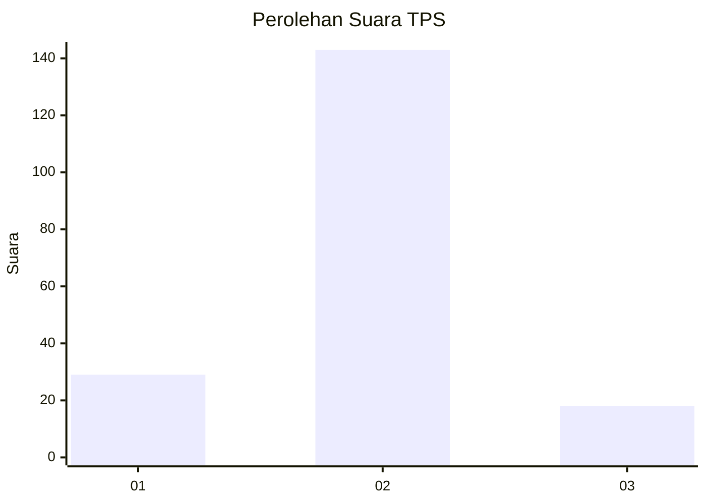
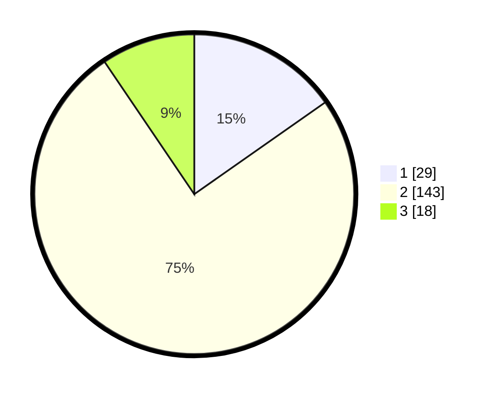

# Hasil

## Grafik

## Tabel

| No. | Nama Paslon    | Suara | Suara (raw) | Persentase |
|:--- |:-------------- | -----:| -----------:| ----------:|
| 1   | ANIES MUHAIMIN | 29    | [29][p-1]   | 15,26      |
| 2   | PRABOWO GIBRAN | 143   | [143][p-2]  | 75,26      |
| 3   | GANJAR MAHFUD  | 18    | [18][p-3]   | 9,47       |

[p-1]: https://github.com/gigit-pemilu/pemilu-2024-32-jawa-barat/blob/main/pilpres/hitung-suara/sub/32-jawa-barat/sub/11-sumedang/sub/03-darmaraja/sub/2005-sukaratu/sub/009-tps/sub/paslon-1.txt
[p-2]: https://github.com/gigit-pemilu/pemilu-2024-32-jawa-barat/blob/main/pilpres/hitung-suara/sub/32-jawa-barat/sub/11-sumedang/sub/03-darmaraja/sub/2005-sukaratu/sub/009-tps/sub/paslon-2.txt
[p-3]: https://github.com/gigit-pemilu/pemilu-2024-32-jawa-barat/blob/main/pilpres/hitung-suara/sub/32-jawa-barat/sub/11-sumedang/sub/03-darmaraja/sub/2005-sukaratu/sub/009-tps/sub/paslon-3.txt

## Foto C Plano

https://sirekap-obj-formc.kpu.go.id/a144/pemilu/ppwp/32/11/03/20/05/3211032005009-20240218-114122--b59d2727-f848-41a3-89ac-2348a27a84e4.jpg

https://sirekap-obj-formc.kpu.go.id/a144/pemilu/ppwp/32/11/03/20/05/3211032005009-20240218-114050--64d9aa0b-9d99-49fb-821e-22763fd55c0b.jpg

https://sirekap-obj-formc.kpu.go.id/a144/pemilu/ppwp/32/11/03/20/05/3211032005009-20240218-114152--65aaf42f-cdc3-4776-b183-854c900ae052.jpg

## Metadata

| Key        | Value               |
| ---------- | ------------------- |
| Time Stamp | 2024-02-19 12:00:00 |

## DATA PEMILIH TETAP

Jumlah pemilih dalam DPT: **156**.
 * L: **128**.
 * P: **823**.

## DATA PENGGUNA HAK PILIH

Jumlah pengguna hak pilih dalam DPT: **106**.
 * L: **891**.
 * P: **195**.

Jumlah pengguna hak pilih dalam DPTb: **450**.
 * L: **400**.
 * P: **4**.

Jumlah pengguna hak pilih dalam DPK: **87**.
 * L: **88**.
 * P: **840**.

Jumlah pengguna hak pilih: **102**.
 * L: **891**.
 * P: **105**.

## JUMLAH SUARA SAH DAN TIDAK SAH

JUMLAH SELURUH SUARA SAH: **190**.

JUMLAH SUARA TIDAK SAH: **6**.

JUMLAH SELURUH SUARA SAH DAN SUARA TIDAK SAH: **196**.

