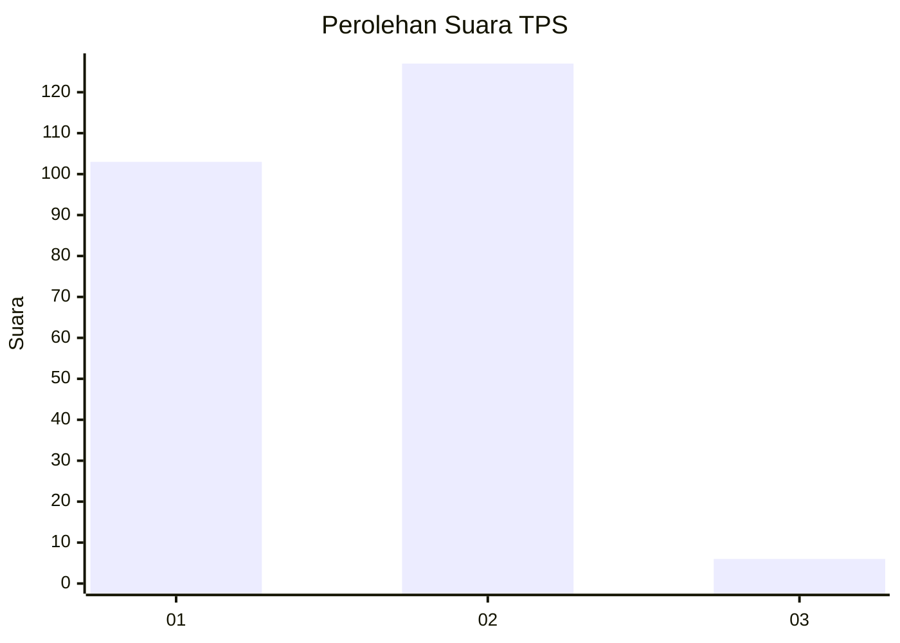
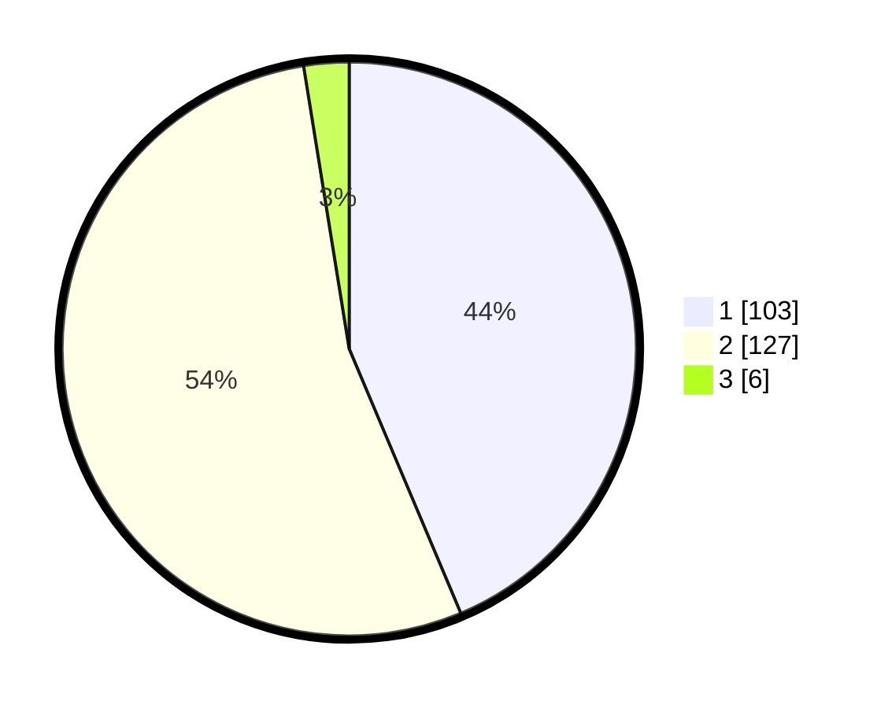

# Hasil

## Grafik

## Tabel

| No. | Nama Paslon    | Suara | Suara (raw) | Persentase |
|:--- |:-------------- | -----:| -----------:| ----------:|
| 1   | ANIES MUHAIMIN | 103   | [103][p-1]  | 43,64      |
| 2   | PRABOWO GIBRAN | 127   | [127][p-2]  | 53,81      |
| 3   | GANJAR MAHFUD  | 6     | [6][p-3]    | 2,54       |

[p-1]: https://github.com/gigit-pemilu/pemilu-2024-32-jawa-barat/blob/main/pilpres/hitung-suara/sub/32-jawa-barat/sub/11-sumedang/sub/04-cibugel/sub/2001-jayamekar/sub/002-tps/sub/paslon-1.txt
[p-2]: https://github.com/gigit-pemilu/pemilu-2024-32-jawa-barat/blob/main/pilpres/hitung-suara/sub/32-jawa-barat/sub/11-sumedang/sub/04-cibugel/sub/2001-jayamekar/sub/002-tps/sub/paslon-2.txt
[p-3]: https://github.com/gigit-pemilu/pemilu-2024-32-jawa-barat/blob/main/pilpres/hitung-suara/sub/32-jawa-barat/sub/11-sumedang/sub/04-cibugel/sub/2001-jayamekar/sub/002-tps/sub/paslon-3.txt

## Foto C Plano

https://sirekap-obj-formc.kpu.go.id/209b/pemilu/ppwp/32/11/04/20/01/3211042001002-20240215-102113--0a8dcc5f-cf29-480b-8981-e6c319b26e5e.jpg

https://sirekap-obj-formc.kpu.go.id/209b/pemilu/ppwp/32/11/04/20/01/3211042001002-20240217-104910--44db3109-6625-4dc3-9562-e5da9cdcb6a5.jpg

https://sirekap-obj-formc.kpu.go.id/209b/pemilu/ppwp/32/11/04/20/01/3211042001002-20240215-010931--9fb34079-1c61-4bce-816e-73cc5b09940c.jpg

## Metadata

| Key        | Value               |
| ---------- | ------------------- |
| Time Stamp | 2024-02-19 06:16:00 |

