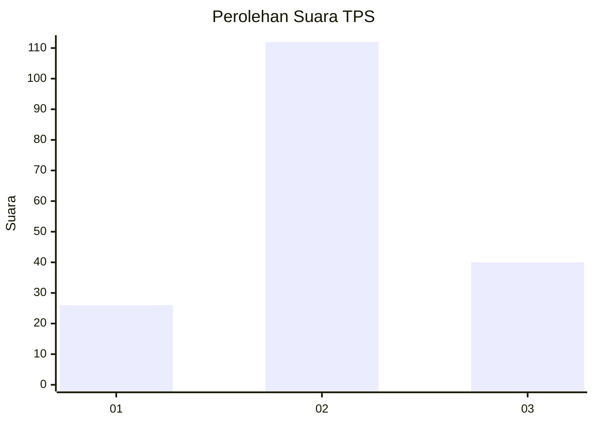
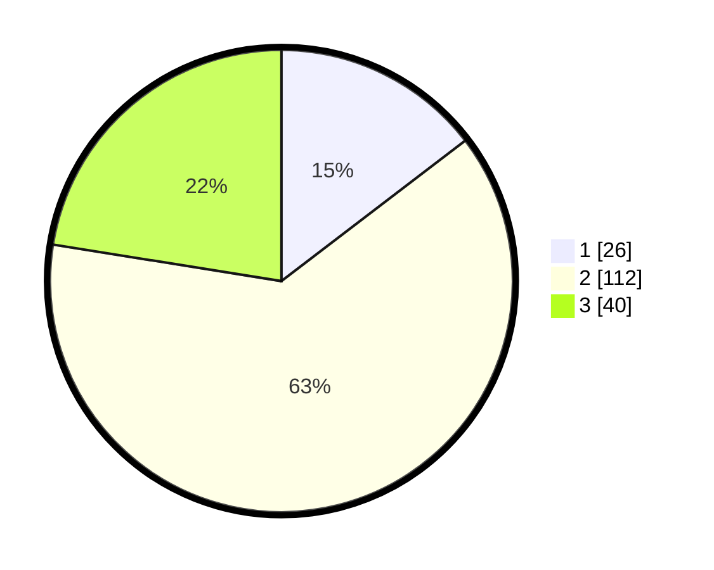

# Hasil

## Grafik

## Tabel

| No. | Nama Paslon    | Suara | Suara (raw) | Persentase |
|:--- |:-------------- | -----:| -----------:| ----------:|
| 1   | ANIES MUHAIMIN | 26    | [26][p-1]   | 14,61      |
| 2   | PRABOWO GIBRAN | 112   | [112][p-2]  | 62,92      |
| 3   | GANJAR MAHFUD  | 40    | [40][p-3]   | 22,47      |

[p-1]: https://github.com/gigit-pemilu/pemilu-2024/blob/main/pilpres/hitung-suara/sub/32-jawa-barat/sub/11-sumedang/sub/05-cisitu/sub/2001-cisitu/sub/002-tps/sub/paslon-1.txt
[p-2]: https://github.com/gigit-pemilu/pemilu-2024/blob/main/pilpres/hitung-suara/sub/32-jawa-barat/sub/11-sumedang/sub/05-cisitu/sub/2001-cisitu/sub/002-tps/sub/paslon-2.txt
[p-3]: https://github.com/gigit-pemilu/pemilu-2024/blob/main/pilpres/hitung-suara/sub/32-jawa-barat/sub/11-sumedang/sub/05-cisitu/sub/2001-cisitu/sub/002-tps/sub/paslon-3.txt

## Foto C Plano

https://sirekap-obj-formc.kpu.go.id/7ed5/pemilu/ppwp/32/11/05/20/01/3211052001002-20240218-103307--5d419049-eef0-44be-ab07-27e3fbec1839.jpg

https://sirekap-obj-formc.kpu.go.id/7ed5/pemilu/ppwp/32/11/05/20/01/3211052001002-20240218-103237--73f0a82e-b223-496e-bdc2-1f754450250e.jpg

https://sirekap-obj-formc.kpu.go.id/7ed5/pemilu/ppwp/32/11/05/20/01/3211052001002-20240218-103037--291eec9f-551a-420a-bc07-20fe8352efa1.jpg

## Metadata

| Key        | Value               |
| ---------- | ------------------- |
| Time Stamp | 2024-02-19 06:16:00 |

## DATA PEMILIH TETAP

Jumlah pemilih dalam DPT: **0**.
 * L: **0**.
 * P: **0**.

## DATA PENGGUNA HAK PILIH

Jumlah pengguna hak pilih dalam DPT: **0**.
 * L: **5**.
 * P: **0**.

Jumlah pengguna hak pilih dalam DPTb: **0**.
 * L: **24**.
 * P: **0**.

Jumlah pengguna hak pilih dalam DPK: **800**.
 * L: **554**.
 * P: **951**.

Jumlah pengguna hak pilih: **0**.
 * L: **0**.
 * P: **0**.

## JUMLAH SUARA SAH DAN TIDAK SAH

JUMLAH SELURUH SUARA SAH: **177**.

JUMLAH SUARA TIDAK SAH: **2**.

JUMLAH SELURUH SUARA SAH DAN SUARA TIDAK SAH: **180**.

