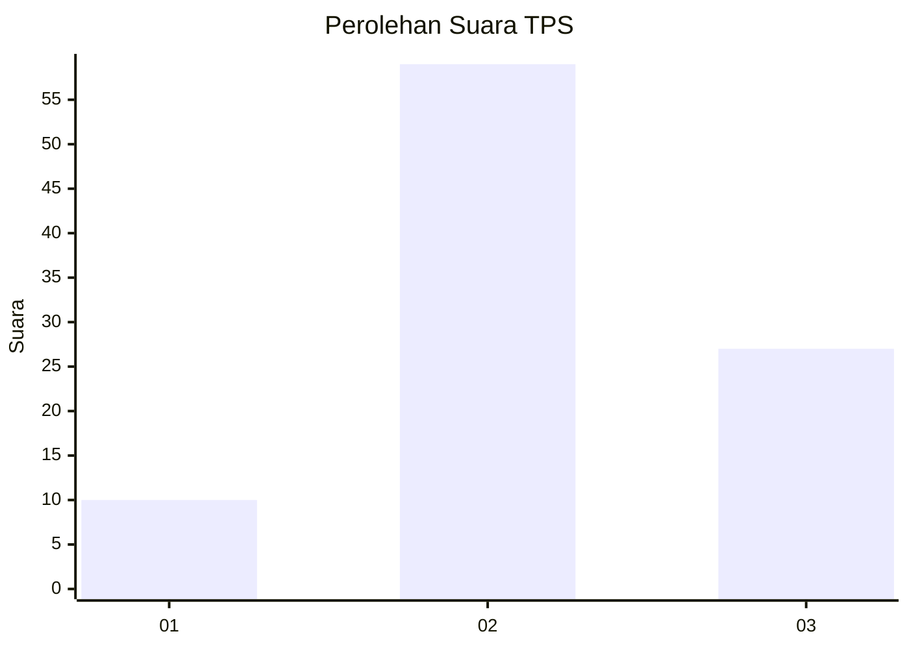
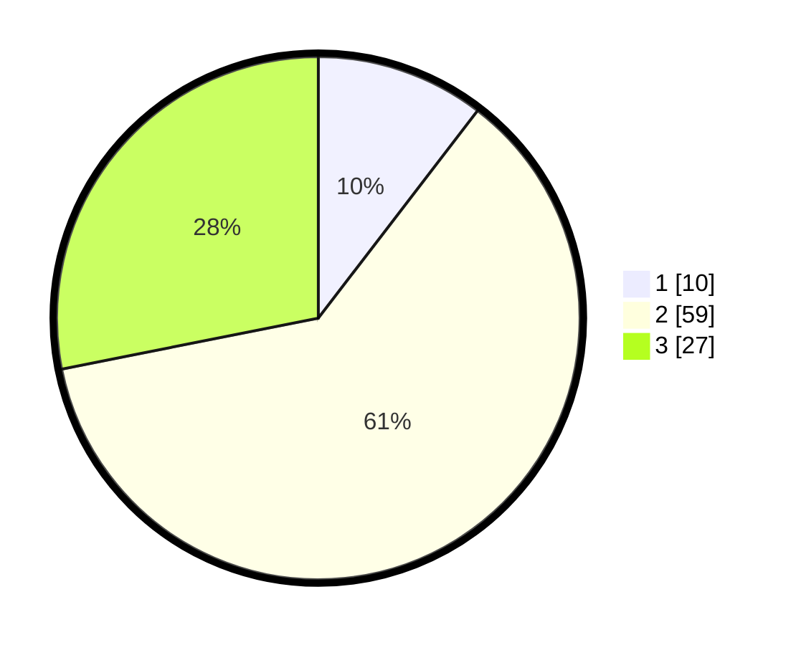

# Hasil

## Grafik

## Tabel

| No. | Nama Paslon    | Suara | Suara (raw) | Persentase |
|:--- |:-------------- | -----:| -----------:| ----------:|
| 1   | ANIES MUHAIMIN | 10    | [10][p-1]   | 10,42      |
| 2   | PRABOWO GIBRAN | 59    | [59][p-2]   | 61,46      |
| 3   | GANJAR MAHFUD  | 27    | [27][p-3]   | 28,13      |

[p-1]: https://github.com/gigit-pemilu/pemilu-2024-32-jawa-barat/blob/main/pilpres/hitung-suara/sub/32-jawa-barat/sub/11-sumedang/sub/08-paseh/sub/2006-padanaan/sub/002-tps/sub/paslon-1.txt
[p-2]: https://github.com/gigit-pemilu/pemilu-2024-32-jawa-barat/blob/main/pilpres/hitung-suara/sub/32-jawa-barat/sub/11-sumedang/sub/08-paseh/sub/2006-padanaan/sub/002-tps/sub/paslon-2.txt
[p-3]: https://github.com/gigit-pemilu/pemilu-2024-32-jawa-barat/blob/main/pilpres/hitung-suara/sub/32-jawa-barat/sub/11-sumedang/sub/08-paseh/sub/2006-padanaan/sub/002-tps/sub/paslon-3.txt

## Foto C Plano

https://sirekap-obj-formc.kpu.go.id/ce2b/pemilu/ppwp/32/11/08/20/06/3211082006002-20240214-232220--cc9f6487-c916-496d-8786-89466d76c756.jpg

https://sirekap-obj-formc.kpu.go.id/ce2b/pemilu/ppwp/32/11/08/20/06/3211082006002-20240214-233243--d6f8cd37-66eb-49b1-bbb2-07bc7561ad22.jpg

https://sirekap-obj-formc.kpu.go.id/ce2b/pemilu/ppwp/32/11/08/20/06/3211082006002-20240215-143906--daa19e3b-0488-43ce-9693-f8526a7dc07c.jpg

## Metadata

| Key        | Value               |
| ---------- | ------------------- |
| Time Stamp | 2024-02-15 15:00:29 |

