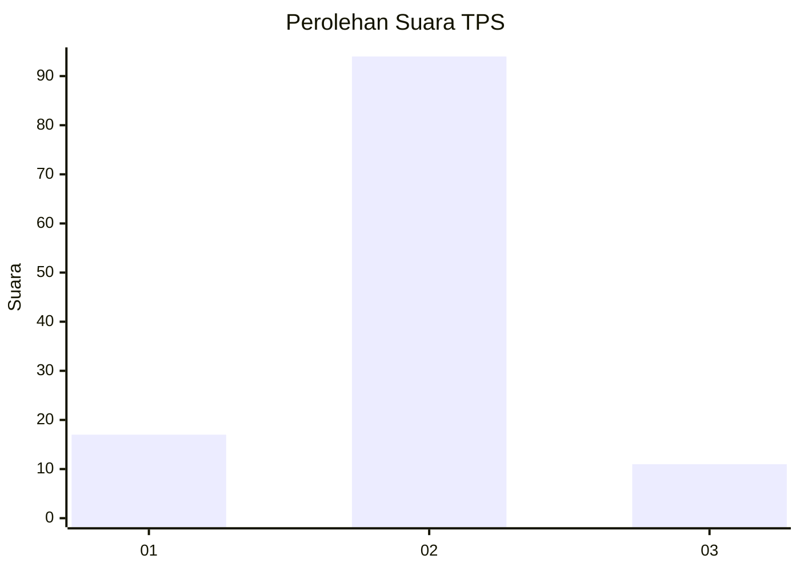
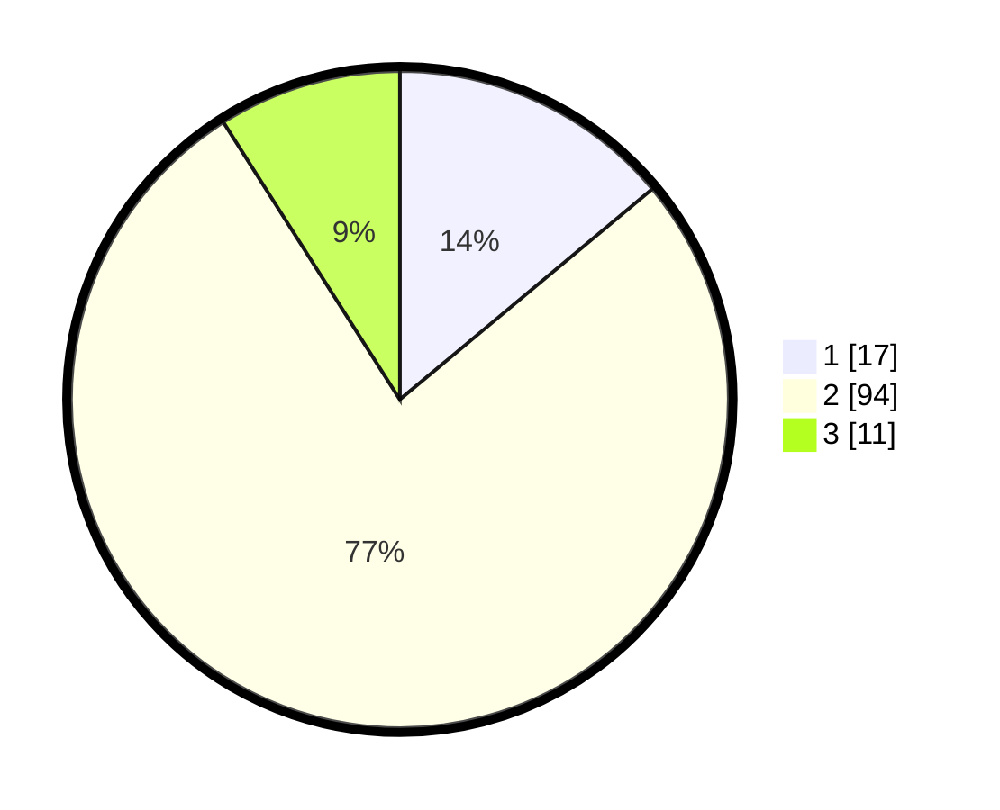

# Hasil

## Grafik

## Tabel

| No. | Nama Paslon    | Suara | Suara (raw) | Persentase |
|:--- |:-------------- | -----:| -----------:| ----------:|
| 1   | ANIES MUHAIMIN | 17    | [17][p-1]   | 13,93      |
| 2   | PRABOWO GIBRAN | 94    | [94][p-2]   | 77,05      |
| 3   | GANJAR MAHFUD  | 11    | [11][p-3]   | 9,02       |

[p-1]: https://github.com/gigit-pemilu/pemilu-2024-32-jawa-barat/blob/main/pilpres/hitung-suara/sub/32-jawa-barat/sub/11-sumedang/sub/09-surian/sub/2001-wanasari/sub/001-tps/sub/paslon-1.txt
[p-2]: https://github.com/gigit-pemilu/pemilu-2024-32-jawa-barat/blob/main/pilpres/hitung-suara/sub/32-jawa-barat/sub/11-sumedang/sub/09-surian/sub/2001-wanasari/sub/001-tps/sub/paslon-2.txt
[p-3]: https://github.com/gigit-pemilu/pemilu-2024-32-jawa-barat/blob/main/pilpres/hitung-suara/sub/32-jawa-barat/sub/11-sumedang/sub/09-surian/sub/2001-wanasari/sub/001-tps/sub/paslon-3.txt

## Foto C Plano

https://sirekap-obj-formc.kpu.go.id/f1aa/pemilu/ppwp/32/11/09/20/01/3211092001001-20240215-032133--64fd162a-b85c-4675-a08a-8ff5bf7d3c8c.jpg

https://sirekap-obj-formc.kpu.go.id/f1aa/pemilu/ppwp/32/11/09/20/01/3211092001001-20240215-032248--7e13637f-e64b-4a7d-8206-689ff1afe057.jpg

https://sirekap-obj-formc.kpu.go.id/f1aa/pemilu/ppwp/32/11/09/20/01/3211092001001-20240215-032354--a5b6342a-e035-413d-a3ce-53db6247fa84.jpg

## Metadata

| Key        | Value               |
| ---------- | ------------------- |
| Time Stamp | 2024-02-19 06:16:00 |

