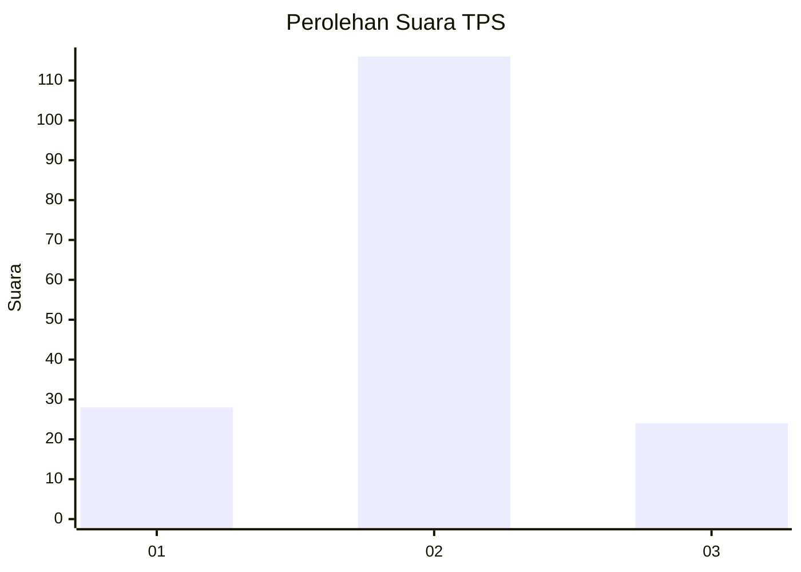
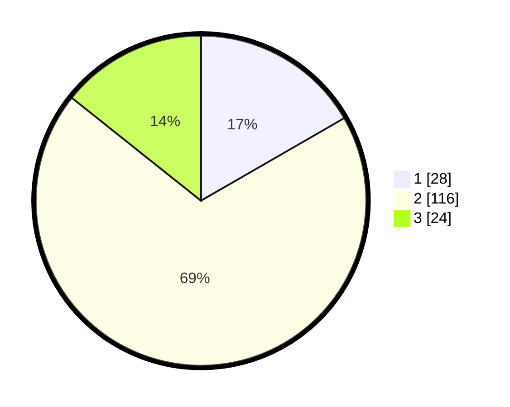

# Hasil

## Grafik

## Tabel

| No. | Nama Paslon    | Suara | Suara (raw) | Persentase |
|:--- |:-------------- | -----:| -----------:| ----------:|
| 1   | ANIES MUHAIMIN | 28    | [28][p-1]   | 16,67      |
| 2   | PRABOWO GIBRAN | 116   | [116][p-2]  | 69,05      |
| 3   | GANJAR MAHFUD  | 24    | [24][p-3]   | 14,29      |

[p-1]: https://github.com/gigit-pemilu/pemilu-2024/blob/main/pilpres/hitung-suara/sub/32-jawa-barat/sub/11-sumedang/sub/09-surian/sub/2002-wanajaya/sub/002-tps/sub/paslon-1.txt
[p-2]: https://github.com/gigit-pemilu/pemilu-2024/blob/main/pilpres/hitung-suara/sub/32-jawa-barat/sub/11-sumedang/sub/09-surian/sub/2002-wanajaya/sub/002-tps/sub/paslon-2.txt
[p-3]: https://github.com/gigit-pemilu/pemilu-2024/blob/main/pilpres/hitung-suara/sub/32-jawa-barat/sub/11-sumedang/sub/09-surian/sub/2002-wanajaya/sub/002-tps/sub/paslon-3.txt

## Foto C Plano

https://sirekap-obj-formc.kpu.go.id/d5a7/pemilu/ppwp/32/11/09/20/02/3211092002002-20240214-141144--b46e868a-23fe-45dc-bd4b-3d8d153dc124.jpg

https://sirekap-obj-formc.kpu.go.id/d5a7/pemilu/ppwp/32/11/09/20/02/3211092002002-20240214-141535--39a14fa7-3d16-4b9b-a8dc-f578e750139b.jpg

https://sirekap-obj-formc.kpu.go.id/d5a7/pemilu/ppwp/32/11/09/20/02/3211092002002-20240214-141723--8de13102-8adc-4ef1-ac1b-686c52fa4feb.jpg

## Metadata

| Key        | Value               |
| ---------- | ------------------- |
| Time Stamp | 2024-02-14 21:46:01 |

