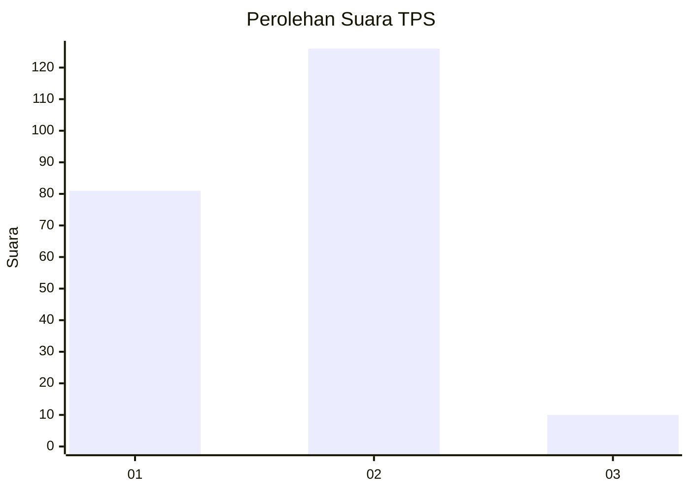
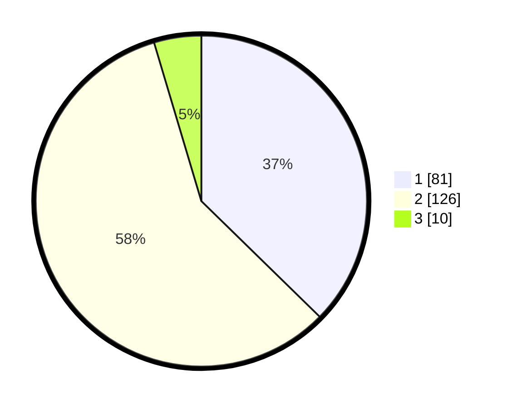

# Hasil

## Grafik

## Tabel

| No. | Nama Paslon    | Suara | Suara (raw) | Persentase |
|:--- |:-------------- | -----:| -----------:| ----------:|
| 1   | ANIES MUHAIMIN | 81    | [81][p-1]   | 37,33      |
| 2   | PRABOWO GIBRAN | 126   | [126][p-2]  | 58,06      |
| 3   | GANJAR MAHFUD  | 10    | [10][p-3]   | 4,61       |

[p-1]: https://github.com/gigit-pemilu/pemilu-2024/blob/main/pilpres/hitung-suara/sub/32-jawa-barat/sub/11-sumedang/sub/11-tanjungsari/sub/2001-gudang/sub/002-tps/sub/paslon-1.txt
[p-2]: https://github.com/gigit-pemilu/pemilu-2024/blob/main/pilpres/hitung-suara/sub/32-jawa-barat/sub/11-sumedang/sub/11-tanjungsari/sub/2001-gudang/sub/002-tps/sub/paslon-2.txt
[p-3]: https://github.com/gigit-pemilu/pemilu-2024/blob/main/pilpres/hitung-suara/sub/32-jawa-barat/sub/11-sumedang/sub/11-tanjungsari/sub/2001-gudang/sub/002-tps/sub/paslon-3.txt

## Foto C Plano

https://sirekap-obj-formc.kpu.go.id/3a11/pemilu/ppwp/32/11/11/20/01/3211112001002-20240218-114924--c3a08708-2534-4271-b9a7-54ed9067fd85.jpg

https://sirekap-obj-formc.kpu.go.id/3a11/pemilu/ppwp/32/11/11/20/01/3211112001002-20240218-115114--e48d84af-3fd5-4e43-b3a4-63f6732ce7c7.jpg

https://sirekap-obj-formc.kpu.go.id/3a11/pemilu/ppwp/32/11/11/20/01/3211112001002-20240218-115150--f736fad8-95e0-49f9-910c-cfce91b2373d.jpg

## Metadata

| Key        | Value               |
| ---------- | ------------------- |
| Time Stamp | 2024-02-19 06:16:00 |

