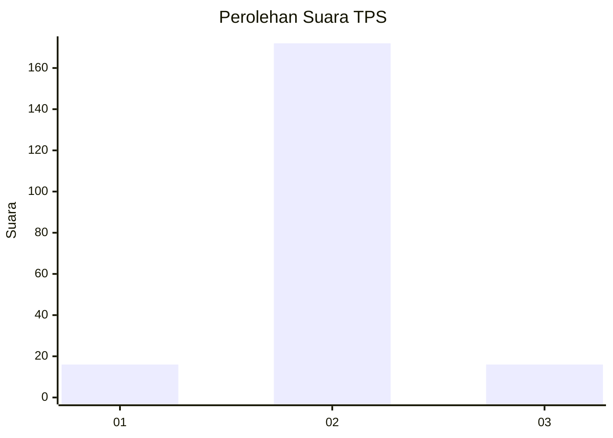
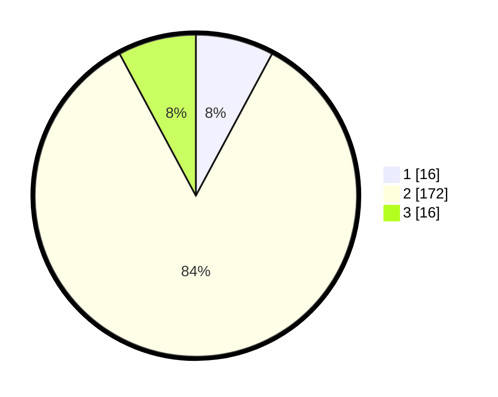

# Hasil

## Grafik

## Tabel

| No. | Nama Paslon    | Suara | Suara (raw) | Persentase |
|:--- |:-------------- | -----:| -----------:| ----------:|
| 1   | ANIES MUHAIMIN | 16    | [16][p-1]   | 7,84       |
| 2   | PRABOWO GIBRAN | 172   | [172][p-2]  | 84,31      |
| 3   | GANJAR MAHFUD  | 16    | [16][p-3]   | 7,84       |

[p-1]: https://github.com/gigit-pemilu/pemilu-2024-32-jawa-barat/blob/main/pilpres/hitung-suara/sub/32-jawa-barat/sub/11-sumedang/sub/11-tanjungsari/sub/2001-gudang/sub/003-tps/sub/paslon-1.txt
[p-2]: https://github.com/gigit-pemilu/pemilu-2024-32-jawa-barat/blob/main/pilpres/hitung-suara/sub/32-jawa-barat/sub/11-sumedang/sub/11-tanjungsari/sub/2001-gudang/sub/003-tps/sub/paslon-2.txt
[p-3]: https://github.com/gigit-pemilu/pemilu-2024-32-jawa-barat/blob/main/pilpres/hitung-suara/sub/32-jawa-barat/sub/11-sumedang/sub/11-tanjungsari/sub/2001-gudang/sub/003-tps/sub/paslon-3.txt

## Foto C Plano

https://sirekap-obj-formc.kpu.go.id/6230/pemilu/ppwp/32/11/11/20/01/3211112001003-20240218-192607--42000dd7-8807-41e8-b8da-9669407ae27d.jpg

https://sirekap-obj-formc.kpu.go.id/6230/pemilu/ppwp/32/11/11/20/01/3211112001003-20240218-192727--c196f273-2f52-43b9-a6e9-269b0879e615.jpg

https://sirekap-obj-formc.kpu.go.id/6230/pemilu/ppwp/32/11/11/20/01/3211112001003-20240218-192824--15e1efb9-bc92-4e5b-9a1f-2c1efcaea66d.jpg

## Metadata

| Key        | Value               |
| ---------- | ------------------- |
| Time Stamp | 2024-02-19 06:16:00 |

