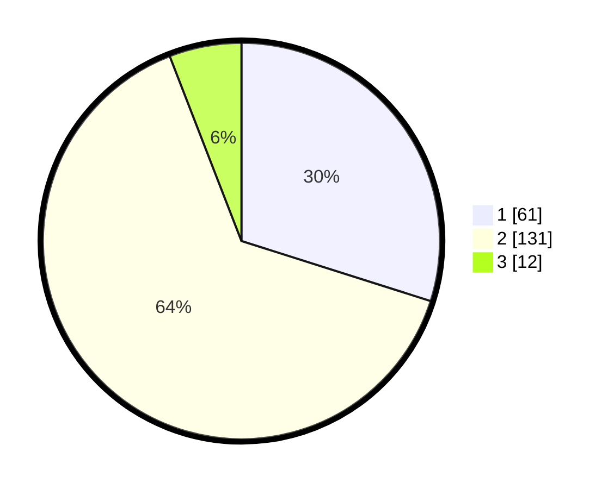

# Hasil

## Grafik

## Tabel

| No. | Nama Paslon    | Suara | Suara (raw) | Persentase |
|:--- |:-------------- | -----:| -----------:| ----------:|
| 1   | ANIES MUHAIMIN | 61    | [61][p-1]   | 29,90      |
| 2   | PRABOWO GIBRAN | 131   | [131][p-2]  | 64,22      |
| 3   | GANJAR MAHFUD  | 12    | [12][p-3]   | 5,88       |

[p-1]: https://github.com/gigit-pemilu/pemilu-2024/blob/main/pilpres/hitung-suara/sub/32-jawa-barat/sub/11-sumedang/sub/11-tanjungsari/sub/2001-gudang/sub/004-tps/sub/paslon-1.txt
[p-2]: https://github.com/gigit-pemilu/pemilu-2024/blob/main/pilpres/hitung-suara/sub/32-jawa-barat/sub/11-sumedang/sub/11-tanjungsari/sub/2001-gudang/sub/004-tps/sub/paslon-2.txt
[p-3]: https://github.com/gigit-pemilu/pemilu-2024/blob/main/pilpres/hitung-suara/sub/32-jawa-barat/sub/11-sumedang/sub/11-tanjungsari/sub/2001-gudang/sub/004-tps/sub/paslon-3.txt

## Foto C Plano

https://sirekap-obj-formc.kpu.go.id/fe0e/pemilu/ppwp/32/11/11/20/01/3211112001004-20240218-114243--490c7a8d-aba9-411e-984b-945283eef5d1.jpg

https://sirekap-obj-formc.kpu.go.id/fe0e/pemilu/ppwp/32/11/11/20/01/3211112001004-20240218-114319--6b8859d3-96b5-4b8c-9418-1a4a35462ffa.jpg

https://sirekap-obj-formc.kpu.go.id/fe0e/pemilu/ppwp/32/11/11/20/01/3211112001004-20240218-114434--0c6ec049-adc6-4792-a5d7-2de69b8a50a1.jpg

## Metadata

| Key        | Value               |
| ---------- | ------------------- |
| Time Stamp | 2024-02-19 06:16:00 |

