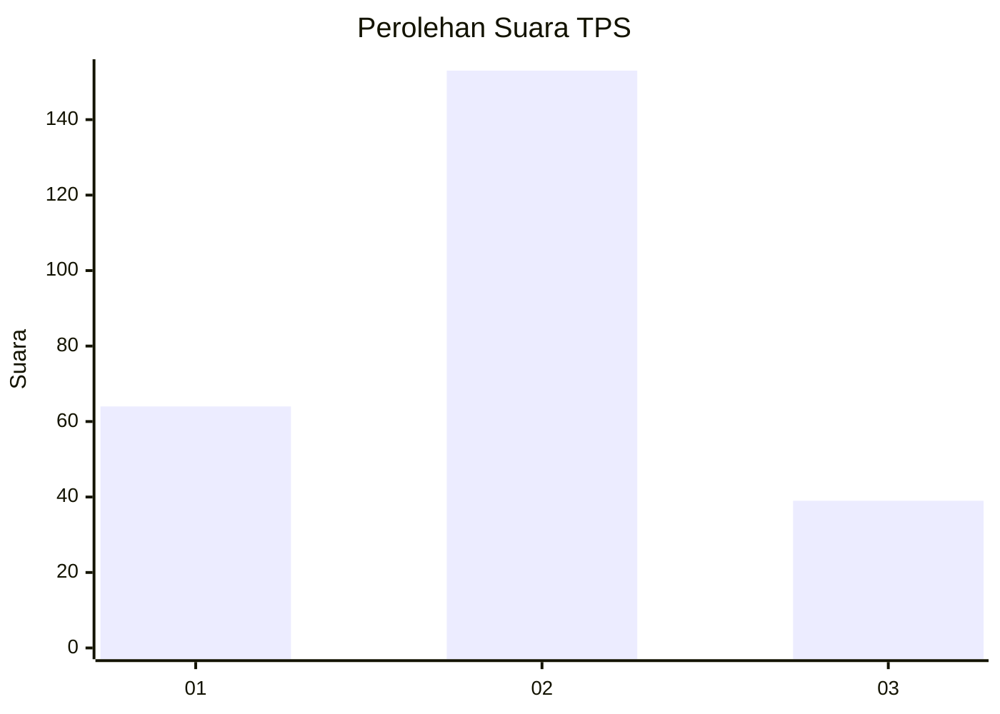

# Hasil

## Grafik

## Tabel

| No. | Nama Paslon    | Suara | Suara (raw) | Persentase |
|:--- |:-------------- | -----:| -----------:| ----------:|
| 1   | ANIES MUHAIMIN | 64    | [64][p-1]   | 25,00      |
| 2   | PRABOWO GIBRAN | 153   | [153][p-2]  | 59,77      |
| 3   | GANJAR MAHFUD  | 39    | [39][p-3]   | 15,23      |

[p-1]: https://github.com/gigit-pemilu/pemilu-2024/blob/main/pilpres/hitung-suara/sub/32-jawa-barat/sub/11-sumedang/sub/11-tanjungsari/sub/2001-gudang/sub/005-tps/sub/paslon-1.txt
[p-2]: https://github.com/gigit-pemilu/pemilu-2024/blob/main/pilpres/hitung-suara/sub/32-jawa-barat/sub/11-sumedang/sub/11-tanjungsari/sub/2001-gudang/sub/005-tps/sub/paslon-2.txt
[p-3]: https://github.com/gigit-pemilu/pemilu-2024/blob/main/pilpres/hitung-suara/sub/32-jawa-barat/sub/11-sumedang/sub/11-tanjungsari/sub/2001-gudang/sub/005-tps/sub/paslon-3.txt

## Foto C Plano

https://sirekap-obj-formc.kpu.go.id/54ce/pemilu/ppwp/32/11/11/20/01/3211112001005-20240218-113816--ab7615e0-cd15-4ba0-b284-c494bb505f06.jpg

https://sirekap-obj-formc.kpu.go.id/54ce/pemilu/ppwp/32/11/11/20/01/3211112001005-20240218-113856--2a004118-125d-414b-986a-8cedda97a0f1.jpg

https://sirekap-obj-formc.kpu.go.id/54ce/pemilu/ppwp/32/11/11/20/01/3211112001005-20240218-113929--69a55049-265f-4a87-9ed7-bc05f3d1f772.jpg

## Metadata

| Key        | Value               |
| ---------- | ------------------- |
| Time Stamp | 2024-02-19 06:16:00 |

