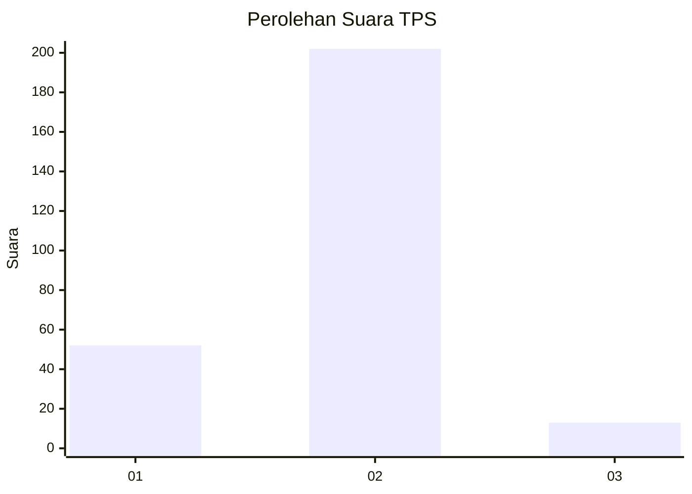
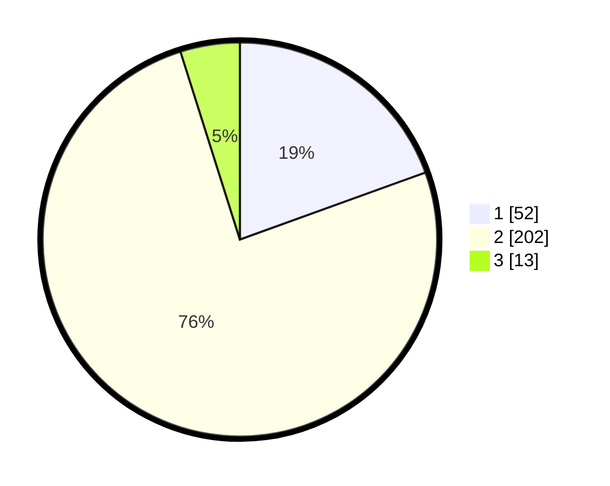

# Hasil

## Grafik

## Tabel

| No. | Nama Paslon    | Suara | Suara (raw) | Persentase |
|:--- |:-------------- | -----:| -----------:| ----------:|
| 1   | ANIES MUHAIMIN | 52    | [52][p-1]   | 19,48      |
| 2   | PRABOWO GIBRAN | 202   | [202][p-2]  | 75,66      |
| 3   | GANJAR MAHFUD  | 13    | [13][p-3]   | 4,87       |

[p-1]: https://github.com/gigit-pemilu/pemilu-2024/blob/main/pilpres/hitung-suara/sub/32-jawa-barat/sub/11-sumedang/sub/11-tanjungsari/sub/2002-tanjungsari/sub/009-tps/sub/paslon-1.txt
[p-2]: https://github.com/gigit-pemilu/pemilu-2024/blob/main/pilpres/hitung-suara/sub/32-jawa-barat/sub/11-sumedang/sub/11-tanjungsari/sub/2002-tanjungsari/sub/009-tps/sub/paslon-2.txt
[p-3]: https://github.com/gigit-pemilu/pemilu-2024/blob/main/pilpres/hitung-suara/sub/32-jawa-barat/sub/11-sumedang/sub/11-tanjungsari/sub/2002-tanjungsari/sub/009-tps/sub/paslon-3.txt

## Foto C Plano

https://sirekap-obj-formc.kpu.go.id/5110/pemilu/ppwp/32/11/11/20/02/3211112002009-20240218-134724--55627aa4-0112-42fe-9bc8-79af5819f3e6.jpg

https://sirekap-obj-formc.kpu.go.id/5110/pemilu/ppwp/32/11/11/20/02/3211112002009-20240218-134756--c65430ca-d5b2-4426-a245-fa5ea606a7f4.jpg

https://sirekap-obj-formc.kpu.go.id/5110/pemilu/ppwp/32/11/11/20/02/3211112002009-20240218-134829--6d7740c6-81c2-4ece-8dff-4b88e6d78c51.jpg

## Metadata

| Key        | Value               |
| ---------- | ------------------- |
| Time Stamp | 2024-02-19 06:16:00 |

