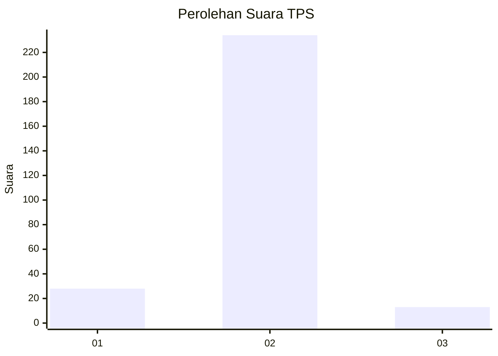
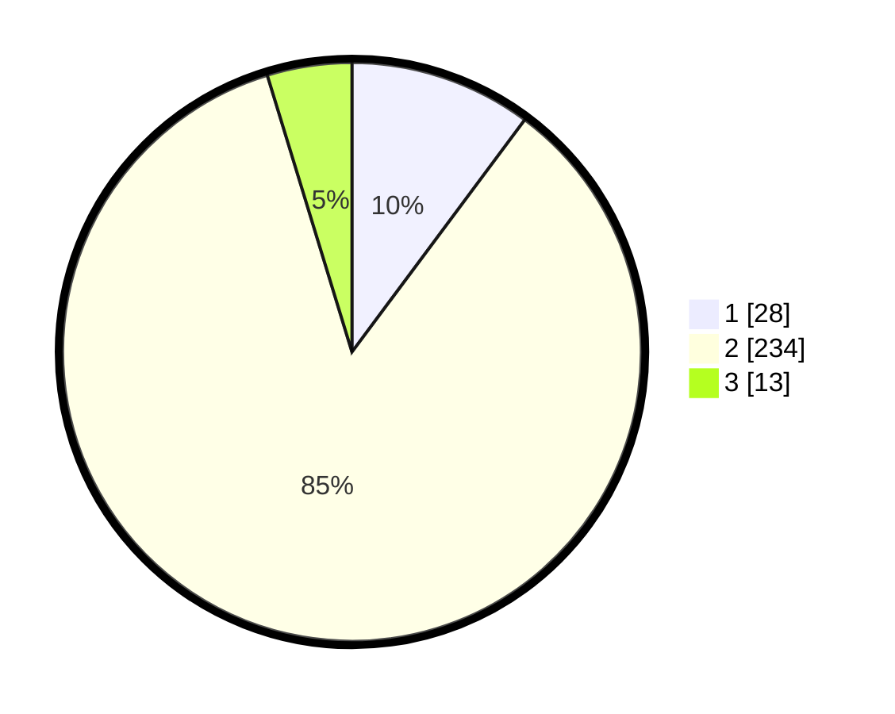

# Hasil

## Grafik

## Tabel

| No. | Nama Paslon    | Suara | Suara (raw) | Persentase |
|:--- |:-------------- | -----:| -----------:| ----------:|
| 1   | ANIES MUHAIMIN | 28    | [28][p-1]   | 10,18      |
| 2   | PRABOWO GIBRAN | 234   | [234][p-2]  | 85,09      |
| 3   | GANJAR MAHFUD  | 13    | [13][p-3]   | 4,73       |

[p-1]: https://github.com/gigit-pemilu/pemilu-2024-32-jawa-barat/blob/main/pilpres/hitung-suara/sub/32-jawa-barat/sub/11-sumedang/sub/11-tanjungsari/sub/2004-margaluyu/sub/021-tps/sub/paslon-1.txt
[p-2]: https://github.com/gigit-pemilu/pemilu-2024-32-jawa-barat/blob/main/pilpres/hitung-suara/sub/32-jawa-barat/sub/11-sumedang/sub/11-tanjungsari/sub/2004-margaluyu/sub/021-tps/sub/paslon-2.txt
[p-3]: https://github.com/gigit-pemilu/pemilu-2024-32-jawa-barat/blob/main/pilpres/hitung-suara/sub/32-jawa-barat/sub/11-sumedang/sub/11-tanjungsari/sub/2004-margaluyu/sub/021-tps/sub/paslon-3.txt

## Foto C Plano

https://sirekap-obj-formc.kpu.go.id/13df/pemilu/ppwp/32/11/11/20/04/3211112004021-20240215-024033--7ea52cfa-2239-4d73-bad4-fcd9012309e7.jpg

https://sirekap-obj-formc.kpu.go.id/13df/pemilu/ppwp/32/11/11/20/04/3211112004021-20240215-024155--64cd7b57-c8d6-4903-b225-3024bf097f0f.jpg

https://sirekap-obj-formc.kpu.go.id/13df/pemilu/ppwp/32/11/11/20/04/3211112004021-20240214-202858--f8f3b782-df86-4eaa-a6a6-d5ba25fb285c.jpg

## Metadata

| Key        | Value               |
| ---------- | ------------------- |
| Time Stamp | 2024-02-19 06:16:00 |

