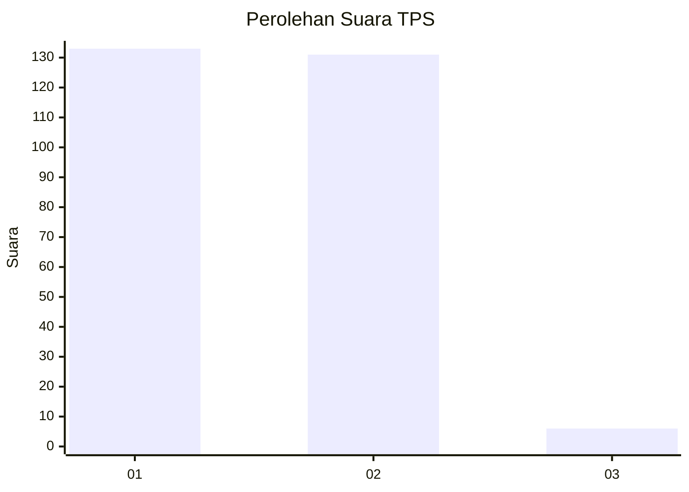
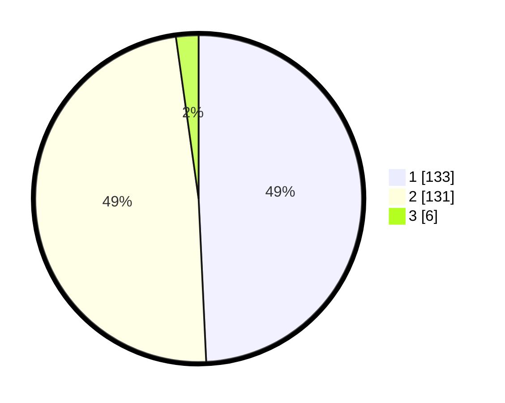

# Hasil

## Grafik

## Tabel

| No. | Nama Paslon    | Suara | Suara (raw) | Persentase |
|:--- |:-------------- | -----:| -----------:| ----------:|
| 1   | ANIES MUHAIMIN | 133   | [133][p-1]  | 49,26      |
| 2   | PRABOWO GIBRAN | 131   | [131][p-2]  | 48,52      |
| 3   | GANJAR MAHFUD  | 6     | [6][p-3]    | 2,22       |

[p-1]: https://github.com/gigit-pemilu/pemilu-2024/blob/main/pilpres/hitung-suara/sub/32-jawa-barat/sub/11-sumedang/sub/11-tanjungsari/sub/2010-gunung-manik/sub/026-tps/sub/paslon-1.txt
[p-2]: https://github.com/gigit-pemilu/pemilu-2024/blob/main/pilpres/hitung-suara/sub/32-jawa-barat/sub/11-sumedang/sub/11-tanjungsari/sub/2010-gunung-manik/sub/026-tps/sub/paslon-2.txt
[p-3]: https://github.com/gigit-pemilu/pemilu-2024/blob/main/pilpres/hitung-suara/sub/32-jawa-barat/sub/11-sumedang/sub/11-tanjungsari/sub/2010-gunung-manik/sub/026-tps/sub/paslon-3.txt

## Foto C Plano

https://sirekap-obj-formc.kpu.go.id/355c/pemilu/ppwp/32/11/11/20/10/3211112010026-20240214-215045--f3881ba9-1f02-45ec-a960-f8f8efe45546.jpg

https://sirekap-obj-formc.kpu.go.id/355c/pemilu/ppwp/32/11/11/20/10/3211112010026-20240214-215300--78c06578-e8e3-4625-a1e3-fae3605989c3.jpg

https://sirekap-obj-formc.kpu.go.id/355c/pemilu/ppwp/32/11/11/20/10/3211112010026-20240214-215412--1c960f2d-9fe7-450d-92dc-7904cf95a74a.jpg

## Metadata

| Key        | Value               |
| ---------- | ------------------- |
| Time Stamp | 2024-02-19 07:00:00 |

