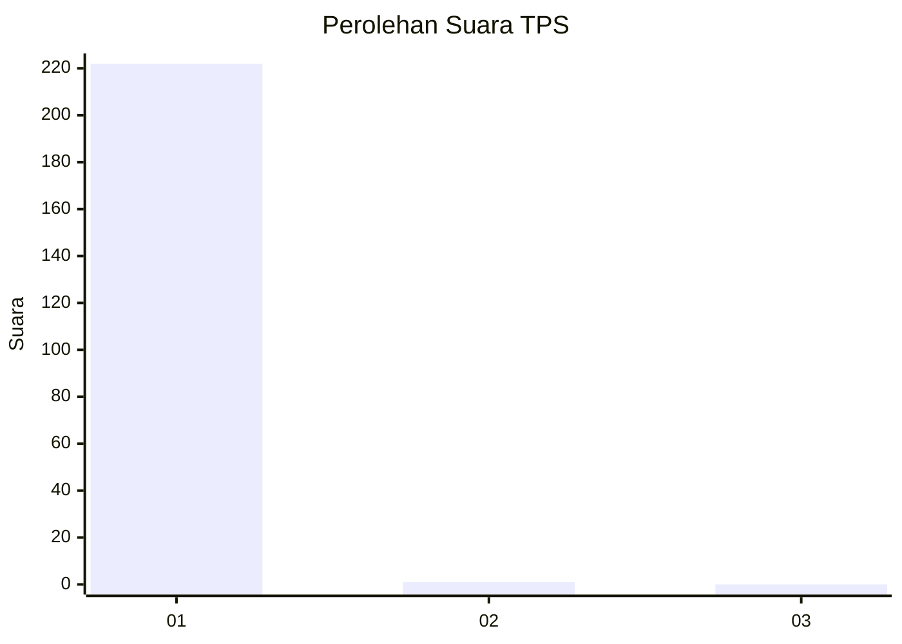
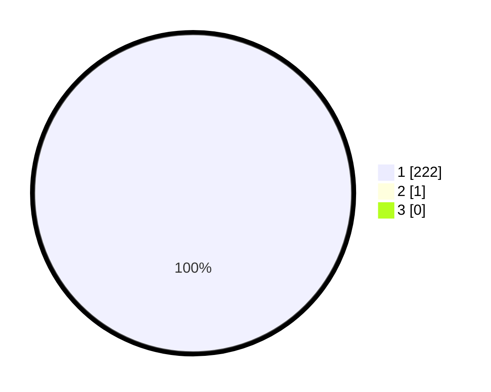

# Hasil

## Grafik

## Tabel

| No. | Nama Paslon    | Suara | Suara (raw) | Persentase |
|:--- |:-------------- | -----:| -----------:| ----------:|
| 1   | ANIES MUHAIMIN | 222   | [222][p-1]  | 99,55      |
| 2   | PRABOWO GIBRAN | 1     | [1][p-2]    | 0,45       |
| 3   | GANJAR MAHFUD  | 0     | [0][p-3]    | 0,00       |

[p-1]: https://github.com/gigit-pemilu/pemilu-2024/blob/main/pilpres/hitung-suara/sub/32-jawa-barat/sub/11-sumedang/sub/13-pamulihan/sub/2004-haurngombong/sub/901-tps/sub/paslon-1.txt
[p-2]: https://github.com/gigit-pemilu/pemilu-2024/blob/main/pilpres/hitung-suara/sub/32-jawa-barat/sub/11-sumedang/sub/13-pamulihan/sub/2004-haurngombong/sub/901-tps/sub/paslon-2.txt
[p-3]: https://github.com/gigit-pemilu/pemilu-2024/blob/main/pilpres/hitung-suara/sub/32-jawa-barat/sub/11-sumedang/sub/13-pamulihan/sub/2004-haurngombong/sub/901-tps/sub/paslon-3.txt

## Foto C Plano

https://sirekap-obj-formc.kpu.go.id/613c/pemilu/ppwp/32/11/13/20/04/3211132004901-20240215-163345--123534f8-afbe-48e1-b827-ced048290236.jpg

https://sirekap-obj-formc.kpu.go.id/613c/pemilu/ppwp/32/11/13/20/04/3211132004901-20240215-163303--a7242949-135f-4ba1-a4e7-9197c472e5d1.jpg

https://sirekap-obj-formc.kpu.go.id/613c/pemilu/ppwp/32/11/13/20/04/3211132004901-20240215-163329--a994c381-145b-4bbf-8158-4eab3dd67603.jpg

## Metadata

| Key        | Value               |
| ---------- | ------------------- |
| Time Stamp | 2024-02-19 06:16:00 |

