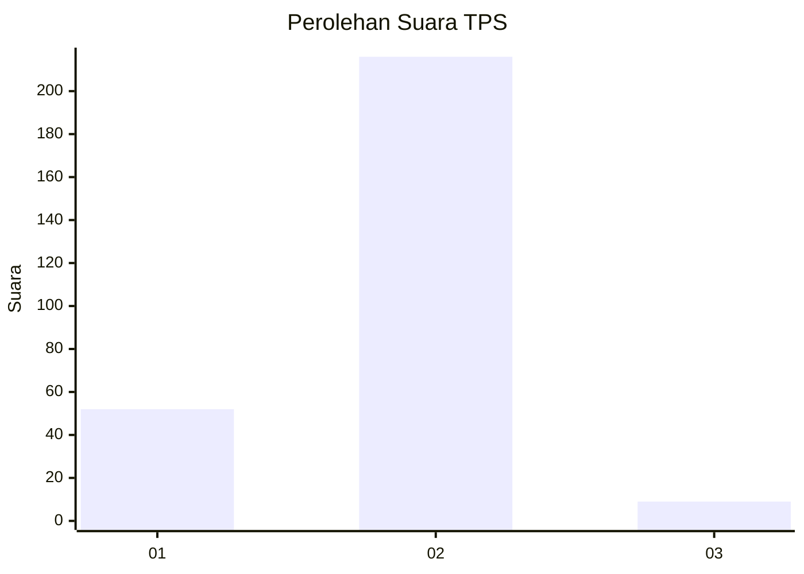
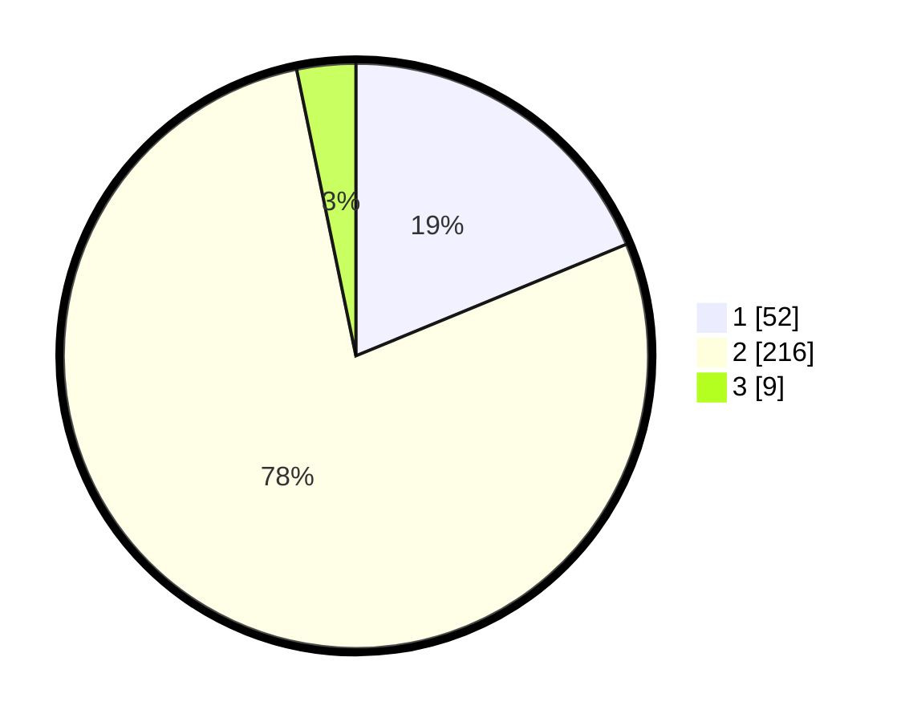

# Hasil

## Grafik

## Tabel

| No. | Nama Paslon    | Suara | Suara (raw) | Persentase |
|:--- |:-------------- | -----:| -----------:| ----------:|
| 1   | ANIES MUHAIMIN | 52    | [52][p-1]   | 18,77      |
| 2   | PRABOWO GIBRAN | 216   | [216][p-2]  | 77,98      |
| 3   | GANJAR MAHFUD  | 9     | [9][p-3]    | 3,25       |

[p-1]: https://github.com/gigit-pemilu/pemilu-2024-32-jawa-barat/blob/main/pilpres/hitung-suara/sub/32-jawa-barat/sub/11-sumedang/sub/14-cimanggung/sub/2001-cimanggung/sub/011-tps/sub/paslon-1.txt
[p-2]: https://github.com/gigit-pemilu/pemilu-2024-32-jawa-barat/blob/main/pilpres/hitung-suara/sub/32-jawa-barat/sub/11-sumedang/sub/14-cimanggung/sub/2001-cimanggung/sub/011-tps/sub/paslon-2.txt
[p-3]: https://github.com/gigit-pemilu/pemilu-2024-32-jawa-barat/blob/main/pilpres/hitung-suara/sub/32-jawa-barat/sub/11-sumedang/sub/14-cimanggung/sub/2001-cimanggung/sub/011-tps/sub/paslon-3.txt

## Foto C Plano

https://sirekap-obj-formc.kpu.go.id/74bb/pemilu/ppwp/32/11/14/20/01/3211142001011-20240217-220841--c3df1c6f-a9d9-4a98-a2c8-cb449f6859f0.jpg

https://sirekap-obj-formc.kpu.go.id/74bb/pemilu/ppwp/32/11/14/20/01/3211142001011-20240217-220957--6eefd67e-d0db-4849-92a0-b0a2cdc8c16d.jpg

https://sirekap-obj-formc.kpu.go.id/74bb/pemilu/ppwp/32/11/14/20/01/3211142001011-20240217-221131--28950ea2-bcc1-4411-bd09-f6d3a7b962b3.jpg

## Metadata

| Key        | Value               |
| ---------- | ------------------- |
| Time Stamp | 2024-02-19 06:16:00 |

## DATA PEMILIH TETAP

Jumlah pemilih dalam DPT: **293**.
 * L: **154**.
 * P: **139**.

## DATA PENGGUNA HAK PILIH

Jumlah pengguna hak pilih dalam DPT: **714**.
 * L: **50**.
 * P: **555**.

Jumlah pengguna hak pilih dalam DPTb: **403**.
 * L: **2**.
 * P: **1**.

Jumlah pengguna hak pilih dalam DPK: **78**.
 * L: **0**.
 * P: **400**.

Jumlah pengguna hak pilih: **277**.
 * L: **144**.
 * P: **133**.

## JUMLAH SUARA SAH DAN TIDAK SAH

JUMLAH SELURUH SUARA SAH: **277**.

JUMLAH SUARA TIDAK SAH: **0**.

JUMLAH SELURUH SUARA SAH DAN SUARA TIDAK SAH: **277**.

