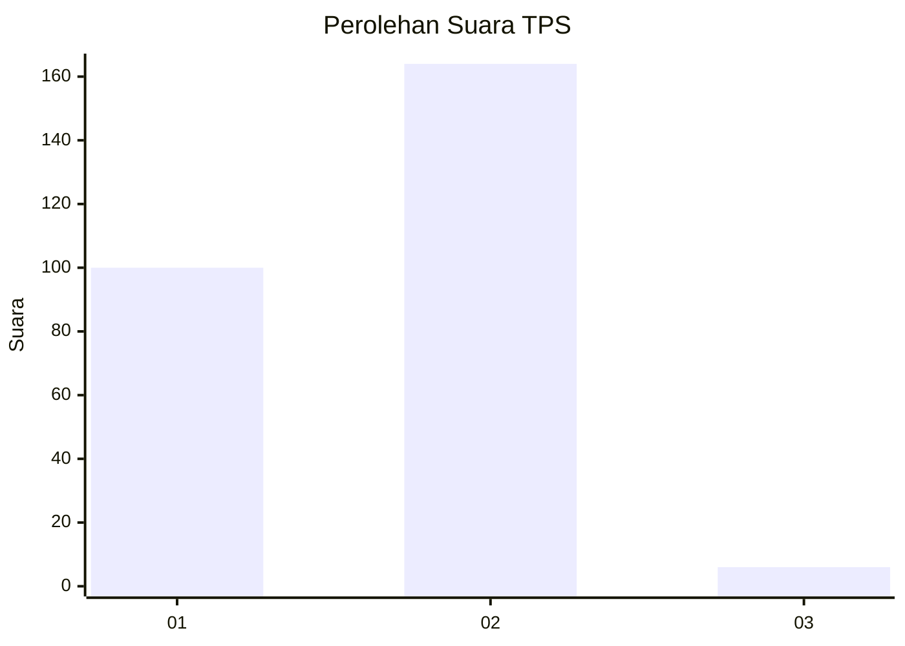
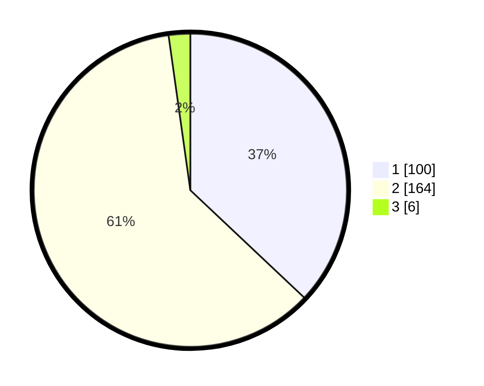

# Hasil

## Grafik

## Tabel

| No. | Nama Paslon    | Suara | Suara (raw) | Persentase |
|:--- |:-------------- | -----:| -----------:| ----------:|
| 1   | ANIES MUHAIMIN | 100   | [100][p-1]  | 37,04      |
| 2   | PRABOWO GIBRAN | 164   | [164][p-2]  | 60,74      |
| 3   | GANJAR MAHFUD  | 6     | [6][p-3]    | 2,22       |

[p-1]: https://github.com/gigit-pemilu/pemilu-2024-32-jawa-barat/blob/main/pilpres/hitung-suara/sub/32-jawa-barat/sub/11-sumedang/sub/14-cimanggung/sub/2008-sukadana/sub/005-tps/sub/paslon-1.txt
[p-2]: https://github.com/gigit-pemilu/pemilu-2024-32-jawa-barat/blob/main/pilpres/hitung-suara/sub/32-jawa-barat/sub/11-sumedang/sub/14-cimanggung/sub/2008-sukadana/sub/005-tps/sub/paslon-2.txt
[p-3]: https://github.com/gigit-pemilu/pemilu-2024-32-jawa-barat/blob/main/pilpres/hitung-suara/sub/32-jawa-barat/sub/11-sumedang/sub/14-cimanggung/sub/2008-sukadana/sub/005-tps/sub/paslon-3.txt

## Foto C Plano

https://sirekap-obj-formc.kpu.go.id/6b57/pemilu/ppwp/32/11/14/20/08/3211142008005-20240217-210339--d8fec160-e3d7-4f4e-b372-673d2e6dcd8a.jpg

https://sirekap-obj-formc.kpu.go.id/6b57/pemilu/ppwp/32/11/14/20/08/3211142008005-20240217-210414--246b6554-baa1-46cd-bf3c-25f0bf0993fd.jpg

https://sirekap-obj-formc.kpu.go.id/6b57/pemilu/ppwp/32/11/14/20/08/3211142008005-20240217-210452--dc18b772-9418-493d-b009-e1178e935f02.jpg

## Metadata

| Key        | Value               |
| ---------- | ------------------- |
| Time Stamp | 2024-02-19 22:00:00 |

