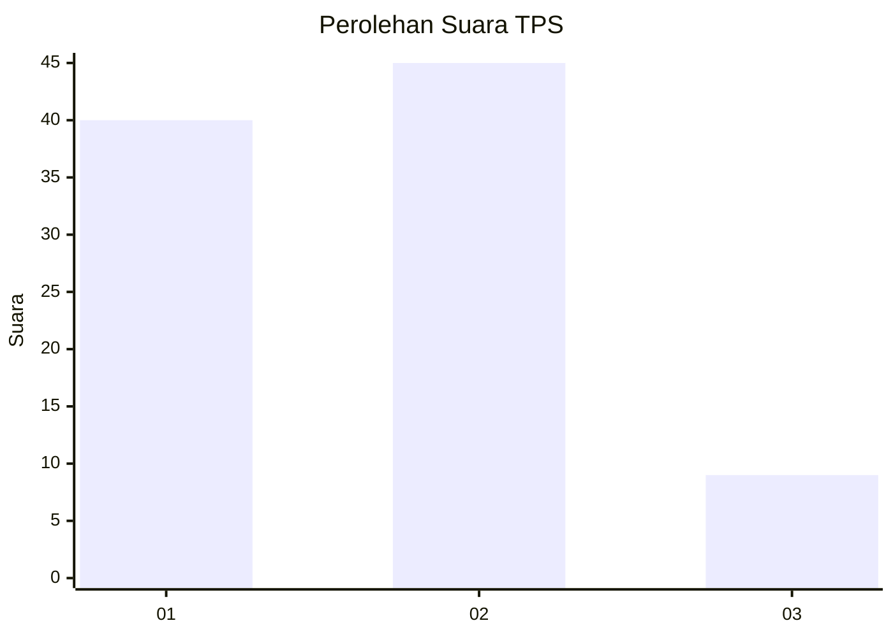
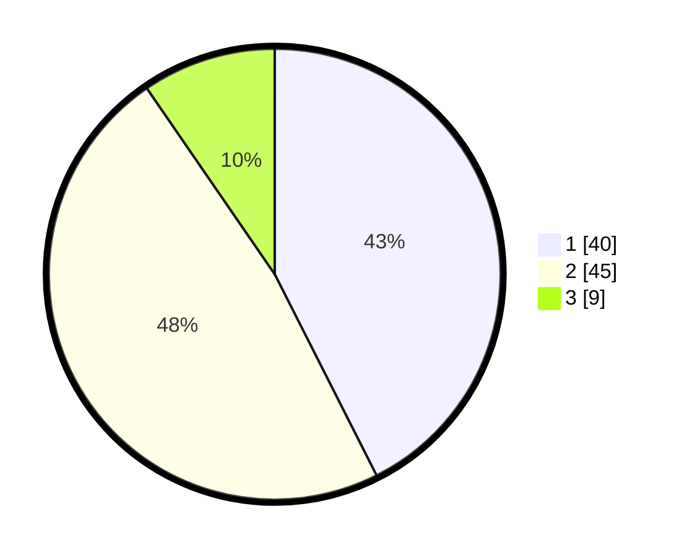

# Hasil

## Grafik

## Tabel

| No. | Nama Paslon    | Suara | Suara (raw) | Persentase |
|:--- |:-------------- | -----:| -----------:| ----------:|
| 1   | ANIES MUHAIMIN | 40    | [40][p-1]   | 42,55      |
| 2   | PRABOWO GIBRAN | 45    | [45][p-2]   | 47,87      |
| 3   | GANJAR MAHFUD  | 9     | [9][p-3]    | 9,57       |

[p-1]: https://github.com/gigit-pemilu/pemilu-2024/blob/main/pilpres/hitung-suara/sub/32-jawa-barat/sub/11-sumedang/sub/14-cimanggung/sub/2008-sukadana/sub/018-tps/sub/paslon-1.txt
[p-2]: https://github.com/gigit-pemilu/pemilu-2024/blob/main/pilpres/hitung-suara/sub/32-jawa-barat/sub/11-sumedang/sub/14-cimanggung/sub/2008-sukadana/sub/018-tps/sub/paslon-2.txt
[p-3]: https://github.com/gigit-pemilu/pemilu-2024/blob/main/pilpres/hitung-suara/sub/32-jawa-barat/sub/11-sumedang/sub/14-cimanggung/sub/2008-sukadana/sub/018-tps/sub/paslon-3.txt

## Foto C Plano

https://sirekap-obj-formc.kpu.go.id/dc05/pemilu/ppwp/32/11/14/20/08/3211142008018-20240217-211957--fe9b1db4-93e1-447e-9a62-48d11123bb17.jpg

https://sirekap-obj-formc.kpu.go.id/dc05/pemilu/ppwp/32/11/14/20/08/3211142008018-20240217-212038--ef191e85-146e-4ad0-84e2-9f0c794cc8c1.jpg

https://sirekap-obj-formc.kpu.go.id/dc05/pemilu/ppwp/32/11/14/20/08/3211142008018-20240217-212113--aa5d9636-e0d7-4013-bd32-5f8d3b2786df.jpg

## Metadata

| Key        | Value               |
| ---------- | ------------------- |
| Time Stamp | 2024-02-19 23:00:00 |

