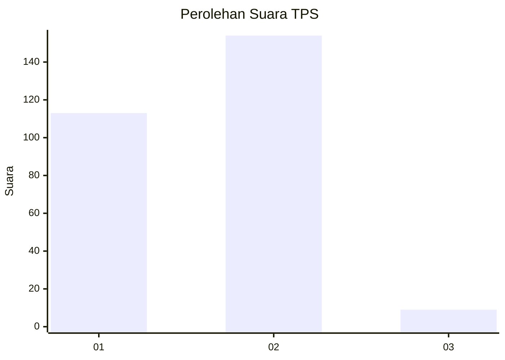
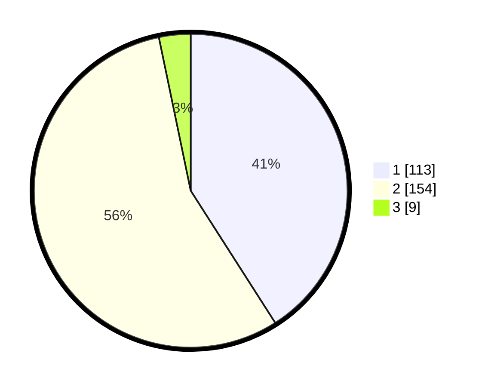

# Hasil

## Grafik

## Tabel

| No. | Nama Paslon    | Suara | Suara (raw) | Persentase |
|:--- |:-------------- | -----:| -----------:| ----------:|
| 1   | ANIES MUHAIMIN | 113   | [113][p-1]  | 40,94      |
| 2   | PRABOWO GIBRAN | 154   | [154][p-2]  | 55,80      |
| 3   | GANJAR MAHFUD  | 9     | [9][p-3]    | 3,26       |

[p-1]: https://github.com/gigit-pemilu/pemilu-2024/blob/main/pilpres/hitung-suara/sub/32-jawa-barat/sub/11-sumedang/sub/14-cimanggung/sub/2010-cihanjuang/sub/010-tps/sub/paslon-1.txt
[p-2]: https://github.com/gigit-pemilu/pemilu-2024/blob/main/pilpres/hitung-suara/sub/32-jawa-barat/sub/11-sumedang/sub/14-cimanggung/sub/2010-cihanjuang/sub/010-tps/sub/paslon-2.txt
[p-3]: https://github.com/gigit-pemilu/pemilu-2024/blob/main/pilpres/hitung-suara/sub/32-jawa-barat/sub/11-sumedang/sub/14-cimanggung/sub/2010-cihanjuang/sub/010-tps/sub/paslon-3.txt

## Foto C Plano

https://sirekap-obj-formc.kpu.go.id/95fd/pemilu/ppwp/32/11/14/20/10/3211142010010-20240219-135023--d05ca4d2-717e-4d3a-90e7-db6223db43b2.jpg

https://sirekap-obj-formc.kpu.go.id/95fd/pemilu/ppwp/32/11/14/20/10/3211142010010-20240219-135452--55cd4a4c-0baa-4c55-a1d6-9debe064c0d8.jpg

https://sirekap-obj-formc.kpu.go.id/95fd/pemilu/ppwp/32/11/14/20/10/3211142010010-20240219-135607--873f3760-d92f-4879-828a-047eaecf8f20.jpg

## Metadata

| Key        | Value               |
| ---------- | ------------------- |
| Time Stamp | 2024-02-19 21:00:00 |

