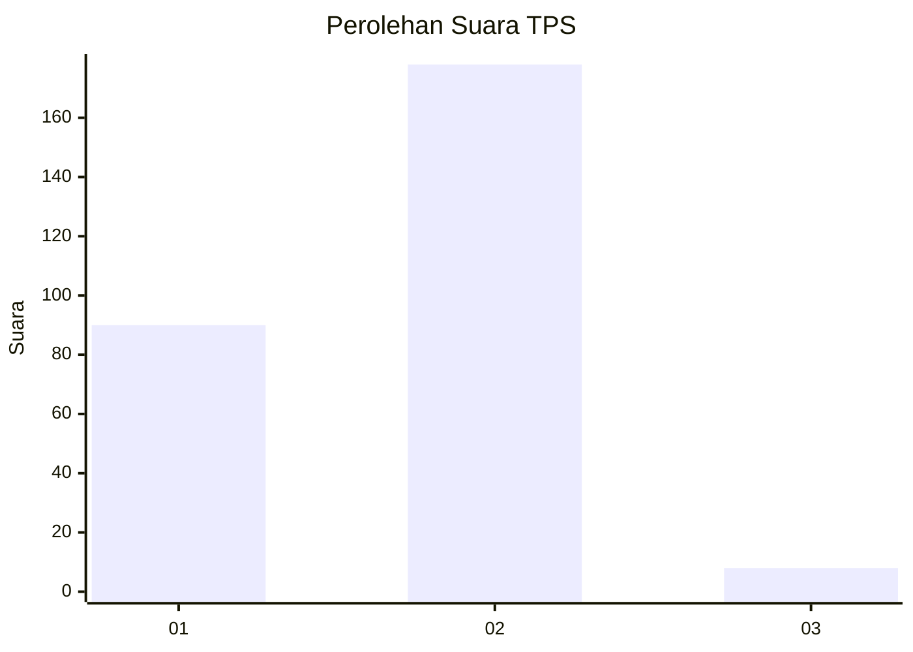
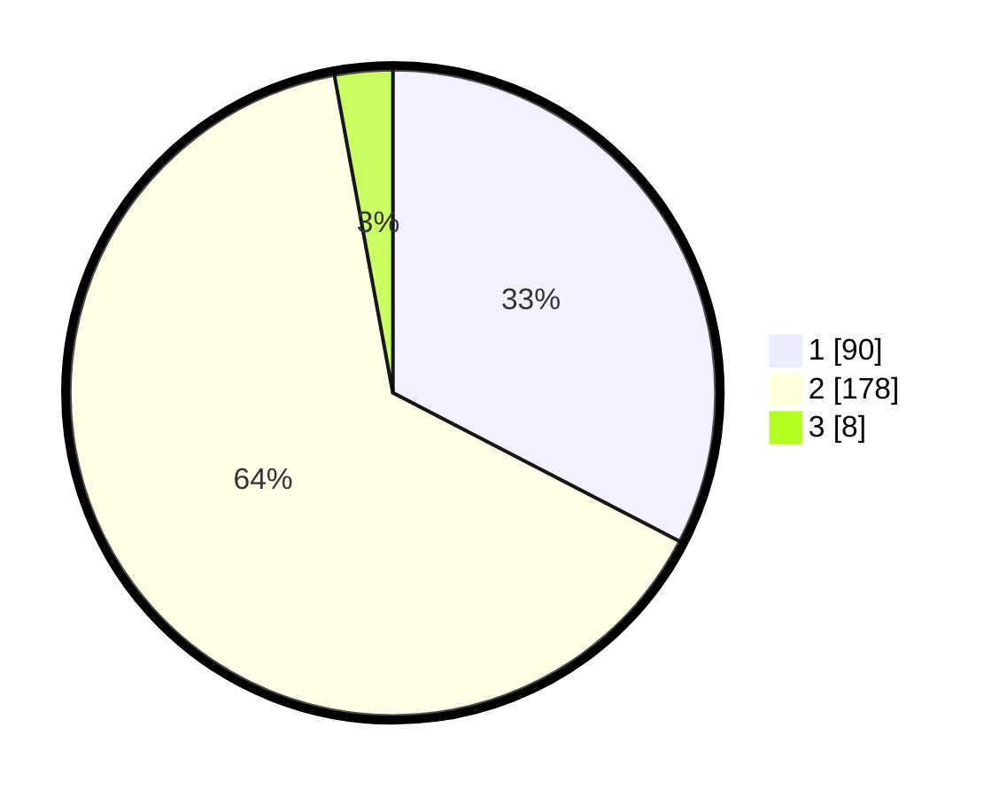

# Hasil

## Grafik

## Tabel

| No. | Nama Paslon    | Suara | Suara (raw) | Persentase |
|:--- |:-------------- | -----:| -----------:| ----------:|
| 1   | ANIES MUHAIMIN | 90    | [90][p-1]   | 32,61      |
| 2   | PRABOWO GIBRAN | 178   | [178][p-2]  | 64,49      |
| 3   | GANJAR MAHFUD  | 8     | [8][p-3]    | 2,90       |

[p-1]: https://github.com/gigit-pemilu/pemilu-2024/blob/main/pilpres/hitung-suara/sub/32-jawa-barat/sub/11-sumedang/sub/14-cimanggung/sub/2010-cihanjuang/sub/012-tps/sub/paslon-1.txt
[p-2]: https://github.com/gigit-pemilu/pemilu-2024/blob/main/pilpres/hitung-suara/sub/32-jawa-barat/sub/11-sumedang/sub/14-cimanggung/sub/2010-cihanjuang/sub/012-tps/sub/paslon-2.txt
[p-3]: https://github.com/gigit-pemilu/pemilu-2024/blob/main/pilpres/hitung-suara/sub/32-jawa-barat/sub/11-sumedang/sub/14-cimanggung/sub/2010-cihanjuang/sub/012-tps/sub/paslon-3.txt

## Foto C Plano

https://sirekap-obj-formc.kpu.go.id/1e3c/pemilu/ppwp/32/11/14/20/10/3211142010012-20240217-182354--5aeb900b-ad34-4891-b500-d746aa43bd21.jpg

https://sirekap-obj-formc.kpu.go.id/1e3c/pemilu/ppwp/32/11/14/20/10/3211142010012-20240217-182502--799885fd-3cbd-48dd-a885-d0c5f71df1d8.jpg

https://sirekap-obj-formc.kpu.go.id/1e3c/pemilu/ppwp/32/11/14/20/10/3211142010012-20240217-182547--9d14188f-cf6c-4b1b-9538-10f755246ffe.jpg

## Metadata

| Key        | Value               |
| ---------- | ------------------- |
| Time Stamp | 2024-02-19 06:16:00 |

