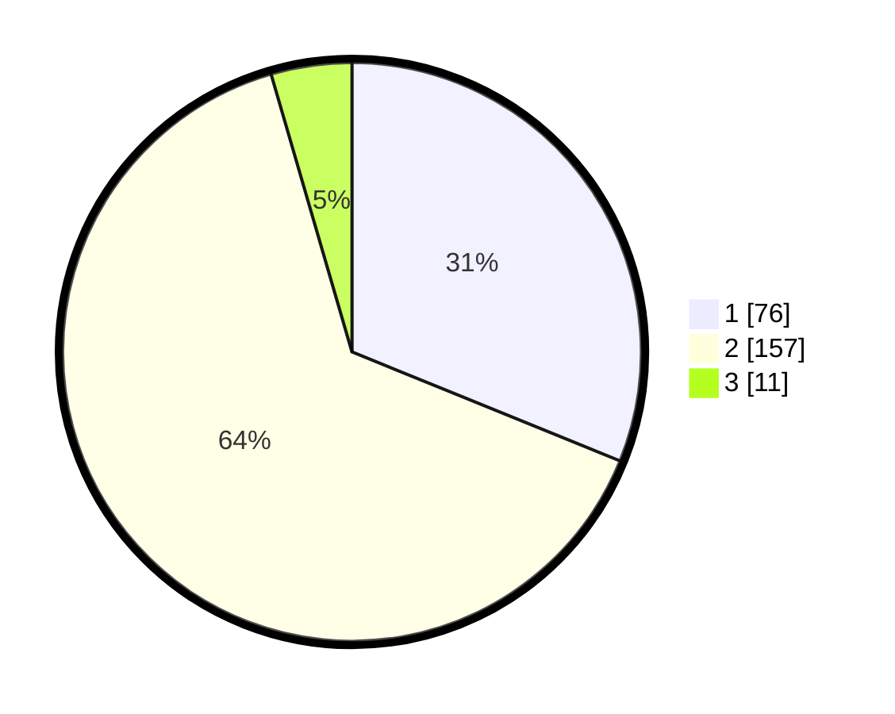

# Hasil

## Grafik

## Tabel

| No. | Nama Paslon    | Suara | Suara (raw) | Persentase |
|:--- |:-------------- | -----:| -----------:| ----------:|
| 1   | ANIES MUHAIMIN | 76    | [76][p-1]   | 31,15      |
| 2   | PRABOWO GIBRAN | 157   | [157][p-2]  | 64,34      |
| 3   | GANJAR MAHFUD  | 11    | [11][p-3]   | 4,51       |

[p-1]: https://github.com/gigit-pemilu/pemilu-2024/blob/main/pilpres/hitung-suara/sub/32-jawa-barat/sub/11-sumedang/sub/15-jatinangor/sub/2001-cikeruh/sub/002-tps/sub/paslon-1.txt
[p-2]: https://github.com/gigit-pemilu/pemilu-2024/blob/main/pilpres/hitung-suara/sub/32-jawa-barat/sub/11-sumedang/sub/15-jatinangor/sub/2001-cikeruh/sub/002-tps/sub/paslon-2.txt
[p-3]: https://github.com/gigit-pemilu/pemilu-2024/blob/main/pilpres/hitung-suara/sub/32-jawa-barat/sub/11-sumedang/sub/15-jatinangor/sub/2001-cikeruh/sub/002-tps/sub/paslon-3.txt

## Foto C Plano

https://sirekap-obj-formc.kpu.go.id/18ea/pemilu/ppwp/32/11/15/20/01/3211152001002-20240218-101156--6ddfcec0-c28a-4f1a-b817-b9c7468eb592.jpg

https://sirekap-obj-formc.kpu.go.id/18ea/pemilu/ppwp/32/11/15/20/01/3211152001002-20240218-101324--5c02c5e4-ac95-4b16-9554-2ffa151ceee7.jpg

https://sirekap-obj-formc.kpu.go.id/18ea/pemilu/ppwp/32/11/15/20/01/3211152001002-20240218-101423--15586ed8-cc71-4fdc-996a-1476ca720a84.jpg

## Metadata

| Key        | Value               |
| ---------- | ------------------- |
| Time Stamp | 2024-02-19 06:16:00 |

