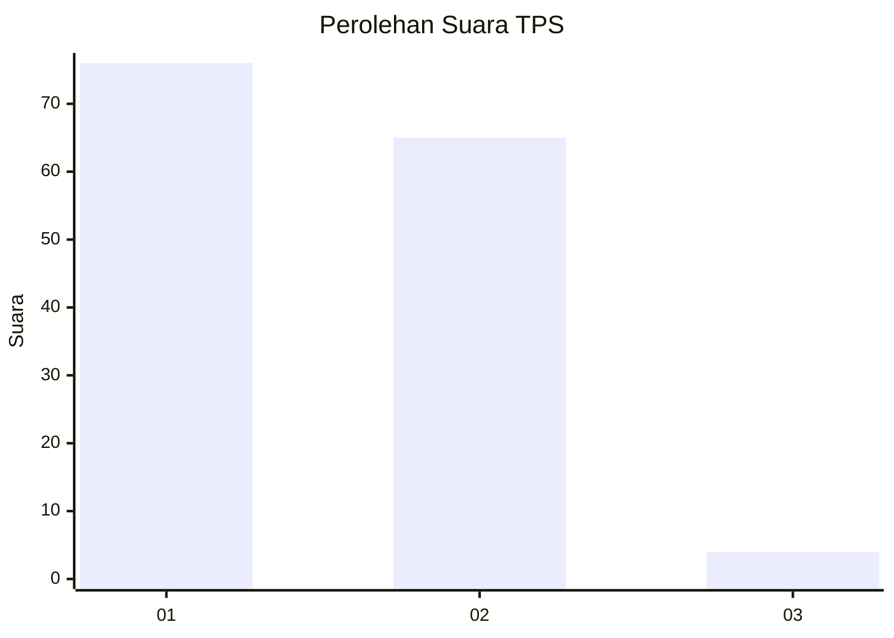
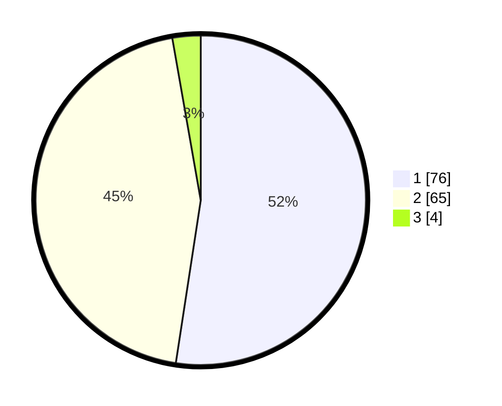

# Hasil

## Grafik

## Tabel

| No. | Nama Paslon    | Suara | Suara (raw) | Persentase |
|:--- |:-------------- | -----:| -----------:| ----------:|
| 1   | ANIES MUHAIMIN | 76    | [76][p-1]   | 52,41      |
| 2   | PRABOWO GIBRAN | 65    | [65][p-2]   | 44,83      |
| 3   | GANJAR MAHFUD  | 4     | [4][p-3]    | 2,76       |

[p-1]: https://github.com/gigit-pemilu/pemilu-2024/blob/main/pilpres/hitung-suara/sub/32-jawa-barat/sub/11-sumedang/sub/15-jatinangor/sub/2001-cikeruh/sub/005-tps/sub/paslon-1.txt
[p-2]: https://github.com/gigit-pemilu/pemilu-2024/blob/main/pilpres/hitung-suara/sub/32-jawa-barat/sub/11-sumedang/sub/15-jatinangor/sub/2001-cikeruh/sub/005-tps/sub/paslon-2.txt
[p-3]: https://github.com/gigit-pemilu/pemilu-2024/blob/main/pilpres/hitung-suara/sub/32-jawa-barat/sub/11-sumedang/sub/15-jatinangor/sub/2001-cikeruh/sub/005-tps/sub/paslon-3.txt

## Foto C Plano

https://sirekap-obj-formc.kpu.go.id/9f99/pemilu/ppwp/32/11/15/20/01/3211152001005-20240214-212126--9f217b54-7858-4ea8-b4c6-63bf2a483777.jpg

https://sirekap-obj-formc.kpu.go.id/9f99/pemilu/ppwp/32/11/15/20/01/3211152001005-20240214-212236--a5c61bc7-dd68-4091-9f1b-e116a009fd11.jpg

https://sirekap-obj-formc.kpu.go.id/9f99/pemilu/ppwp/32/11/15/20/01/3211152001005-20240214-212322--1bfcf75f-d1d5-44f6-a858-9fb81ed2ef42.jpg

## Metadata

| Key        | Value               |
| ---------- | ------------------- |
| Time Stamp | 2024-02-19 06:16:00 |

