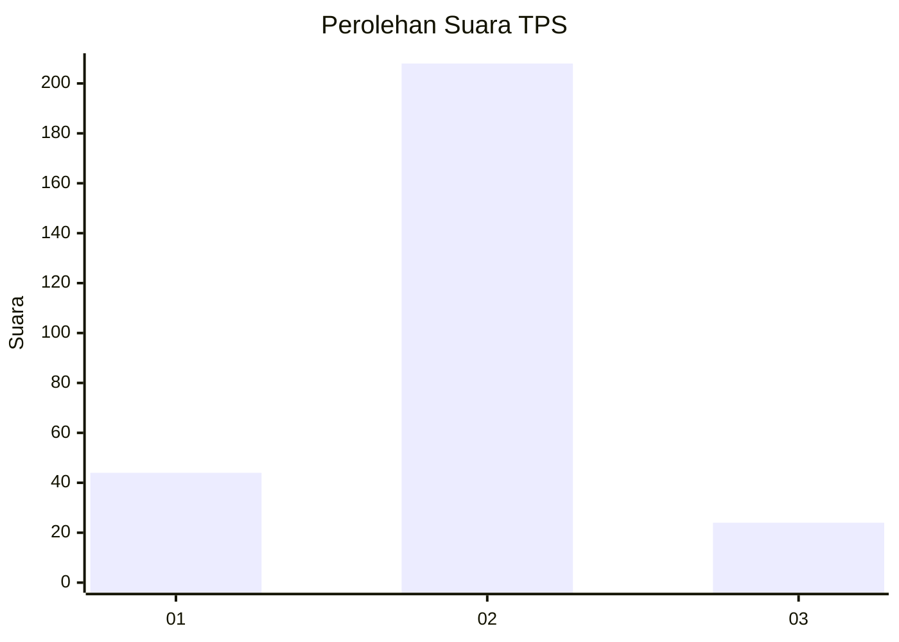
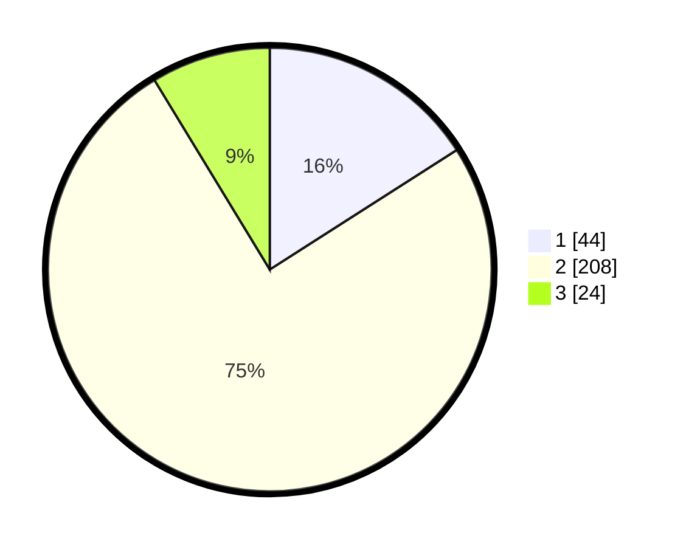

# Hasil

## Grafik

## Tabel

| No. | Nama Paslon    | Suara | Suara (raw) | Persentase |
|:--- |:-------------- | -----:| -----------:| ----------:|
| 1   | ANIES MUHAIMIN | 44    | [44][p-1]   | 15,94      |
| 2   | PRABOWO GIBRAN | 208   | [208][p-2]  | 75,36      |
| 3   | GANJAR MAHFUD  | 24    | [24][p-3]   | 8,70       |

[p-1]: https://github.com/gigit-pemilu/pemilu-2024/blob/main/pilpres/hitung-suara/sub/32-jawa-barat/sub/11-sumedang/sub/15-jatinangor/sub/2002-hegarmanah/sub/002-tps/sub/paslon-1.txt
[p-2]: https://github.com/gigit-pemilu/pemilu-2024/blob/main/pilpres/hitung-suara/sub/32-jawa-barat/sub/11-sumedang/sub/15-jatinangor/sub/2002-hegarmanah/sub/002-tps/sub/paslon-2.txt
[p-3]: https://github.com/gigit-pemilu/pemilu-2024/blob/main/pilpres/hitung-suara/sub/32-jawa-barat/sub/11-sumedang/sub/15-jatinangor/sub/2002-hegarmanah/sub/002-tps/sub/paslon-3.txt

## Foto C Plano

https://sirekap-obj-formc.kpu.go.id/e271/pemilu/ppwp/32/11/15/20/02/3211152002002-20240218-132746--711cb0ca-64b4-4c0f-afe5-1017ebe0c09b.jpg

https://sirekap-obj-formc.kpu.go.id/e271/pemilu/ppwp/32/11/15/20/02/3211152002002-20240218-132839--11822158-3a68-4e47-aeb9-193203293b7e.jpg

https://sirekap-obj-formc.kpu.go.id/e271/pemilu/ppwp/32/11/15/20/02/3211152002002-20240218-132924--94b65c52-0a0a-4fae-ab2f-9f4fae845b6f.jpg

## Metadata

| Key        | Value               |
| ---------- | ------------------- |
| Time Stamp | 2024-02-19 06:16:00 |

