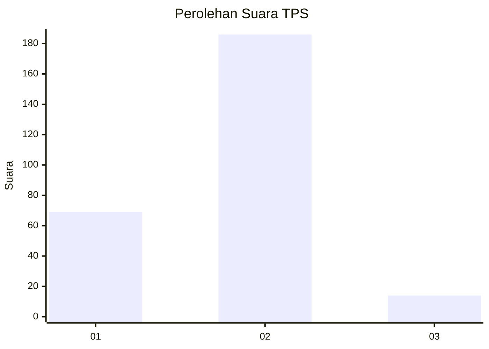
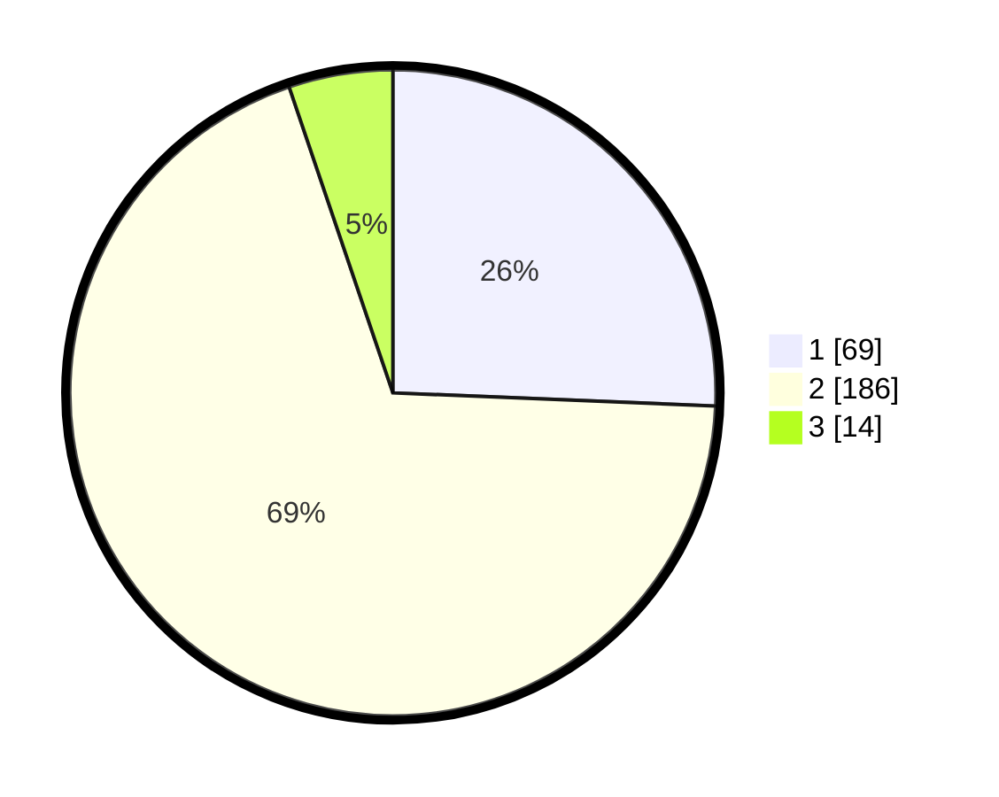

# Hasil

## Grafik

## Tabel

| No. | Nama Paslon    | Suara | Suara (raw) | Persentase |
|:--- |:-------------- | -----:| -----------:| ----------:|
| 1   | ANIES MUHAIMIN | 69    | [69][p-1]   | 25,65      |
| 2   | PRABOWO GIBRAN | 186   | [186][p-2]  | 69,14      |
| 3   | GANJAR MAHFUD  | 14    | [14][p-3]   | 5,20       |

[p-1]: https://github.com/gigit-pemilu/pemilu-2024-32-jawa-barat/blob/main/pilpres/hitung-suara/sub/32-jawa-barat/sub/11-sumedang/sub/15-jatinangor/sub/2002-hegarmanah/sub/024-tps/sub/paslon-1.txt
[p-2]: https://github.com/gigit-pemilu/pemilu-2024-32-jawa-barat/blob/main/pilpres/hitung-suara/sub/32-jawa-barat/sub/11-sumedang/sub/15-jatinangor/sub/2002-hegarmanah/sub/024-tps/sub/paslon-2.txt
[p-3]: https://github.com/gigit-pemilu/pemilu-2024-32-jawa-barat/blob/main/pilpres/hitung-suara/sub/32-jawa-barat/sub/11-sumedang/sub/15-jatinangor/sub/2002-hegarmanah/sub/024-tps/sub/paslon-3.txt

## Foto C Plano

https://sirekap-obj-formc.kpu.go.id/0ac8/pemilu/ppwp/32/11/15/20/02/3211152002024-20240214-235850--ab85b430-1fff-4969-9b44-2e9e85cfc734.jpg

https://sirekap-obj-formc.kpu.go.id/0ac8/pemilu/ppwp/32/11/15/20/02/3211152002024-20240215-090650--1a28edd5-66af-4def-9d41-5a1f7fe3bb6c.jpg

https://sirekap-obj-formc.kpu.go.id/0ac8/pemilu/ppwp/32/11/15/20/02/3211152002024-20240215-001243--2bd04f51-b846-46fb-9c44-daefcf171a5e.jpg

## Metadata

| Key        | Value               |
| ---------- | ------------------- |
| Time Stamp | 2024-02-16 00:00:26 |

