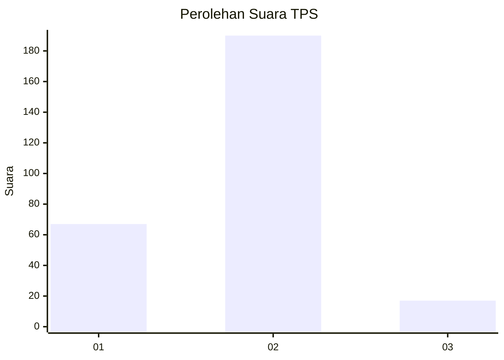

# Hasil

## Grafik

## Tabel

| No. | Nama Paslon    | Suara | Suara (raw) | Persentase |
|:--- |:-------------- | -----:| -----------:| ----------:|
| 1   | ANIES MUHAIMIN | 67    | [67][p-1]   | 24,45      |
| 2   | PRABOWO GIBRAN | 190   | [190][p-2]  | 69,34      |
| 3   | GANJAR MAHFUD  | 17    | [17][p-3]   | 6,20       |

[p-1]: https://github.com/gigit-pemilu/pemilu-2024/blob/main/pilpres/hitung-suara/sub/32-jawa-barat/sub/11-sumedang/sub/15-jatinangor/sub/2003-cibeusi/sub/907-tps/sub/paslon-1.txt
[p-2]: https://github.com/gigit-pemilu/pemilu-2024/blob/main/pilpres/hitung-suara/sub/32-jawa-barat/sub/11-sumedang/sub/15-jatinangor/sub/2003-cibeusi/sub/907-tps/sub/paslon-2.txt
[p-3]: https://github.com/gigit-pemilu/pemilu-2024/blob/main/pilpres/hitung-suara/sub/32-jawa-barat/sub/11-sumedang/sub/15-jatinangor/sub/2003-cibeusi/sub/907-tps/sub/paslon-3.txt

## Foto C Plano

https://sirekap-obj-formc.kpu.go.id/fa78/pemilu/ppwp/32/11/15/20/03/3211152003907-20240218-144915--6232a6b2-33f1-4757-a557-45bb04400874.jpg

https://sirekap-obj-formc.kpu.go.id/fa78/pemilu/ppwp/32/11/15/20/03/3211152003907-20240218-145616--18713c09-6f2d-4f48-9f8f-7e4ef9544237.jpg

https://sirekap-obj-formc.kpu.go.id/fa78/pemilu/ppwp/32/11/15/20/03/3211152003907-20240218-145718--513c3c5c-1f57-436e-a797-efd4b2e81e86.jpg

## Metadata

| Key        | Value               |
| ---------- | ------------------- |
| Time Stamp | 2024-02-19 06:16:00 |

