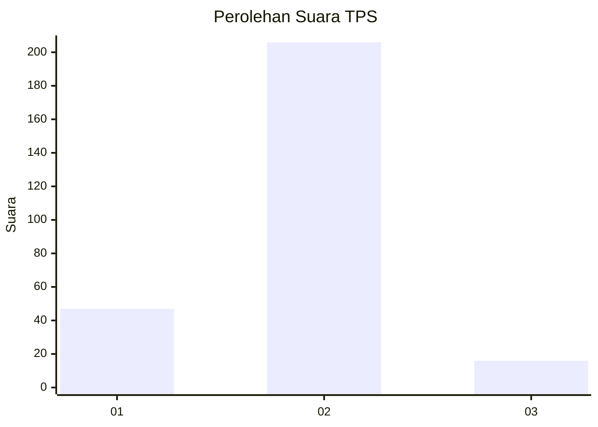
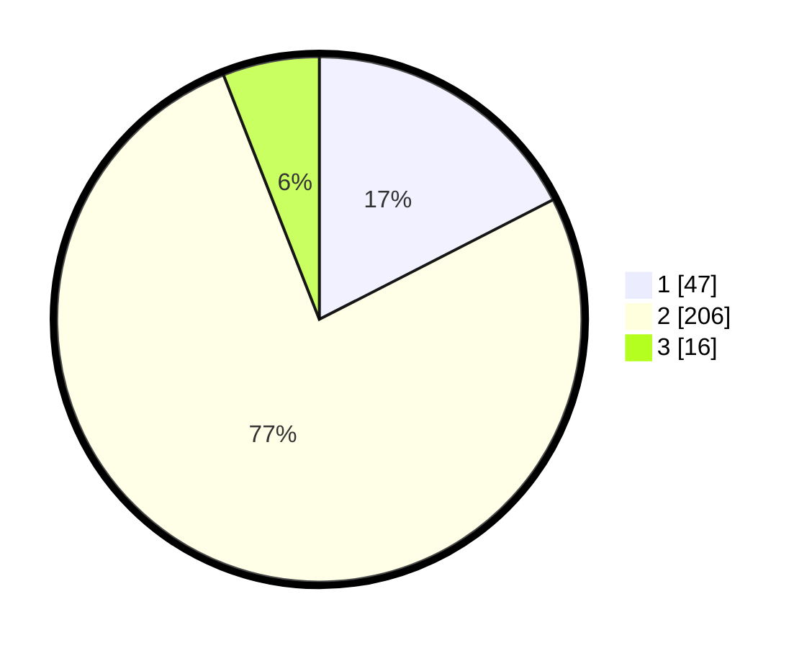

# Hasil

## Grafik

## Tabel

| No. | Nama Paslon    | Suara | Suara (raw) | Persentase |
|:--- |:-------------- | -----:| -----------:| ----------:|
| 1   | ANIES MUHAIMIN | 47    | [47][p-1]   | 17,47      |
| 2   | PRABOWO GIBRAN | 206   | [206][p-2]  | 76,58      |
| 3   | GANJAR MAHFUD  | 16    | [16][p-3]   | 5,95       |

[p-1]: https://github.com/gigit-pemilu/pemilu-2024/blob/main/pilpres/hitung-suara/sub/32-jawa-barat/sub/11-sumedang/sub/15-jatinangor/sub/2004-cipacing/sub/031-tps/sub/paslon-1.txt
[p-2]: https://github.com/gigit-pemilu/pemilu-2024/blob/main/pilpres/hitung-suara/sub/32-jawa-barat/sub/11-sumedang/sub/15-jatinangor/sub/2004-cipacing/sub/031-tps/sub/paslon-2.txt
[p-3]: https://github.com/gigit-pemilu/pemilu-2024/blob/main/pilpres/hitung-suara/sub/32-jawa-barat/sub/11-sumedang/sub/15-jatinangor/sub/2004-cipacing/sub/031-tps/sub/paslon-3.txt

## Foto C Plano

https://sirekap-obj-formc.kpu.go.id/dbb8/pemilu/ppwp/32/11/15/20/04/3211152004031-20240218-170506--5a5342f7-ae03-49ab-99d4-3ce700e5f702.jpg

https://sirekap-obj-formc.kpu.go.id/dbb8/pemilu/ppwp/32/11/15/20/04/3211152004031-20240214-194753--c081a57c-7381-466b-a173-2c8e9e455822.jpg

https://sirekap-obj-formc.kpu.go.id/dbb8/pemilu/ppwp/32/11/15/20/04/3211152004031-20240214-194952--8a91b376-003a-4897-87cd-7945f99fd494.jpg

## Metadata

| Key        | Value               |
| ---------- | ------------------- |
| Time Stamp | 2024-02-19 06:16:00 |

