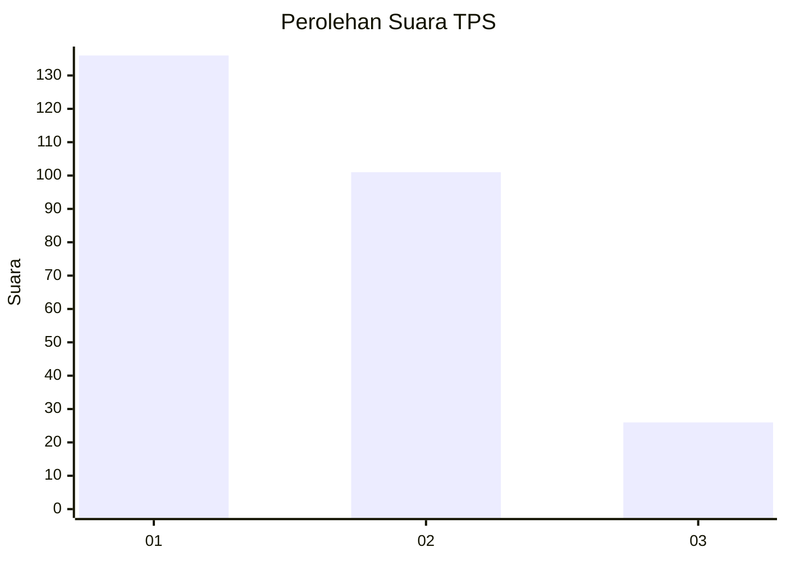
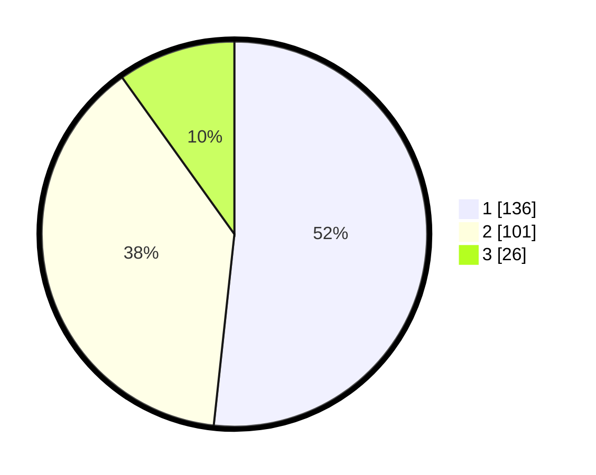

# Hasil

## Grafik

## Tabel

| No. | Nama Paslon    | Suara | Suara (raw) | Persentase |
|:--- |:-------------- | -----:| -----------:| ----------:|
| 1   | ANIES MUHAIMIN | 136   | [136][p-1]  | 51,71      |
| 2   | PRABOWO GIBRAN | 101   | [101][p-2]  | 38,40      |
| 3   | GANJAR MAHFUD  | 26    | [26][p-3]   | 9,89       |

[p-1]: https://github.com/gigit-pemilu/pemilu-2024-32-jawa-barat/blob/main/pilpres/hitung-suara/sub/32-jawa-barat/sub/11-sumedang/sub/15-jatinangor/sub/2005-sayang/sub/006-tps/sub/paslon-1.txt
[p-2]: https://github.com/gigit-pemilu/pemilu-2024-32-jawa-barat/blob/main/pilpres/hitung-suara/sub/32-jawa-barat/sub/11-sumedang/sub/15-jatinangor/sub/2005-sayang/sub/006-tps/sub/paslon-2.txt
[p-3]: https://github.com/gigit-pemilu/pemilu-2024-32-jawa-barat/blob/main/pilpres/hitung-suara/sub/32-jawa-barat/sub/11-sumedang/sub/15-jatinangor/sub/2005-sayang/sub/006-tps/sub/paslon-3.txt

## Foto C Plano

https://sirekap-obj-formc.kpu.go.id/e921/pemilu/ppwp/32/11/15/20/05/3211152005006-20240218-131307--e2d5de7c-ee53-475b-b4a5-1889b67f2f6b.jpg

https://sirekap-obj-formc.kpu.go.id/e921/pemilu/ppwp/32/11/15/20/05/3211152005006-20240218-130143--8a467442-798d-4944-8471-3581dd25bf8e.jpg

https://sirekap-obj-formc.kpu.go.id/e921/pemilu/ppwp/32/11/15/20/05/3211152005006-20240218-130237--07a4e92a-c89f-4052-b6e6-701d9e18afdd.jpg

## Metadata

| Key        | Value               |
| ---------- | ------------------- |
| Time Stamp | 2024-02-19 06:16:00 |

