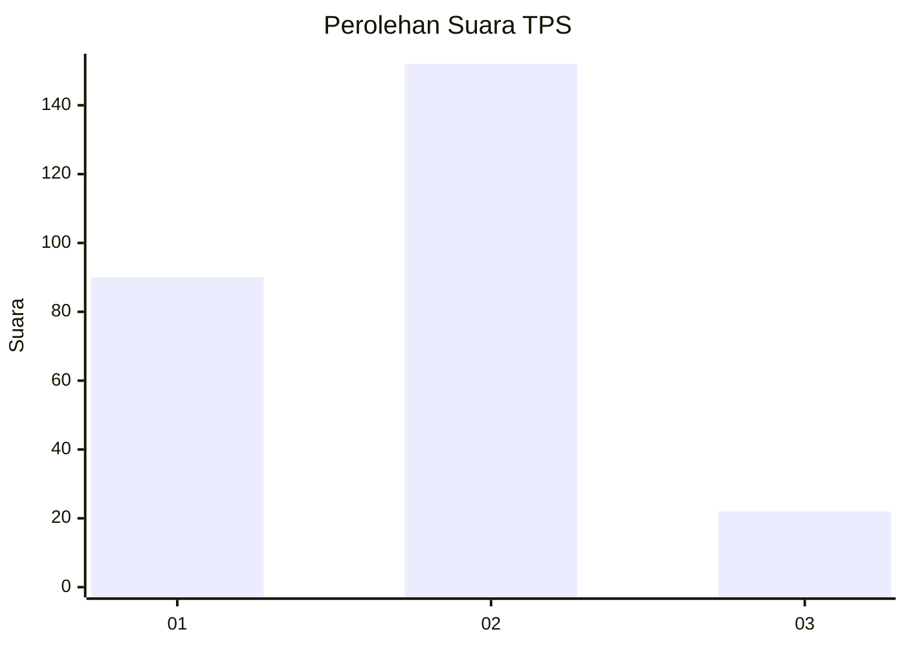
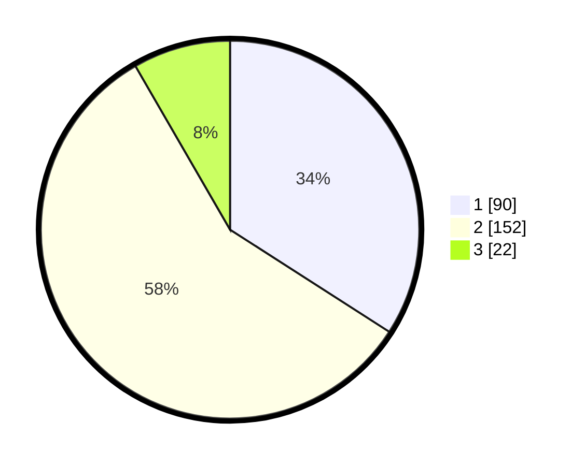

# Hasil

## Grafik

## Tabel

| No. | Nama Paslon    | Suara | Suara (raw) | Persentase |
|:--- |:-------------- | -----:| -----------:| ----------:|
| 1   | ANIES MUHAIMIN | 90    | [90][p-1]   | 34,09      |
| 2   | PRABOWO GIBRAN | 152   | [152][p-2]  | 57,58      |
| 3   | GANJAR MAHFUD  | 22    | [22][p-3]   | 8,33       |

[p-1]: https://github.com/gigit-pemilu/pemilu-2024-32-jawa-barat/blob/main/pilpres/hitung-suara/sub/32-jawa-barat/sub/11-sumedang/sub/15-jatinangor/sub/2005-sayang/sub/011-tps/sub/paslon-1.txt
[p-2]: https://github.com/gigit-pemilu/pemilu-2024-32-jawa-barat/blob/main/pilpres/hitung-suara/sub/32-jawa-barat/sub/11-sumedang/sub/15-jatinangor/sub/2005-sayang/sub/011-tps/sub/paslon-2.txt
[p-3]: https://github.com/gigit-pemilu/pemilu-2024-32-jawa-barat/blob/main/pilpres/hitung-suara/sub/32-jawa-barat/sub/11-sumedang/sub/15-jatinangor/sub/2005-sayang/sub/011-tps/sub/paslon-3.txt

## Foto C Plano

https://sirekap-obj-formc.kpu.go.id/881e/pemilu/ppwp/32/11/15/20/05/3211152005011-20240218-133421--c35f1cf4-fcea-42e3-b234-a97cf6dfbe24.jpg

https://sirekap-obj-formc.kpu.go.id/881e/pemilu/ppwp/32/11/15/20/05/3211152005011-20240218-133618--e2cd9051-863d-4ace-89de-5625ccd40836.jpg

https://sirekap-obj-formc.kpu.go.id/881e/pemilu/ppwp/32/11/15/20/05/3211152005011-20240218-133526--c57ceb6b-623a-47e7-8b56-ed693ea20653.jpg

## Metadata

| Key        | Value               |
| ---------- | ------------------- |
| Time Stamp | 2024-02-19 06:16:00 |

