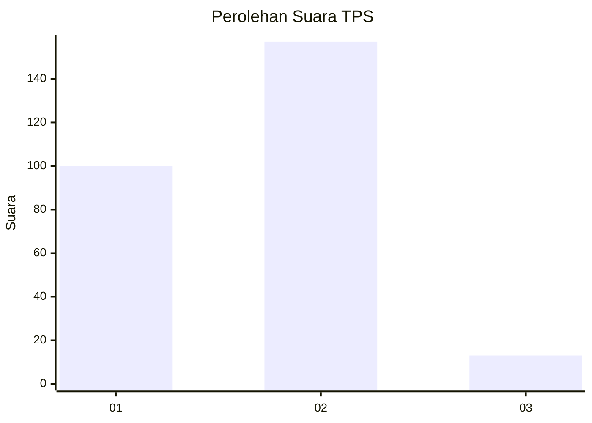
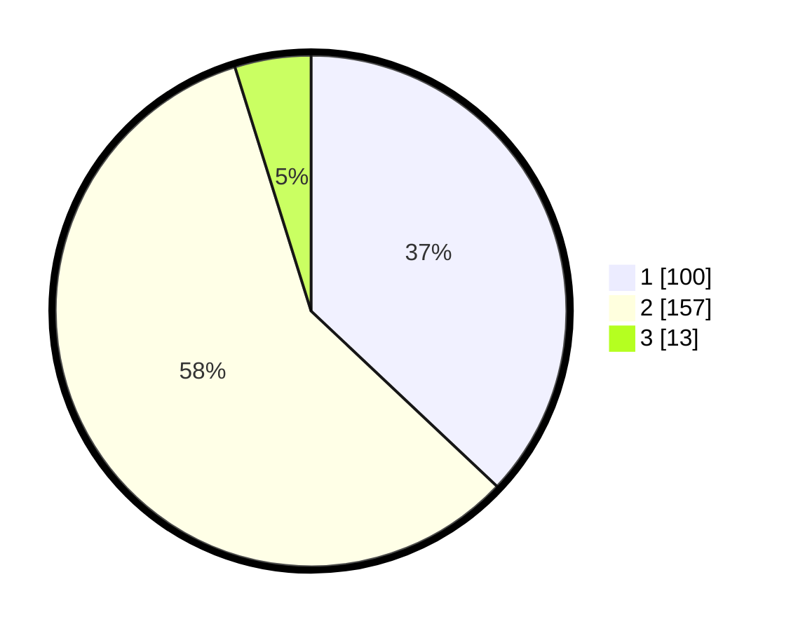

# Hasil

## Grafik

## Tabel

| No. | Nama Paslon    | Suara | Suara (raw) | Persentase |
|:--- |:-------------- | -----:| -----------:| ----------:|
| 1   | ANIES MUHAIMIN | 100   | [100][p-1]  | 37,04      |
| 2   | PRABOWO GIBRAN | 157   | [157][p-2]  | 58,15      |
| 3   | GANJAR MAHFUD  | 13    | [13][p-3]   | 4,81       |

[p-1]: https://github.com/gigit-pemilu/pemilu-2024/blob/main/pilpres/hitung-suara/sub/32-jawa-barat/sub/11-sumedang/sub/15-jatinangor/sub/2005-sayang/sub/014-tps/sub/paslon-1.txt
[p-2]: https://github.com/gigit-pemilu/pemilu-2024/blob/main/pilpres/hitung-suara/sub/32-jawa-barat/sub/11-sumedang/sub/15-jatinangor/sub/2005-sayang/sub/014-tps/sub/paslon-2.txt
[p-3]: https://github.com/gigit-pemilu/pemilu-2024/blob/main/pilpres/hitung-suara/sub/32-jawa-barat/sub/11-sumedang/sub/15-jatinangor/sub/2005-sayang/sub/014-tps/sub/paslon-3.txt

## Foto C Plano

https://sirekap-obj-formc.kpu.go.id/e68a/pemilu/ppwp/32/11/15/20/05/3211152005014-20240218-133755--e25a4d47-17af-46ac-8739-6ec029187435.jpg

https://sirekap-obj-formc.kpu.go.id/e68a/pemilu/ppwp/32/11/15/20/05/3211152005014-20240218-133844--0fef1497-135a-451b-adce-70b20c61b197.jpg

https://sirekap-obj-formc.kpu.go.id/e68a/pemilu/ppwp/32/11/15/20/05/3211152005014-20240218-133930--613ca3f3-14be-499f-9a30-b03ff9259f9f.jpg

## Metadata

| Key        | Value               |
| ---------- | ------------------- |
| Time Stamp | 2024-02-19 06:16:00 |

