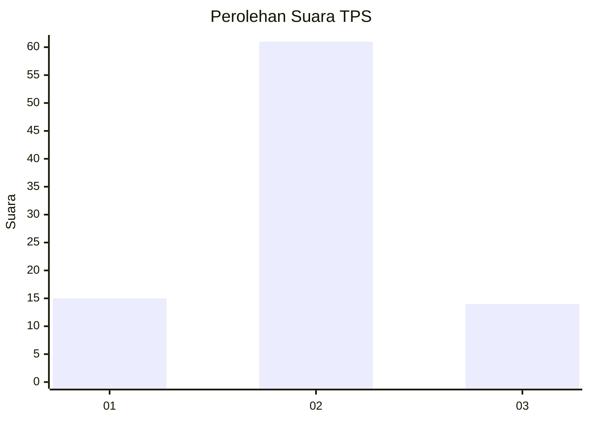
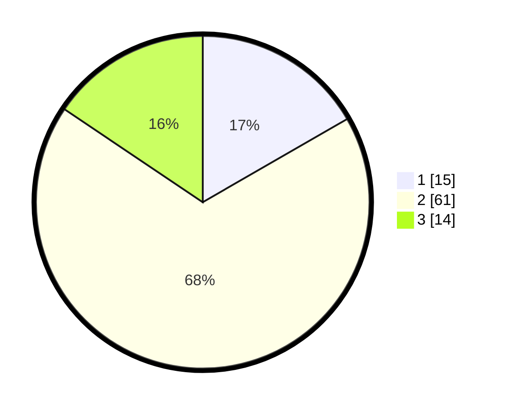

# Hasil

## Grafik

## Tabel

| No. | Nama Paslon    | Suara | Suara (raw) | Persentase |
|:--- |:-------------- | -----:| -----------:| ----------:|
| 1   | ANIES MUHAIMIN | 15    | [15][p-1]   | 16,67      |
| 2   | PRABOWO GIBRAN | 61    | [61][p-2]   | 67,78      |
| 3   | GANJAR MAHFUD  | 14    | [14][p-3]   | 15,56      |

[p-1]: https://github.com/gigit-pemilu/pemilu-2024/blob/main/pilpres/hitung-suara/sub/32-jawa-barat/sub/11-sumedang/sub/15-jatinangor/sub/2007-cintamulya/sub/001-tps/sub/paslon-1.txt
[p-2]: https://github.com/gigit-pemilu/pemilu-2024/blob/main/pilpres/hitung-suara/sub/32-jawa-barat/sub/11-sumedang/sub/15-jatinangor/sub/2007-cintamulya/sub/001-tps/sub/paslon-2.txt
[p-3]: https://github.com/gigit-pemilu/pemilu-2024/blob/main/pilpres/hitung-suara/sub/32-jawa-barat/sub/11-sumedang/sub/15-jatinangor/sub/2007-cintamulya/sub/001-tps/sub/paslon-3.txt

## Foto C Plano

https://sirekap-obj-formc.kpu.go.id/4c1e/pemilu/ppwp/32/11/15/20/07/3211152007001-20240218-144117--51b07f37-988a-4702-98fb-ab4a5d819346.jpg

https://sirekap-obj-formc.kpu.go.id/4c1e/pemilu/ppwp/32/11/15/20/07/3211152007001-20240218-144204--4e3f961b-bf0a-4c20-a205-7b6bcb8b3da6.jpg

https://sirekap-obj-formc.kpu.go.id/4c1e/pemilu/ppwp/32/11/15/20/07/3211152007001-20240218-144312--a3abde9d-1358-4449-9f38-99701168e454.jpg

## Metadata

| Key        | Value               |
| ---------- | ------------------- |
| Time Stamp | 2024-02-19 06:16:00 |

