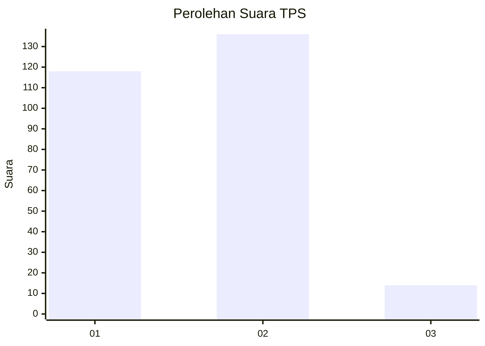
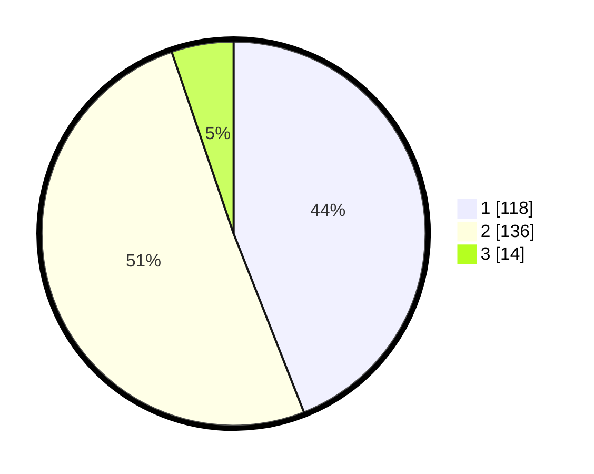

# Hasil

## Grafik

## Tabel

| No. | Nama Paslon    | Suara | Suara (raw) | Persentase |
|:--- |:-------------- | -----:| -----------:| ----------:|
| 1   | ANIES MUHAIMIN | 118   | [118][p-1]  | 44,03      |
| 2   | PRABOWO GIBRAN | 136   | [136][p-2]  | 50,75      |
| 3   | GANJAR MAHFUD  | 14    | [14][p-3]   | 5,22       |

[p-1]: https://github.com/gigit-pemilu/pemilu-2024-32-jawa-barat/blob/main/pilpres/hitung-suara/sub/32-jawa-barat/sub/11-sumedang/sub/15-jatinangor/sub/2010-jatiroke/sub/010-tps/sub/paslon-1.txt
[p-2]: https://github.com/gigit-pemilu/pemilu-2024-32-jawa-barat/blob/main/pilpres/hitung-suara/sub/32-jawa-barat/sub/11-sumedang/sub/15-jatinangor/sub/2010-jatiroke/sub/010-tps/sub/paslon-2.txt
[p-3]: https://github.com/gigit-pemilu/pemilu-2024-32-jawa-barat/blob/main/pilpres/hitung-suara/sub/32-jawa-barat/sub/11-sumedang/sub/15-jatinangor/sub/2010-jatiroke/sub/010-tps/sub/paslon-3.txt

## Foto C Plano

https://sirekap-obj-formc.kpu.go.id/612c/pemilu/ppwp/32/11/15/20/10/3211152010010-20240218-121457--3aa535a5-acd5-45a3-9924-5562fdd36951.jpg

https://sirekap-obj-formc.kpu.go.id/612c/pemilu/ppwp/32/11/15/20/10/3211152010010-20240215-050429--5e39d9ec-293d-43c4-8be6-7dea6371e13b.jpg

https://sirekap-obj-formc.kpu.go.id/612c/pemilu/ppwp/32/11/15/20/10/3211152010010-20240215-050532--af3f242a-3979-4535-bc5d-03cdfb300ef3.jpg

## Metadata

| Key        | Value               |
| ---------- | ------------------- |
| Time Stamp | 2024-02-19 06:16:00 |

